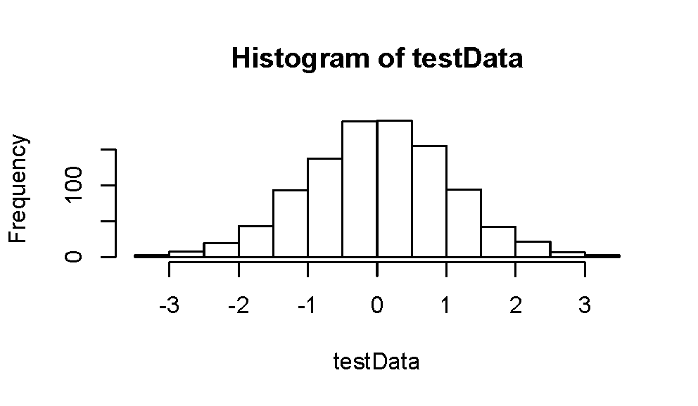
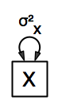
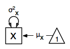
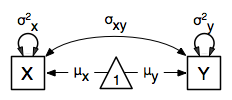

Alternative Approaches
==================================

In the Beginner's Guide, we introduced the OpenMx framework for building and fitting models to data.  Here we will discuss some basic examples in more detail, providing a parallel treatment of the different formats and types of data and their associated functions to apply them to and the different methods and styles to build and fit models.  We will start with a single variable - univariate - example and generate data of different type and in different formats.  
Three types of data can be used: 

"(1)" continuous data, 
"(2)" ordinal data or 
"(3)" binary data,  

and the two supported data formats are 

"(i)" summary statistics, i.e. covariance matrices and possibly means, and 
"(ii)" raw data format.  

We will illustrate all of them, as arguments of functions may differ.  There are currently two supported methods for specifying models: 

"(a)" path specification and 
"(b)" matrix specification.  

Each example is presented using both approaches, so you can get a sense of their advantages/ disadvantages, and see which best fits your style.  In the 'path specification' model style you specify a model in terms of paths in a path diagram; the 'matrix specification' model style relies on matrices and matrix algebra to produce OpenMx code.  Furthermore, we will introduce the different styles available to specify models and data, namely 

"(A)" the piecewise style, 
"(B)" the stepwise style and
"(C)" the classic style.  

This will be done for a bivariate extension of the first example.

The code used to run the examples in this chapter is available here, and you may wish to access it while working through this manual. 

* http://openmx.psyc.virginia.edu/docs/OpenMx/latest/_static/demo/AlternativeApproaches.R

Introduction
------------

Our first example fits a model to one variable - and is thus considered a univariate model.  The simplest model is one in which we estimate the variance of the variable.  Additionally we can estimate both the mean and the variance - a so called saturated model.  You might wonder why we use a modeling framework to estimate the mean and variance of a variable which we can do with anything from a calculator to using any basic spreadsheet or statistical program.  That is a fair question if you're just interested in the value of the mean and/or variance.  However, if you want to test, for example the mean of your variable is equal to a certain fixed value or to the mean of another variable or the same variable in another group, the modeling framework becomes relevant.  

Data Handling
-------------

You probably have your favorite data set ready to go, but before reading in data from an external file, we simulate a simple dataset directly in R, and use some of R's great capabilities.  As this is not an R manual, we just provide the code here with minimal explanation. There are several helpful sites for learning R, for instance http://www.statmethods.net/
    
..
   DO NOT EXECUTE

.. cssclass:: input
..   

.. code-block:: r
       
    # Simulate Data
    set.seed(100)
    x <- rnorm (1000, 0, 1)
    univData <- as.matrix(x)
    dimnames(univData) <- list(NULL, "X")
    summary(univData)
    mean(univData)
    var(univData)

The first line is a comment (starting with a #).  We set a seed for the simulation so that we generate the same data each time and get a reproducible answer.  We then create a variable *x* for 1000 subjects, with a mean of 0 and a variance of 1, using R's normal distribution function ``rnorm``.  We read the data in as a matrix into an object *univData* and give the variable a name *"X"* using the ``dimnames`` command.  We can easily produce some descriptive statistics in R using built-in functions ``summary``, ``mean`` and ``var``, just to make sure the data look like what we expect.  The output generated looks like this:   

.. cssclass:: output
..   

.. code-block:: r 

    summary(univData)
        X          
    Min.   :-3.32078  
    1st Qu.:-0.64970  
    Median : 0.03690  
    Mean   : 0.01681  
    3rd Qu.: 0.70959  
    Max.   : 3.30415  
    > mean(univData)
    [1] 0.01680509
    > var(univData)
             X
    X 1.062112

For our second example, we will be fitting models to two variables which may be correlated.
The data used for the second example were generated using the multivariate normal function (``mvrnorm()`` in the R package MASS).  The ``mvrnorm()`` has three arguments: (i) sample size, (ii) vector of means, and (iii) covariance matrix.  We are simulating data on two variables named *X* and *Y* for 1000 individuals with means of zero, variances of one and a covariance of 0.5 using the following R code, and saved is as *bivData*.  Note that we can now use the R function ``colMeans()`` to generate the predicted means for the columns of our data frame and the ``cov()`` to generate the observed covariance matrix.

.. cssclass:: input
..
   
.. code-block:: r

    # Simulate Data
    require(MASS)
    set.seed(200)
    bivData <- mvrnorm (1000, c(0,0), matrix(c(1,.5,.5,1),2,2))
    dimnames(bivData) <- list(NULL, c('X','Y'))
    summary(bivData)
    colMeans(bivData)
    cov(bivData)

Notice that the simulated data are close to what we expected.

.. cssclass:: output
..   

..  code-block:: r
     
    > summary(bivData)
            X                   Y            
    Min.   :-3.296159   Min.   :-2.942561  
    1st Qu.:-0.596177   1st Qu.:-0.633711  
    Median :-0.010538   Median :-0.004139  
    Mean   :-0.004884   Mean   : 0.032116  
    3rd Qu.: 0.598326   3rd Qu.: 0.739236  
    Max.   : 4.006771   Max.   : 4.173841  
    > colMeans(bivData)
            X            Y 
    -0.004883811  0.032116480 
    > cov(bivData)
              X         Y
    X 0.9945328 0.4818317
    Y 0.4818317 1.0102951

Data Types
^^^^^^^^^^

Continuous Data
+++++++++++++++

The data we simulated are continuous in nature and follow a normal distribution.  This can easily be verified by R's excellent graphical capabilities.  Here we show the R code and a basic histogram of the *univData* we generated.  

.. cssclass:: input
..
   
.. code-block:: r
       
    hist(univData)

This is the ideal type of data, as many of the models we fit to them assume that the data are normally distributed.  However, reality is often different and it might be necessary to apply a transformation to the original data to better approximate a normal distribution.  When there are 15 or more possible values for the variable of interest, it is appropriate to treat them as continuous.  Note that although the simulated data have many more than 15 different values, values are binned to simplify the graph.

Continuous data can be summarized by their mean and standard deviation.  Two or more variables are summarized by a vector of means and a covariance matrix which provides information on the variance of each of the variables as well as the covariances between the variables.

Categorical Data
++++++++++++++++

A lot of variables, however, are not measured on a continuous scale, but using a limited number of categories.  If the categories are ordered in a logical way, we refer to them as **ordinal** variables and often assume that the underlying construct follows a normal distribution.  This assumption can actually be tested for any ordinal variable with a minimum of three categories, when more than one variable is available or the same variable is measured in related individuals or over time.

Categorical data contain less information than continuous data, and are summarized by thresholds which predict the proportion of individuals in a specific category.  As the sum of the proportions of each of the categories adds up to one, there is no information about the variance.  The relationship between two or more variables can be summarized in a correlation matrix.  Rather than estimating two (or more) thresholds and a correlation(s), one could fix the first threshold to zero and the second to one and estimate the means and covariance matrices instead, which can be interpreted in the same way as for continuous variables.  The estimated proportion in each of the categories can then be calculated by rescaling the statistics.

Often, unfortunately, variables are only measured with two categories (Yes/No, affected/unaffected, etc.) and called **binary** variables.  The only statistic to be estimated in the univariate case is the threshold and no information is available about the variance.  With two or more variables, their relationship is also summarized in a correlation matrix.

The power of your study is directly related to the type of variable analyzed, and is typically higher for continuous variables compared to categorical variables, with ordinal variables providing more power than binary variables.  Whenever possible, use continuous variables or at least ordinal variables.

As a lot of real data are only available as categorical variables, we will generate both an ordinal and a binary variable from the simulated continuous variable in *univData*.  The code below uses the ``cut`` and ``breaks`` commands to cut the continuous variable into 5 ordered categories.

.. cssclass:: input
..

.. code-block:: r
       
    univDataOrd <- data.frame(X=cut(univData[,1], breaks=5, ordered_result=T, 
                              labels=c(0,1,2,3,4)) )
    table(univDataOrd)

A summary of the resulting data set looks as follows:

.. cssclass:: output
..   

..  code-block:: r
    
    > table(univDataOrd)
    univDataOrd
      0   1   2   3   4 
     28 216 483 244  29

A similar approach could be used to create a binary variable.  However, here we show an alternative way to generate a binary variable using a specific cutoff using the ``ifelse`` command.  We will assign a value of 1 when the value of our original standardized continuous variable is above 0.5; otherwise a value of 0 will be assigned.

.. cssclass:: input
..
   
.. code-block:: r
       
    univDataBin <- data.frame(X=ifelse(univData[,1] >.5,1,0))
    table(univDataBin)

The resulting data set table looks as follows: 

.. cssclass:: output
..   

..  code-block:: r
    
    > table(univDataBin)
    univDataBin
      0   1 
    680 320
        
We will go through the same steps to generate ordinal and binary data from the simulated bivariate data.  Given we need to repeat the same statement for the two variables, we employ a ``for`` statement.

.. cssclass:: input
..
   
.. code-block:: r
       
    bivDataOrd <- data.frame(bivData)
    for (i in 1:2) { bivDataOrd[,i] <- cut(bivData[,i], breaks=5, ordered_result=T, 
                                           labels=c(0,1,2,3,4)) }
       table(bivDataOrd[,1],bivDataOrd[,2])
    bivDataBin <- data.frame(bivData)
    for (i in 1:2) { bivDataBin[,i] <- ifelse(bivData[,i] >.5,1,0) }
       table(bivDataBin[,1],bivDataBin[,2])

Data Formats
^^^^^^^^^^^^

Raw Data
++++++++

To make these data available for statistical modeling in OpenMx, we need to create an "MxData" object which is accomplished with the ``mxData`` function.  Remember to load the OpenMx package first.

.. cssclass:: input
..
   
.. code-block:: r
       
    require(OpenMx)
    obsRawData <- mxData( observed=univData, type="raw" )
    selVars <- "X"

First, we read the data matrix in with the ``observed`` argument.  Then, we tell OpenMx what format or type the data is in, in this case we're reading in the raw data.  We save this MxData object as *obsRawData*.  As later on, we need to be able to map our data onto the model, we typically create a vector with the variable labels of the variable(s) we are analyzing.  To make our scripts more readable, we use consistent names for objects - something you can decide to copy or change according to your preferences - and we use *selVars* for the variables we select for analysis.  In this example, it is a single variable *X*.

.. cssclass:: output
..   

..  code-block:: r
    
    > obsRawData
    MxData 'data' 
    type : 'raw' 
    numObs : '1000' 
    Data Frame or Matrix : 
                        X
       [1,] -5.021924e-01
       [2,]  1.315312e-01
       ....
       [1000,] -2.141428e+00
       Means : NA 
       Acov : NA 
       Thresholds : NA 
        
A look at this newly created object shows that it was given the  ``name`` *data*, which is done by default.  It has the ``type`` that we specified, and ``numObs`` are automatically counted for us.  The actual data for the variable *X* are then listed; we only show the first two values.

In a similar manner we create a MxData object for the second example.  We read in the ``observed`` *bivData*, and indicate the ``type`` as raw.  We refer to this object as *obsBivData*.

.. cssclass:: input
..
   
.. code-block:: r
       
    obsBivData <- mxData( observed=bivData, type="raw" )

If we want to fit models to categorical data, we need to read in the ordinal or binary data.  However, when your data are ordinal or binary, OpenMx expects them to be 'ordered factors'.  To ensure that your data have the appropriate format, it is recommended/required to apply the ``mxFactor`` command to the categorical variables, where the ``x`` argument reads in a vector of data or a data.frame, and ``levels`` expects a vector of possible values for those data.  We save the resulting objects as *univDataOrdF* and *univDataBinF*, or *bivDataOrdF* and *bivDataBinF* for the corresponding data in the second example.

.. cssclass:: input
..
   
.. code-block:: r
       
    univDataOrdF <- mxFactor( x=univDataOrd, levels=c(0:4) )
    univDataBinF <- mxFactor( x=univDataBin, levels=c(0,1) )
    bivDataOrdF  <- mxFactor( x=bivDataOrd, levels=c(0:4) )
    bivDataBinF  <- mxFactor( x=bivDataBin, levels=c(0,1) )

Next, we generate the corresponding MxData objects.

.. cssclass:: input
..
   
.. code-block:: r
       
    obsRawDataOrd <- mxData( observed=univDataOrdF, type="raw" )
    obsRawDataBin <- mxData( observed=univDataBinF, type="raw" )
    obsBivDataOrd <- mxData( observed=bivDataOrdF, type="raw" )
    obsBivDataBin <- mxData( observed=bivDataBinF, type="raw" )

Summary Stats
+++++++++++++

Covariances
...........

While analyzing raw data is the standard in most statistical modeling these days, this was not the case in a previous generation of computers, which could only deal with summary statistics.  As fitting models to summary statistics still is much faster then using raw data (unless your data set is small), it is sometimes useful for didactic purposes.  Furthermore, sometimes one has access only to the summary statistics.  In the case where the dataset is complete, in other words there are no missing data, there is no advantage to using raw data.  For our example, we can easily create a covariance matrix based on our data set by using R's ``var()`` function, in the case of analyzing a single variable, or ``cov()`` function, when analyzing more than one variable.  This can be done prior to or directly when creating the MxData object.   Its first argument, ``observed``, reads in the data from an R matrix or data.frame, with the ``type`` given in the second argument, followed by the ``numObs`` argument which is necessary when reading in summary statistics.

.. cssclass:: input
..
   
.. code-block:: r
       
    univDataCov <- var(univData)
    obsCovData  <- mxData( observed=univDataCov, type="cov", numObs=1000 )
        
or 

.. cssclass:: input
..
   
.. code-block:: r
       
    obsCovData  <- mxData( observed=var(univData), type="cov", numObs=1000 )

Given our first example has only one variable, we use the ``var()`` function (as there is no covariance for a single variable).  When summary statistics are used as input, the number of observations (``numObs``) needs to be supplied.  The resulting MxData object looks as follows:

.. cssclass:: output
..   

..  code-block:: r
    
    > obsCovData
    MxData 'data' 
    type : 'cov' 
    numObs : '1000' 
    Data Frame or Matrix : 
                 X
    X 1.062112
    Means : NA
    Acov : NA 
    Thresholds : NA
    
The differences with the previous data objects are that the type is now 'cov' and the actual data frame is now a single value, the variance of the 1000 data points.

Covariances + Means
...................

In addition to the observed covariance matrix, a fourth argument ``means`` can be added for the vector of observed means from the data, calculated using the R ``colMeans`` command.

.. cssclass:: input
..
   
.. code-block:: r
       
    obsCovMeanData <- mxData( observed=var(univData),  type="cov", numObs=1000, 
                              means=colMeans(univData) )

You can verify that the new *obsCovMeanData* object now has a value for the observed means as well.

For the second, bivariate example the only change we'd have to make - besides reading in the *bivData* - is the use of ``cov`` instead of ``var`` to generate the object for the observed covariance matrix.

Correlations
............

To analyze categorical data, we can also fit the models to summary statistics, in this case, correlation matrices, as indicated by using the ``cor()`` R command to generate them and by the ``type=``\ cor, which also requires the ``numObs`` argument to indicate how many observations (data records) are in the dataset.
 
.. cssclass:: input
..
   
.. code-block:: r
       
    obsOrdData <- mxData( observed=cor(univDataOrdF), type="cor", numObs=1000 )

We will start by fitting a simple univariate model to the continuous data and then show which changes have to be made when dealing with ordinal or binary variables.  For the continuous data example, we will start with fitting the model to the summary statistics prior to fitting to raw data and show their equivalence (in the absence of missing data).

Model Handling
--------------

Path Method 
^^^^^^^^^^^

Summary Stats 
+++++++++++++

If we have data on a single variable *X* summarized in its variance, the basic univariate model will simply estimate the variance of the variable *X*.  We call this model saturated because there is a free parameter corresponding to each and every observed statistic.  Here we have covariance matrix input only, so we can estimate one variance.  This model can be represented by the following path diagram:

Model Building
..............

When using the path specification, it is easiest to work from the path diagram.  Assuming you are familiar with path analysis (*for those who are not, there are several excellent introductions, see [LI1986]*), we have a box for the observed/manifest variable *X*, and one double headed arrow, labeled :math:`\sigma^2_x`.  To indicate which variable we are analyzing, we use the ``manifestVars`` argument, which takes a vector of labels.  In this example, we are selecting one variable, which we pre-specified in the *selVars* object.

.. cssclass:: input
..
   
.. code-block:: r
       
    selVars   <- c("X")
    manifestVars=selVars

We have already built the MxData object above, so here we will build the model by specifying the relevant paths.  Our first model only has one path which has two arrows and goes from the variable *X* to the variable *X*.  That path represents the variance of *X* which we aim to estimate.  Let's see how this translates into the ``mxPath`` object.

The ``mxPath`` command indicates where the path originates (``from``) and where it ends (``to``).  If the ``to`` argument is omitted, the path ends at the same variable where it started.  The ``arrows`` argument distinguishes one-headed arrows (if ``arrows``\ =1) from two-headed arrows (if ``arrows``\ =2).  The ``free`` command is used to specify which elements are free or fixed with a ``TRUE`` or ``FALSE`` option.  If the ``mxPath`` command creates more than one path, a single "T" implies that all paths created here are free.  If some of the paths are free and others fixed, a list is expected.  The same applies for the ``values`` command which is used to assign starting values or fixed final values, depending on the corresponding 'free' status.  Optionally, lower and upper bounds can be specified (using ``lbound`` and ``ubound``, again generally for all the paths or specifically for each path).  Labels can also be assigned using the ``labels`` command which expects as many labels (in quotes) as there are elements.  Thus for our example, we specify only a ``from`` argument, as the double-headed arrow (``arrows``\ =2) goes back to *X*.  This path is estimated (``free``\ =TRUE), and given a start value of 1 (``values``\ =1) and has to be positive (``lbound``\ =.01).  Finally we assign it a label (``labels``\ ="vX").  The generated MxPath object is called *expVariance*.

.. cssclass:: input
..
   
.. code-block:: r
       
    expVariance <- mxPath(
        from=c("X"), arrows=2, 
        free=TRUE, 
        values=1, 
        lbound=.01, 
        labels="vX"
        )

Note that all arguments could be listed on one (or two) lines; in either case they are separated by comma's:

.. cssclass:: input
..
   
.. code-block:: r

    expVariance <- mxPath( from=c("X"), arrows=2, 
                           free=TRUE, values=1, lbound=.01, labels="vX" )

The resulting MxPath object looks as follows:

.. cssclass:: output
..   

..  code-block:: r
    
    > expVariance
    mxPath 
    $from:  'X' 
    $to:  'X' 
    $arrows:  2 
    $values:  1 
    $free:  TRUE 
    $labels:  vX 
    $lbound:  0.01 
    $ubound:  NA
    $connect:  single   
    
To evaluate the model that we have built, we need an expectation and a fit function that obtain the best solution for the model given the data.  When using the path specification, both are automatically generated by invoking the ``type="RAM"`` argument in the model.  The 'RAM' objective function has a predefined structure.

.. cssclass:: input
..
   
.. code-block:: r
       
    type="RAM"

Internally, OpenMx translates the paths into RAM notation in the form of the matrices **A**, **S**, and **F** [see RAM1990].  Before we can 'run' the model through the optimizer, we need to put all the arguments into an MxModel using the ``mxModel`` command.  Its first argument is a ``name``, and therefore is in quotes.  We then add all the arguments we have built so far, including the list of variables to be analyzed in ``manifestVars``, the MxData object, and the predicted model specified using paths.

.. cssclass:: input
..
   
.. code-block:: r
       
    univSatModel1 <- mxModel("univSat1", manifestVars=selVars, obsCovData, 
                              expVariance, type="RAM" )

We can inspect the MxModel object generated by this statement.

.. cssclass:: output
..   

..  code-block:: r
    
    > univSatModel1
    MxModel 'univSat1' 
    type : RAM 
    $matrices : 'A', 'S', and 'F' 
    $algebras :  
    $constraints :  
    $intervals :  
    $latentVars : none
    $manifestVars : 'X' 
    $data : 1 x 1 
    $data means : NA
    $data type: 'cov' 
    $submodels :  
    $expectation : MxExpectationRAM 
    $fitfunction : MxFitFunctionML 
    $compute : NULL 
    $independent : FALSE 
    $options :  
    $output : FALSE 
    
Note that only the relevant arguments have been updated, and that the path information has been stored in the **A**, **S**, and **F** matrices.  The free parameter for the variance "vX" ends up in the **S** matrix which holds the symmetric (double-headed) paths.  Here we print the details for this **S** matrix:

.. cssclass:: output
..   

..  code-block:: r
    
    > univSatModel1$matrices$S
    SymmMatrix 'S' 
    
    $labels
      X   
    X "vX"
    
    $values
      X
    X 1
    
    $free
         X
    X TRUE
    
    $lbound
         X
    X 0.01
    
    $ubound: No upper bounds assigned.
    
Model Fitting
.............

So far, we have specified the model, but nothing has been evaluated.  We have 'saved' the specification in the object *univSatModel1*.  This object is evaluated when we invoke the ``mxRun`` command with the MxModel object as its argument.

.. cssclass:: input
..
   
.. code-block:: r
       
    univSatFit1 <- mxRun(univSatModel1)

You can verify that the arguments of the *univSatModel1* and *univSatFit1* look mostly identical.  What we expect to be updated with the estimated value of variance is the element of the **S** matrix, which we can output as follows:

.. cssclass:: output
..   

..  code-block:: r
    
    > univSatFit1$matrices$S$values
             X
    X 1.062112
        
An alternative form of extracting values from a matrix is:

.. cssclass:: output
..   

..  code-block:: r
    
    > univSatFit1[['S']]$values
             X
    X 1.062112
    
There are actually a variety of ways to generate output.  We will promote the use of the ``mxEval`` command, which takes two arguments: an ``expression`` and a ``model`` object.  The ``expression`` can be a matrix or algebra  defined in the model, new calculations using any of these matrices/algebras of the model, the objective function, etc.  Here we use ``mxEval`` to simply list the values of the **S** matrix, which formats the output slightly differently as a typical R matrix object, and call it *EC1*, short for the expected covariance:

.. cssclass:: output
..   

..  code-block:: r

    EC1 <- mxEval(S, univSatFit1)
    >        EC1
                 X
        X 1.062112
    
We can then use any regular R function in the ``mxEval`` command to generate derived fit statistics, some of which are built in as standard.  When fitting to covariance matrices, the saturated likelihood can be easily obtained and subtracted from the likelihood of the data to obtain a Chi-square goodness-of-fit.  The saturated likelihood, here named 'SL1' is obtained from the ``$output$Saturated`` argument of the fitted object *univSatFit1* which contains a range of statistics.  We get the likelihood of the data, here referred to as *LL1*, from the ``$output$fit`` argument of the fitted object *univSatFit1*.

.. cssclass:: input
..
   
.. code-block:: r
       
    SL1  <- univSatFit1$output$Saturated
    LL1  <- univSatFit1$output$fit
    Chi1 <- LL1-SL1

The output of these objects like as follows

.. cssclass:: output
..   

..  code-block:: r
    
    > SL1
    [1] 1059.199
    > LL1
    [1] 1059.199
    > Chi1
    [1] 0
        
An alternative to requesting specific output is to generate the default summary of the model, which can be done with the ``summary`` function, and can also be saved in another R object, i.e. *univSatSumm1*.

.. cssclass:: input
..

.. code-block:: r
       
    summary(univSatFit1)
    univSatSumm1 <- summary(univSatFit1)

This output includes a summary of the data (if available), a list of all the free parameters with their estimates (if the model contains free parameters), their confidence intervals (if requested), a list of goodness-of-fit statistics, and a list of job statistics (timestamps and OpenMx version).

.. cssclass:: output
..   

..  code-block:: r
    
    > univSatSumm1
    data:
    $univSat1.data
    $univSat1.data$cov
             X
    X 1.062112
    
    free parameters:
      name matrix row col Estimate  Std.Error Std.Estimate     Std.SE lbound ubound
    1   vX      S   X   X 1.062112 0.04752282            1 0.04474372   0.01              
    
    observed statistics:  1 
    estimated parameters:  1 
    degrees of freedom:  0 
    -2 log likelihood:  1059.199 
    saturated -2 log likelihood:  1059.199 
    number of observations:  1000 
    chi-square:  0 
    p:  1 
    Information Criteria: 
        df Penalty Parameters Penalty Sample-Size Adjusted
    AIC          0           2.000000                   NA
    BIC          0           6.907755             3.731699
    CFI: NaN 
    TLI: NaN 
    RMSEA:  NA 
    timestamp: 2014-04-02 18:41:35 
    frontend time: 0.09399414 secs 
    backend time: 0.007524967 secs 
    independent submodels time: 5.602837e-05 secs 
    wall clock time: 0.1015751 secs 
    cpu time: 0.1015751 secs 
    openmx version number: 999.0.0-3160 

In addition to providing a covariance matrix as input data, we could add a means vector.  As this requires a few minor changes, let's highlight those.  The path diagram for this model, now including means (path from triangle of value 1) is as follows:

We have to specify one additional ``mxPath`` command for the means.  In the path diagram, the means are specified by a triangle which has a fixed value of one, reflected in the ``from="one"`` argument, with the ``to`` argument referring to the variable whose mean is estimated.  Note that paths for means are always single headed.  We will save this path as the R object *expMean*.

.. cssclass:: input
..

.. code-block:: r
       
    expMean <- mxPath(from="one", to="X", arrows=1, free=TRUE, values=0, labels="mX")

This new path adds one additional parameter, called 'mX'.

.. cssclass:: output
..   

..  code-block:: r
    
    >  expMean
    mxPath 
    $from:  'one' 
    $to:  'X' 
    $arrows:  1 
    $values:  0 
    $free:  TRUE 
    $labels:  mX 
    $lbound:  NA 
    $ubound:  NA
    $connect:  single 
    
The other required change is in the ``mxData`` command, which now takes a fourth argument ``means`` for the vector of observed means from the data, calculated using the R ``colMeans`` command.

.. cssclass:: input
..
   
.. code-block:: r
       
    obsCovMeanData <- mxData( observed=var(univData), type="cov", numObs=1000, 
                              means=colMeans(univData) )

As this new object will simply be added to the previous model, we can build onto our existing model.  Therefore, instead of using the first argument for the name, we use it in its other capacity, namely as the name of a previously defined MxModel object that is being modified.  In this case, we start with the previous model *univSatModel1*, which becomes the first argument of our new model *univSatModel1M*.  To change the name of the object, we add a ``name`` argument.  Note that the default order of arguments can be changed by adding the argument's syntax name.  We then add the new argument for the expected means, as well as the modified MxData object.

.. cssclass:: input
..
   
.. code-block:: r
       
    univSatModel1M <- mxModel(univSatModel1, name="univSat1M", expMean, obsCovMeanData )
    
Note the following changes in the modified MxModel below.  First, the name is changed to 'univSat1M'.  Second, an additional matrix **M** was generated for the expected means vector.  Third, observed means were added, here referred to as '$data means'.

.. cssclass:: output
..   

..  code-block:: r
    
    >  	univSatModel1M
    MxModel 'univSat1M' 
    type : RAM 
    $matrices : 'A', 'S', 'F', and 'M' 
    $algebras :  
    $constraints :  
    $intervals :  
    $latentVars : none
    $manifestVars : 'X' 
    $data : 1 x 1 
    $data means : 1 x 1 
    $data type: 'cov' 
    $submodels :  
    $expectation : MxExpectationRAM 
    $fitfunction : MxFitFunctionML 
    $compute : NULL  
    $independent : FALSE 
    $options :  
    $output : FALSE
    
When a mean vector is supplied and a parameter added for the estimated mean, the RAM matrices **A**, **S** and **F** are augmented with an **M** matrix which can be extracted from the output in a similar way as the expected variance before, and is called *EM1*, short for expected mean.

.. cssclass:: input
..
   
.. code-block:: r
       
    univSatFit1M  <- mxRun(univSatModel1M)
    EM1M          <- mxEval(M, univSatFit1M) 
    univSatSumm1M <- summary(univSatFit1M)

The new summary object *univSatSumm1M* is different from the previous one in the following ways: the observed data means were added, an extra free parameter is listed and estimated, thus the fit statistics are updated.  Notice, however, that the likelihood of both models is the same.  (We have cut part of the summary that is not relevant here.)

.. cssclass:: output
..   

..  code-block:: r
    
    > univSatSumm1M
    data:
    $univSat1M.data
    $univSat1M.data$cov
             X
    X 1.062112
    
    $univSat1M.data$means
                  X
    [1,] 0.01680509
    
    
    free parameters:
      name matrix row col   Estimate  Std.Error Std.Estimate     Std.SE lbound ubound
    1   vX      S   X   X 1.06211141 0.04752281            1 0.04474372   0.01       
    2   mX      M   1   X 0.01680503 0.03259006           NA         NA                            
    
    observed statistics:  2 
    estimated parameters:  2 
    degrees of freedom:  0 
    -2 log likelihood:  1059.199 
    saturated -2 log likelihood:  1059.199 
    number of observations:  1000 
    chi-square:  8.867573e-12 
    p:  0 
    Information Criteria: 
          df Penalty Parameters Penalty Sample-Size Adjusted
    AIC 8.867573e-12            4.00000                   NA
    BIC 8.867573e-12           13.81551             7.463399

Raw Data 
++++++++

Instead of fitting models to summary statistics, it is now popular to fit models directly to the raw data and using full information maximum likelihood (FIML).  Doing so requires specifying not only a model for the covariances, but also one for the means, just as in the case of fitting to covariance matrices and mean vectors described above. 

The only change required is in the MxData object, *obsRawData* defined above, which reads the raw data in directly from an R matrix or a data.frame into the ``observed`` first argument, and has ``type="raw"`` as its second argument.  A nice feature of OpenMx is that existing models can be easily modified.  Here we will start from the saturated model estimating covariances and means from summary statistics, namely *univSatModel1M*, as both expected means and covariances have to be modeled when fitting to raw data.

.. cssclass:: input
..

.. code-block:: r
       
    univSatModel2 <- mxModel(univSatModel1M, obsRawData )

The resulting model can be run as usual using ``mxRun``:

.. cssclass:: input
..
   
.. code-block:: r
       
    univSatFit2  <- mxRun(univSatModel2)
    univSatSumm2 <- summary(univSatFit2)
    EM2          <- mxEval(M, univSatFit2) 
    EC2          <- mxEval(S, univSatFit2)
    LL2          <- univSatFit2$output$fit

Note that the estimates for the expected means, as well as the expected covariance matrix are exactly the same as before, as we have no missing data.

.. cssclass:: output
..   

..  code-block:: r
    
    >        EM2
                  X
    [1,] 0.01680499
    >        EC2
             X
    X 1.061049
    >        LL2
    [1] 2897.135

The estimates for the predicted mean and covariance matrix are exactly the same as those obtained when fitting to summary statistics.  The likelihood, however, is different.??

.. cssclass:: output
..   

..  code-block:: r
    
    > univSatSumm2
    data:
    $univSat1M.data
            X           
    Min.   :-3.32078  
    1st Qu.:-0.64970  
    Median : 0.03690  
    Mean   : 0.01681  
    3rd Qu.: 0.70959  
    Max.   : 3.30415  
    
    free parameters:
     name matrix row col   Estimate  Std.Error Std.Estimate     Std.SE lbound ubound
    1   vX      S   X   X 1.06104923 0.04745170            1 0.04472149   0.01       
    2   mX      M   1   X 0.01680499 0.03257418           NA         NA                      
    
    observed statistics:  1000 
    estimated parameters:  2 
    degrees of freedom:  998 
    -2 log likelihood:  2897.135 
    saturated -2 log likelihood:  NA 
    number of observations:  1000 
    chi-square:  NA 
    p:  NA 
    Information Criteria: 
       df Penalty Parameters Penalty Sample-Size Adjusted
    AIC   901.1355           2901.135                   NA
    BIC -3996.8043           2910.951             2904.599

Matrix Method
^^^^^^^^^^^^^

The next example replicates these models using matrix-style coding.  In addition to the ``mxData``  and ``mxModel`` commands which were introduced before, the code to specify the model includes three new commands, (i) ``mxMatrix``, and (ii) ``mxExpectationNormal`` and ``mxFitFunctionML()``.

Summary Stats
+++++++++++++

Covariances 
...........

Starting with the model fitted to the summary covariance matrix, the ``mxData`` is identical to that used in path style models, as is the case for all the corresponding models specified using paths or matrices. 

To specify the model, we now create a matrix for the expected covariance matrix using the ``mxMatrix`` command.  The first argument is its ``type``, symmetric for a covariance matrix.  The second and third arguments are the number of rows (``nrow``) and columns (``ncol``) – one each for a univariate model.  The ``free`` and ``values`` parameters work as in the path specification.  If only one element is given, it is applied to all elements of the matrix.  Alternatively, each element can be assigned its free/fixed status and starting value with a list command.  Note that in the current example, the matrix is a simple **1x1** matrix, but that will change rapidly in the later examples.

.. cssclass:: input
..

.. code-block:: r
       
    expCovMat <- mxMatrix( type="Symm", nrow=1, ncol=1, 
                           free=TRUE, values=1, name="expCov" )
    
The resulting MxMatrix object *expCovMat* looks as follows.  Note that the starting value for the free parameter is 1 and that optionally labels can be assigned for the rows and columns of the matrix and lower and upper bounds can be assigned to limit the parameter space for the estimation:

.. cssclass:: output
..   

..  code-block:: r
    
    > expCovMat
    SymmMatrix 'expCov' 
    
    $labels: No labels assigned.
    
    $values
         [,1]
    [1,]    1
    
    $free
         [,1]
    [1,] TRUE
    
    $lbound: No lower bounds assigned.
    
    $ubound: No upper bounds assigned.
        
To link the model for the covariance matrix to the data, an ``mxExpectation`` needs to be specified which will  be evaluated with an ``mxFitFunctionML``.  The ``mxExpectationNormal`` command  takes two arguments, ``covariance`` to hold the expected covariance matrix (which we named "expCov" above using the ``mxMatrix`` command), and ``dimnames`` which allow the mapping of the observed data to the expected covariance matrix, i.e. the model.  ``mxFitFunctionML()`` will invoke the maximum likelihood ('ML'), to obtain the best estimates for the free parameters.

.. cssclass:: input
..
   
.. code-block:: r
       
    expectCov    <- mxExpectationNormal( covariance="expCov", dimnames=selVars )
    funML        <- mxFitFunctionML()
         
The internal name of an MxExpectationNormal object is by default *expectation* and that for an MxFitFunctionML object is by default *fitfunction*.  We can thus inspect these two objects by using the names of the resulting objects, here *expCovFun* and *ML* as shown below. The result of applying the fit function is not yet computed and thus reported as *<0 x 0 matrix>*; its arguments will change after running the model successfully.

.. cssclass:: output
..   

..  code-block:: r
    
    > expectCov
    MxExpectationNormal 'expectation' 
    $covariance : 'expCov' 
    $means : NA 
    $dims : 'X' 
    $thresholds : NA 
    $threshnames : 'X'
         
    > funML
    MxFitFunctionML 'fitfunction' 
    $vector : FALSE 
    <0 x 0 matrix>
    
We can then simply combine the appropriate elements into a new model and fit it in the usual way to the data.  Please note that within the ``mxExpectationNormal`` function, we refer to the expected covariance matrix by its name within the ``mxMatrix`` function that created the matrix, namely *expCov*.  However when we combine the arguments into the ``mxModel`` function, we use the name of the MxMatrix and MxMLObjective objects, respectively *expCovMat*, *expCovFun* and *ML*, as shown below.   

.. cssclass:: input
..
   
.. code-block:: r
       
    univSatModel3 <- mxModel("univSat3", obsCovData, expCovMat, expectCov, funML)
    univSatFit3   <- mxRun(univSatModel3)
    univSatSumm3  <- summary(univSatFit3)

Note that the estimates for the free parameters and the goodness-of-fit statistics are exactly the same for the matrix method as they were for the path method.

.. cssclass:: output
..   

..  code-block:: r
    
    > univSatSumm3
    data:
    $univSat3.data
    $univSat3.data$cov
             X
    X 1.062112    
    
    free parameters:
      name matrix row col Estimate  Std.Error lbound ubound
    1 <NA> expCov   X   X 1.062112 0.04752287              
    
    observed statistics:  1 
    estimated parameters:  1 
    degrees of freedom:  0 
    -2 log likelihood:  1059.199 
    saturated -2 log likelihood:  1059.199 
    number of observations:  1000 
    chi-square:  0 
    p:  1 
    Information Criteria: 
        df Penalty Parameters Penalty Sample-Size Adjusted
    AIC          0           2.000000                   NA
    BIC          0           6.907755             3.731699
        
We can also obtain the values of the likelihood by accessing the fitted object with the default name for the fit function, here *univSatFit4$fitfunction*.  Note the the expectation part of the fitted object has not changed.

.. cssclass:: output
..   

..  code-block:: r        
        
    > univSatFit3$expectation
    MxExpectationNormal 'expectation' 
    $covariance : 'expCov' 
    $means : NA 
    $dims : 'X' 
    $thresholds : NA 
    $threshnames : 'X' 
    
    > univSatFit3$fitfunction
    MxFitFunctionML 'fitfunction' 
    $vector : FALSE 
            [,1]
    [1,] 1059.199
    attr(,"expCov")
             [,1]
    [1,] 1.062112
    attr(,"expMean")
    <0 x 0 matrix>
    attr(,"gradients")
    <0 x 0 matrix>
    attr(,"SaturatedLikelihood")
    [1] 1059.199
    attr(,"IndependenceLikelihood")
    [1] 1059.199
    
Covariances + Means
...................

A means vector can also be added to the observed data as the fourth argument of the ``mxData`` command.  When means are requested to be modeled, a second ``mxMatrix`` command is required to specify the vector of expected means. In this case a matrix of ``type`` ="Full", with one row and one column, is assigned ``free`` =TRUE with start value zero, and the name *expMean*.  The object is saved as *expMeanMat*.  

.. cssclass:: input
..
   
.. code-block:: r
       
    expMeanMat <- mxMatrix( type="Full", nrow=1, ncol=1, 
                            free=TRUE, values=0, name="expMean" )
    
When we inspect this MxMatrix object, note that it looks rather similar to the *expCovMat* object, except for the name and type and start value.  Its estimate depends entirely on which argument of the expectation function it is supposed to represent.  As soon as we move to an example with more than one variable, the difference becomes more obvious as the expected means will be a vector while the expected covariance matrix will always be a symmetric matrix.

.. cssclass:: output
..   

..  code-block:: r

    > exMeanMat
    SymmMatrix 'expMean' 

    $labels: No labels assigned.

    $values
         [,1]
    [1,]    0

    $free
         [,1]
    [1,] TRUE

    $lbound: No lower bounds assigned.

    $ubound: No upper bounds assigned.

The second change is adding an additional argument ``means`` to the ``mxExpectationNormal`` function for the expected mean, here *expMean*.

.. cssclass:: input
..
   
.. code-block:: r
       
    expextCovMean <- mxExpectationNormal( covariance="expCov", means="expMean", 
                                          dimnames=selVars )

We now create a new model based on the old one, give it a new name, read in the MxData object with covariance and mean, add the MxMatrix object for the means and change the expectation function to the one created above.

.. cssclass:: input
..
   
.. code-block:: r
       
    univSatModel3M <- mxModel(univSatModel3, name="univSat3M", obsCovMeanData, 
                              expMeanMat, expextCovMean, funML )
    univSatFit3M   <- mxRun(univSatModel3M)
    univSatSumm3M  <- summary(univSatFit3M)

You can verify that the only changes to the output are the addition of the means to the data and estimates, resulting in two observed statistics and two estimated parameters rather than one.  As a result the values AIC and BIC criteria have changed although the value for the likelihood is exactly the same as before.

Raw Data 
++++++++

Finally, if we want to use the matrix specification with raw data, no changes are needed to the matrices for the means and covariances, or to the expectation which combines the two.  Instead of summary statistics, we now fit the model to the raw data, saved in the MxData object *obsRawData*.  The fit function is still the same ``mxFitFunctionML()`` but now uses FIML (Full Information Maximum Likelihood), appropriate for raw data to evaluate the likelihood of the data .

The MxModel object for the saturated model applied to raw data has a name *univSat4*, a MxData object *obsRawData*, a MxMatrix object for the expected covariance matrix *expCovMat*, a MxMatrix object for the expected means vector *expMeanMat*,  a mxExpectationNormal object *expCovMeanFun*, and a mxFitFunction object *ML*.

.. cssclass:: input
..
   
.. code-block:: r
       
    univSatModel4 <- mxModel("univSat4", obsRawData, 
                              expCovMat, expMeanMat, expectCovMean, funML )
    univSatFit4   <- mxRun(univSatModel4)
    univSatSumm4  <- summary(univSatFit4)

The output looks like this:

.. cssclass:: output
..   

..  code-block:: r
    
    > univSatSumm4
    data:
    $univSat4.data
           X           
    Min.   :-3.32078  
    1st Qu.:-0.64970  
    Median : 0.03690  
    Mean   : 0.01681  
    3rd Qu.: 0.70959  
    Max.   : 3.30415  
    
    free parameters:
      name  matrix row col   Estimate  Std.Error lbound ubound
    1 <NA>  expCov   X   X 1.06104925 0.04745032              
    2 <NA> expMean   1   X 0.01680499 0.03257294              
    
    observed statistics:  1000 
    estimated parameters:  2 
    degrees of freedom:  998 
    -2 log likelihood:  2897.135 
    saturated -2 log likelihood:  NA 
    number of observations:  1000 
    chi-square:  NA 
    p:  NA 
    Information Criteria: 
        df Penalty Parameters Penalty Sample-Size Adjusted
    AIC   901.1355           2901.135                   NA
    BIC -3996.8043           2910.951             2904.599
    
Note that the output generated for the paths and matrices specification are again completely equivalent, regardless of whether the model was fitted to summary statistics or raw data.  In each of the four versions of the model fitted to the same data, the data objects were generated from the continuous data.  Similar models can be fit to categorical data, with one or more thresholds delineating the proportion of individual in each of the two or more categories, based on the assumption of an underlying (multi)normal probability density function.

Threshold Model
+++++++++++++++

Binary Data
...........

We will show below - only for the version using the matrix method to build a model to be fitted to the raw data - which changes are required when the input data is categorical.  We'll start with a binary example, followed by an ordinal one.

First, we read in the binary data, *obsRawDataBin* created earlier.  Then we turn the symmetric predicted covariance matrix into a standardized matrix with the variance of categorical variables (on the diagonal) fixed to one.  To estimate the thresholds, we need to fix the mean to zero, by changing the ``type`` argument to 'Zero'.  The one new object that is required is a matrix for the thresholds which will be estimated.  For binary data, the threshold matrix is similar to the means matrix before.

.. cssclass:: input
..
   
.. code-block:: r
       
    expCovMatBin  <- mxMatrix( type="Stand", nrow=1, ncol=1, 
                               free=TRUE, values=.5, name="expCov" )
    expMeanMatBin <- mxMatrix( type="Zero", nrow=1, ncol=1, name="expMean" )
    expThreMatBin <- mxMatrix( type="Full", nrow=1, ncol=1, 
                               free=TRUE, values=0, name="expThre" )
        
Let's inspect the latter matrix.

.. cssclass:: output
..   

..  code-block:: r

    > expThreMatBin
    FullMatrix 'expThre' 

    $labels: No labels assigned.

    $values
         [,1]
    [1,]    0

    $free
         [,1]
    [1,] TRUE

    $lbound: No lower bounds assigned.

    $ubound: No upper bounds assigned.
        
The final change is adding an additional ``threshold`` argument to the ``mxExpectationNormal`` function for the expected threshold, here "expThre".

.. cssclass:: input
..
   
.. code-block:: r
       
    expectBin <- mxExpectationNormal( covariance="expCov", means="expMean", 
                                      threshold="expThre", dimnames=selVars )

We then include all these objects into a model *univSat5* and fit it to the data.

.. cssclass:: input
..
   
.. code-block:: r
       
    univSatModel5 <- mxModel("univSat5", obsRawDataBin, 
                              expCovMatBin, expMeanMatBin, expThreMatBin, expectBin, funML )
    univSatFit5   <- mxRun(univSatModel5)
    univSatSumm5  <- summary(univSatFit5)
         
The summary of the univariate model fitted to binary data includes a summary of the data.  Given binary data have no variance, it is fixed to one while the threshold is estimated.

.. cssclass:: output
..   

..  code-block:: r

    > univSatSumm5
    data:
    $univSat5.data
     X      
     0:680  
     1:320  

    free parameters:
      name  matrix row col  Estimate  Std.Error lbound ubound
    1 <NA> expThre   1   X 0.4676989 0.04124951              

    observed statistics:  1000 
    estimated parameters:  1 
    degrees of freedom:  999 
    -2 log likelihood:  1253.739 
    saturated -2 log likelihood:  NA 
    number of observations:  1000 
    chi-square:  NA 
    p:  NA 
    Information Criteria: 
        df Penalty Parameters Penalty Sample-Size Adjusted
    AIC  -744.2611           1255.739                   NA
    BIC -5647.1086           1260.647             1257.471
    CFI: NA 
    TLI: NA 
    RMSEA:  NA 
    timestamp: 2012-02-24 00:32:39 
    frontend time: 0.1296248 secs 
    backend time: 0.007578135 secs 
    independent submodels time: 5.102158e-05 secs 
    wall clock time: 0.137254 secs 
    cpu time: 0.137254 secs 
    openmx version number: 999.0.0-1661

Ordinal Data
............

Next, we will show how to adapt the model to analyze an ordinal variable.  As the number of thresholds depends on the variable, we specify it first, by creating a number of thresholds *nth* object.  The matrices for the expected covariance matrices and expected means are the same as in the binary case.  The matrix for the thresholds, however, now has as many rows as there are thresholds.  Furthermore, start values should be increasing. Here, we estimate the thresholds directly though.

.. cssclass:: input
..
   
.. code-block:: r
       
    nth <- 4
    expCovMatOrd  <- mxMatrix( type="Stand", nrow=1, ncol=1, 
                               free=TRUE, values=.5, name="expCov" )
    expMeanMatOrd <- mxMatrix( type="Zero", nrow=1, ncol=1, name="expMean" )
    expThreMatOrd <- mxMatrix( type="Full", nrow=nth, ncol=1, 
                               free=TRUE, values=c(-1.5,-.5,.5,1.5), name="expThre" )
    
Here we print the matrix of thresholds:

.. cssclass:: output
..   

..  code-block:: r

    > expThreMatOrd
    FullMatrix 'expThre' 

    $labels: No labels assigned.

    $values
         [,1]
    [1,] -1.5
    [2,] -0.5
    [3,]  0.5
    [4,]  1.5

    $free
         [,1]
    [1,] TRUE
    [2,] TRUE
    [3,] TRUE
    [4,] TRUE

    $lbound: No lower bounds assigned.

    $ubound: No upper bounds assigned.
        
The remainder of the model statements is almost identical to those of the binary model, except for replacing 'Bin' with 'Ord'.

.. cssclass:: input
..
   
.. code-block:: r
       
    expFunOrd     <- mxExpectationNormal( covariance="expCov", means="expMean", 
                                          threshold="expThre", dimnames=selVars )
    univSatModel6 <- mxModel("univSat6", obsRawDataOrd, 
                             expCovMatOrd, expMeanMatOrd, expThreMatOrd, expectOrd, funML )
    univSatFit6   <- mxRun(univSatModel6)
    univSatSumm6  <- summary(univSatFit6)

Thresholds
..........

An alternative approach to ensure that the thresholds are increasing can be enforced through multiplying the threshold matrix with a lower triangular matrix of 'Ones' and bounding all threshold increments except the first to be positive. The first threshold will be estimated as before.  The remaining thresholds are estimated as increments from the previous thresholds.  To generalize this, we specify a start value for the lower threshold ('svLTh') and for the increments ('svITh'), and then create a vector of start values to match the number of thresholds ('svTh').  Similarly, a vector of lower bounds is defined with all thresholds, except the first bounded to be positive ('lbTh').  These start values and lower bounds are read in to a MxMatrix object, of size *nth x 1*, similar to the threshold matrix in the previous example.  Then, we create a lower triangular matrix of ones which will be pre-multiplied with the threshold matrix to generate the expected threshold matrix *expThreMatOrd*.  The rest of the model is not changed, except that all the intermediate matrices, named *threG* and *inc* also have to be included in the MxModel object *univSatModel6I*.

.. cssclass:: input
..
   
.. code-block:: r
   
    svLTh     <- -1.5                              # start value for first threshold
    svITh     <- 1                                 # start value for increments
    svTh      <- (c(svLTh,(rep(svITh,nth-1))))     # start value for thresholds
    lbTh      <- c(-3,(rep(0.001,nth-1)))          # lower bounds for thresholds
        
    threG          <- mxMatrix( type="Full", nrow=nth, ncol=1, 
                                free=TRUE, values=svTh, lbound=lbTh, name="Thre" )
    inc            <- mxMatrix( type="Lower", nrow=nth, ncol=nth, 
                                free=FALSE, values=1, name="Inc" )        
    expThreMatOrd  <- mxAlgebra( expression= Inc %*% Thre, name="expThre" )
    expectOrd      <- mxExpectationNormal( covariance="expCov", means="expMean", 
                                           threshold="expThre", dimnames=selVars )
    univSatModel6I <- mxModel("univSat6", obsRawDataOrd, 
                              expCovMatOrd, expMeanMatOrd, 
                              Inc, Thre, expThreMatOrd, expectOrd, funML )
    univSatFit6I   <- mxRun(univSatModel6I, unsafe=T)
    univSatSumm6I  <- summary(univSatFit6I)

Approaches 
----------

Rarely will we analyze a single variable.  As soon as a second variable is added, not only can we estimate both means and  variances, but also a covariance between the two variables, as shown in the following path diagram:

  
The path diagram for our bivariate example includes two boxes for the observed variables **X** and **Y**, each with a two-headed arrow for the variance of each of the variables.  We also estimate a covariance between the two variables with the two-headed arrow connecting the two boxes.  The optional means are represented as single-headed arrows from a triangle to the two boxes.

As raw data are now standard for data analysis, we will focus this example on fitting directly to the raw data.  We will present the example in both the path and the matrix specification, and furthermore show not only the piecewise style but also the stepwise and the classic style of writing OpenMx scripts.

Piecewise Style
^^^^^^^^^^^^^^^

Here we will illustrate the various approaches with the bivariate example.  For the piecewise approach, we'll show both the path specification and the matrix specification.  The other two approaches, stepwise and classic, will just be shown for the matrix example as specifying models using matrix algebra allows for greater flexibility and variety of models to be built.

Path Method
++++++++++++

In the path specification, we will use three ``mxPath`` commands to specify (i) the variance paths, (ii) the covariance path, and (iii) the mean paths.  We first specify the number of variables *nv* and which variables are selected for analysis *selVars*.

.. cssclass:: input
..
   
.. code-block:: r
       
    nv      <- 2
    selVars <- c('X','Y')
        
We start with the two-headed paths for the variances and covariances.  The first one specifies two-headed arrows from *X* and *Y* to themselves - the ``to`` argument is omitted - to represent the variances.  This command now generates two free parameters, each with start value of 1 and lower bound of .01, but with a different label indicating that these are separate free parameters.  Note that we could test whether the variances are equal by specifying a model with the same label for the two variances and comparing it with the current model.  The second ``mxPath`` command specifies a two-headed arrow from *X* to *Y* for the covariance, which is also assigned 'free' and given a start value of .2 and a label.

.. cssclass:: input
..
   
.. code-block:: r
       
    expVars <- mxPath( from=c("X", "Y"), arrows=2, 
                       free=TRUE, values=1, lbound=.01, labels=c("varX","varY") )
    expCovs <- mxPath( from="X", to="Y", arrows=2, 
                       free=TRUE, values=.2, lbound=.01, labels="covXY" )

The resulting MxPath objects 'expVars' and 'expCovs' are as follows:

.. cssclass:: output
..   

..  code-block:: r
    
    > mxPath( from=c("X", "Y"), arrows=2, 
              free=TRUE, values=1, lbound=.01, labels=c("varX","varY") )
    mxPath 
    $from:  'X' and 'Y' 
    $to:  'X' and 'Y' 
    $arrows:  2 
    $values:  1 
    $free:  TRUE 
    $labels:  varX varY 
    $lbound:  0.01 
    $ubound:  NA 
    >  mxPath( from="X", to="Y", arrows=2, 
               free=TRUE, values=.2, lbound=.01, labels="covXY" )
    mxPath 
    $from:  'X' 
    $to:  'Y' 
    $arrows:  2 
    $values:  0.2 
    $free:  TRUE 
    $labels:  covXY 
    $lbound:  0.01 
    $ubound:  NA 
        
When observed means are included in addition to the observed covariance matrix, as is necessary when fitting to raw data, we add an ``mxPath`` command with single-headed arrows from ``one`` to the variables to represent the two means.

.. cssclass:: input
..
   
.. code-block:: r
       
    expMeans <- mxPath( from="one", to=c("X", "Y"), arrows=1, 
                        free=TRUE, values=.01, labels=c("meanX","meanY") )

The "one" argument in the ``from`` argument is used exclusively for means objects, here called *expMeans*.

.. cssclass:: output
..   

..  code-block:: r
    
    > mxPath( from="one", to=c("X", "Y"), arrows=1, 
              free=TRUE, values=.01, labels=c("meanX","meanY") )
    mxPath 
    $from:  'one' 
    $to:  'X' and 'Y' 
    $arrows:  1 
    $values:  0.01 
    $free:  TRUE 
    $labels:  meanX meanY 
    $lbound:  NA 
    $ubound:  NA 

To fit this bivariate model to the simulated data, we have to combine the data and model statements in a MxModel objects.

.. cssclass:: input
..
   
.. code-block:: r
       
    bivSatModel1 <- mxModel("bivSat1", manifestVars=selVars, obsBivData, 
                             expVars, expCovs, expMeans, type="RAM" )
    bivSatFit1   <- mxRun(bivSatModel1)
    bivSatSumm1  <- summary(bivSatFit1)
    
As you can see below, the maximum likelihood (ML) estimates are very close to the summary statistics of the simulated data.

.. cssclass:: output
..   

..  code-block:: r
    
    > bivSatSumm1
    data:
    $bivSat1.data
            X                   Y            
    Min.   :-3.296159   Min.   :-2.942561  
    1st Qu.:-0.596177   1st Qu.:-0.633711  
    Median :-0.010538   Median :-0.004139  
    Mean   :-0.004884   Mean   : 0.032116  
    3rd Qu.: 0.598326   3rd Qu.: 0.739236  
    Max.   : 4.006771   Max.   : 4.173841  

    free parameters:
       name matrix row col     Estimate  Std.Error Std.Estimate     Std.SE lbound ubound
    1  varX      S   X   X  0.993537344 0.04443221    1.0000000 0.04472123   0.01       
    2 covXY      S   X   Y  0.481348846 0.03513471    0.4806856 0.03508630   0.01       
    3  varY      S   Y   Y  1.009283953 0.04513849    1.0000000 0.04472328   0.01       
    4 meanX      M   1   X -0.004884421 0.03152067           NA         NA              
    5 meanY      M   1   Y  0.032116307 0.03177008           NA         NA              

    observed statistics:  0 
    estimated parameters:  5 
    degrees of freedom:  -5 
    -2 log likelihood:  5415.772 
    saturated -2 log likelihood:  -2 
    number of observations:  1000 
    chi-square:  5417.772 
    p:  NaN 
    Information Criteria: 
         df Penalty Parameters Penalty Sample-Size Adjusted
    AIC:   5425.772           5425.772                   NA
    BIC:   5450.311           5450.311             5434.431

Matrix Method
++++++++++++++

If we use matrices instead of paths to specify the bivariate model, we need to generate matrices to represent the expected covariance matrix and the means.  The ``mxMatrix`` command for the expected covariance matrix now specifies a **2x2** symmetric matrix with all elements free.  Start values have to be given only for the unique elements (diagonal elements plus upper or lower diagonal elements), in this case we provide a list with values of 1 for the variances and 0.5 for the covariance.

.. cssclass:: input
..
   
.. code-block:: r
       
    expCovM <- mxMatrix( type="Symm", nrow=2, ncol=2, 
                         free=TRUE, values=c(1,0.5,1), 
                         labels=c('V1','Cov','V2'), name="expCov" )
    
By specifying labels, we can tell that the two covariance elements, expCovM[1,2] and expCovM[2,1] are constrained to be equal - implied by the fact that the label is the same.  This of course automatically happens when you specify the matrix to be symmetric.

.. cssclass:: output
..   

..  code-block:: r
    
    > expCovM
    SymmMatrix 'expCov' 
    
    $labels
         [,1]  [,2] 
    [1,] "V1"  "Cov"
    [2,] "Cov" "V2" 
    
    $values
         [,1] [,2]
    [1,]  1.0  0.5
    [2,]  0.5  1.0
    
    $free
         [,1] [,2]
    [1,] TRUE TRUE
    [2,] TRUE TRUE
    
    $lbound: No lower bounds assigned.
    
    $ubound: No upper bounds assigned.
    
When fitting to raw data, we also use a ``mxMatrix`` command to specify the expected means as **1x2** row vector with two free parameters, each given a 0 start value.

.. cssclass:: input
..
   
.. code-block:: r
       
    expMeanM <- mxMatrix( type="Full", nrow=1, ncol=2, 
                          free=TRUE, values=c(0,0), labels=c('M1','M2'), name="expMean" )

Similarly to above, the elements in this matrix can also be given labels, although this is entirely optional for both matrices.  However, as soon as we want to change the model to e.g. test equality of means or variances, the most efficient way to do this is by using labels.  Given fitting alternative models to test hypotheses is very common, we highly recommend to use labels at all times.  Note that we truncated the output below as no bounds had been assigned.

.. cssclass:: output
..   

..  code-block:: r
    
    > expMeanM
    FullMatrix 'expMean' 
    
    $labels
         [,1] [,2]
    [1,] "M1" "M2"
    
    $values
         [,1] [,2]
    [1,]    0    0
    
    $free
         [,1] [,2]
    [1,] TRUE TRUE
    
So far, we have specified the expected covariance matrix directly as a symmetric matrix.  However, this may cause optimization problems as the matrix could become not positive-definite which would prevent the likelihood to be evaluated.  To overcome this problem, we can use a Cholesky decomposition of the expected covariance matrix instead, by multiplying a lower triangular matrix with its transpose.  To obtain this, we use a ``mxMatrix`` command and define a **2x2** lower triangular matrix using ``type``\ ="Lower", declare all elements free with 0.5 starting values.  We name this matrix "Chol" and save the object as *lowerTriM*.

.. cssclass:: input
..
   
.. code-block:: r
       
    lowerTriM <- mxMatrix( type="Lower", nrow=2, ncol=2, 
                           free=TRUE, values=.5, name="Chol" )
    
Given we specified the matrix as lower triangular, the start values and free assignments are only applied to the elements on the diagonal and below the diagonal.

.. cssclass:: output
..   

..  code-block:: r
    
    > lowerTriM
    LowerMatrix 'Chol' 
    
    $labels: No labels assigned.
    
    $values
         [,1] [,2]
    [1,]  0.5  0.0
    [2,]  0.5  0.5
    
    $free
         [,1]  [,2]
    [1,] TRUE FALSE
    [2,] TRUE  TRUE
    
We then use an ``mxAlgebra`` command to multiply this matrix with its transpose (R function ``t()``).  The ``mxAlgebra`` command is a very useful command to apply any operation or function to matrices.  It only has two arguments, the first for the ``expression`` you intend to generate, the second the name of the resulting matrix.  Note that although the matrix object for the lower triangular matrix was saved as 'lowerTwiM', the matrices in the ``expression`` are referred to by the name given to them within the MxMatrix object.  This is similar to referring to the names of the expected covariance matrices and means when they are needed in the arguments of the ``mxExpectationNormal`` function.

.. cssclass:: input
..
   
.. code-block:: r
       
    expCovMA <- mxAlgebra( expression=Chol %*% t(Chol), name="expCov" )
    
So far, we've only specified the algebra, but not computed it yet as shown when we look at the *expCovMA* object.  We need to combine all elements in an ``mxModel`` prior to ``mxRun`` ning the model to compute the algebra.

.. cssclass:: output
..   

..  code-block:: r
    
    > expCovMA
    mxAlgebra 'expCov' 
    $formula:  Chol %*% t(Chol) 
    $result: (not yet computed) <0 x 0 matrix>
    dimnames: NULL
    
Given we used the same names for the resulting matrices for the expected covariances and means as in the univariate example, the ``mxExpectationNormal`` command looks identical.  Note that we have redefined *selVars* when starting the bivariate examples.  When you use the piecewise style and you're running more than one job, make sure you're not accidentally using an object from a previous job, especially if you've made an error in a newly specified object with the same name.

.. cssclass:: input
..
   
.. code-block:: r
       
    expectBiv <- mxExpectationNormal( covariance="expCov", means="expMean", 
                                      dimnames=selVars )
 
Combining these two ``mxMatrix`` and the ``mxAlgebra`` objects with the raw data, specified in the ``mxData`` object *obsBivData* created earlier and the ``mxExpectationNormal`` command with the appropriate arguments is all that is needed to fit a saturated bivariate model.

.. cssclass:: input
..
   
.. code-block:: r
       
    bivSatModel2 <- mxModel("bivSat2", obsBivData, lowerTriM, 
                             expCovMA, expMeanM, expectBiv, funML )
    bivSatFit2   <- mxRun(bivSatModel2)
    bivSatSumm2  <- summary(bivSatFit2)
    
The goodness-of-fit statistics in the output from the path and matrix specification appear identical.  However, in the latter model, we do not model the variances and covariance directly but parameterize them using a Cholesky decomposition. 

.. cssclass:: output
..   

..  code-block:: r
    
    > bivSatSumm2
    data:
    $bivSat2.data
            X                   Y            
    Min.   :-3.296159   Min.   :-2.942561  
    1st Qu.:-0.596177   1st Qu.:-0.633711  
    Median :-0.010538   Median :-0.004139  
    Mean   :-0.004884   Mean   : 0.032116  
    3rd Qu.: 0.598326   3rd Qu.: 0.739236  
    Max.   : 4.006771   Max.   : 4.173841  

    free parameters:
                   name  matrix row col     Estimate  Std.Error lbound ubound
    1 bivSat2.Chol[1,1]    Chol   1   1  0.996763911 0.02228823              
    2 bivSat2.Chol[2,1]    Chol   2   1  0.482912544 0.02987720              
    3 bivSat2.Chol[2,2]    Chol   2   2  0.880954091 0.01969863              
    4                M1 expMean   1   X -0.004883967 0.03151918              
    5                M2 expMean   1   Y  0.032116277 0.03176869              

    observed statistics:  2000 
    estimated parameters:  5 
    degrees of freedom:  1995 
    -2 log likelihood:  5415.772 
    saturated -2 log likelihood:  -2 
    number of observations:  1000 
    chi-square:  5417.772 
    p:  2.595415e-313 
    Information Criteria: 
         df Penalty Parameters Penalty Sample-Size Adjusted
    AIC:   1425.772           5425.772                   NA
    BIC:  -8365.200           5450.311             5434.431
         
We can obtain the predicted variances and covariances by printing the *expCov* matrix which can be done with the ``mxEval`` command - either by recalculating or by just printing the calculated algebra, or by grabbing the predicted covariance matrix from the fitted object *bivSatFit2*

.. cssclass:: input
..
   
.. code-block:: r
       
    mxEval(Chol %*% t(Chol), bivSatFit2 )
    mxEval(expCov, bivSatFit2 )
    bivSatFit2$expCov$result

So far, we have presented the bivariate model (path or matrix method) using the piecewise approach.  As a result, we end up with a series of OpenMx objects, each of which we can check for syntax correctness.  As such, this is a great way to build new models.  An alternative approach is to start the mxModel with one argument, and then add another argument step by step.  We will show the various steps of building the bivariate model with matrices (and algebras).

Here, we simply repeat all the lines that make up the model.

.. cssclass:: input
..
   
.. code-block:: r
       
    obsBivData   <- mxData( observed=bivData, type="raw" )
    expMeanM     <- mxMatrix( type="Full", nrow=1, ncol=2, 
                              free=TRUE, values=0, labels=c('M1','M2'), name="expMean" )
    lowerTriM    <- mxMatrix( type="Lower", nrow=2, ncol=2, 
                                    free=TRUE, values=.5, name="Chol" )
    expCovMA     <- mxAlgebra( expression=Chol %*% t(Chol), name="expCov" )
    expectBiv    <- mxExpectationNormal( covariance="expCov", means="expMean", 
                                         dimnames=selVars )
    funML        <- mxFitFunctionML()
    bivSatModel2 <- mxModel("bivSat2", obsBivData, lowerTriM, 
                             expCovMA, expMeanM, expectBiv, funML )
    bivSatFit2   <- mxRun(bivSatModel2)
    bivSatSumm2  <- summary(bivSatFit2)

Stepwise Style
^^^^^^^^^^^^^^

Looking back at the MxModel we just built (*bivSatModel2*), the first argument after the name (in quotes) was the MxData object.  Let's now build a new model that just has a new name and the data object to start, specified from scratch - assuming we had not built the object before.  Note we need to close both the ``mxData`` command which resides within the ``mxModel`` command and the ``mxModel`` command itself.  We can execute it in R, to check for syntax errors.

.. cssclass:: input
..
   
.. code-block:: r
       
    bivSatModel3 <- mxModel("bivSat3", mxData( observed=bivData, type="raw" ) )

If it checks out to be syntactically correct, we can add another argument, i.e. the ``mxMatrix`` command to define the lower triangular matrix.  Given we now want to build upon the previous model, we use that as the first argument (without quotes).  As the previous model already has a name argument we don't need to include that and can go straight to the new argument.

.. cssclass:: input
..
   
.. code-block:: r
       
    bivSatModel3 <- mxModel(bivSatModel3, 
                            mxMatrix( type="Lower", nrow=2, ncol=2, 
                                      free=TRUE, values=.5, name="Chol" ) )

Note that we used the same name for the MxModel object to be generated, thus it will overwrite the previous one.  One might choose a new name if uncertain about the syntax of the new model, to avoid having to rerun the previous step to correct the original model.  As everything checks out OK after step two, let us add another argument, this time the ``mxAlgebra`` object for the expected covariance matrix. 

.. cssclass:: input
..
   
.. code-block:: r
       
    bivSatModel3 <- mxModel(bivSatModel3, 
                            mxAlgebra( expression=Chol %*% t(Chol), name="expCov" ) )
     
As everything still appears OK, we continue to add arguments.  It's not necessary to do them one at the time, but if you're just learning to build a model, it might be the safest bet.  Next, we add the ``mxMatrix`` command for the expected means.

.. cssclass:: input
..
   
.. code-block:: r
       
    bivSatModel3 <- mxModel(bivSatModel3, 
                            mxMatrix( type="Full", nrow=1, ncol=2, 
                                      free=TRUE, values=0, name="expMean" ) )

The only argument left to add is the ``mxExpectationNormal`` and the ``mxFitFunctionML()`` to specify what function to use to test the fit between covariances and means predicted by the observed data and those expected by the model.

.. cssclass:: input
..
   
.. code-block:: r
       
    bivSatModel3 <- mxModel(bivSatModel3, 
                            mxExpectationNormal( covariance="expCov", means="expMean", 
                                                 dimnames=selVars ) )
    bivSatModel3 <- mxModel(bivSatModel3, mxFitFunctionML() )

Now that we have the complete model built, we can evaluate it using the ``mxRun`` command.

.. cssclass:: input
..
   
.. code-block:: r
       
    bivSatFit3  <- mxRun(bivSatModel3)
    bivSatSumm3 <- summary(bivSatFit3)

You can verify for yourself that the results (goodness-of-fit statistics and parameter estimates) are entirely equivalent between this stepwise approach and the piecewise approach.

We here combine all the separate lines to see the full picture.

.. cssclass:: input
..
   
.. code-block:: r
       
    bivSatModel3 <- mxModel("bivSat3", mxData( observed=bivData, type="raw" ) )
    bivSatModel3 <- mxModel(bivSatModel3, 
                            mxMatrix( type="Lower", nrow=2, ncol=2, 
                                      free=TRUE, values=.5, name="Chol" ) )
    bivSatModel3 <- mxModel(bivSatModel3, 
                            mxAlgebra( expression=Chol %*% t(Chol), name="expCov" ) )
    bivSatModel3 <- mxModel(bivSatModel3, 
                            mxMatrix( type="Full", nrow=1, ncol=2, 
                                      free=TRUE, values=0, name="expMean" )
    bivSatModel3 <- mxModel(bivSatModel3, 
                            mxExpectationNormal( covariance="expCov", means="expMean", 
                                                 dimnames=selVars ) )
    bivSatFit3   <- mxRun(bivSatModel3)
    bivSatSumm3  <- summary(bivSatFit3)

Classic Style
^^^^^^^^^^^^^

If you are fairly confident that you can specify each of the arguments of the model syntactically correct, there is no need to build the objects one by one and combine them, as we did using the piecewise approach, or to build models step by step by adding one argument at a time, as we did in the stepwise approach.  Instead, we can generate the complete syntax at once.  As a result, this will be the most concise way to write and run models.  The disadvantage, however, is that if you make changes to the model, and they include a syntax error, it is less evident to find the error.  The advantage, on the other hand, is that some models do not require any changes, but maybe you just want to apply them to different data sets in which case this approach works fine.

Here, we present the complete bivariate saturated model, with each argument printed on a different line for clarity of presentation.  To not overwrite the previous objects, we'll start with a new name for the MxModel object.  Remember that  arguments have to be separated by comma's, and that we need a double bracket after the last argument to close both that argument and the full model.

.. cssclass:: input
..
   
.. code-block:: r
       
    bivSatModel4 <- mxModel("bivSat4", 
                            mxData( observed=bivData, type="raw" ), 
                            mxMatrix( type="Lower", nrow=2, ncol=2, 
                                      free=TRUE, values=.5, name="Chol" ),
                            mxAlgebra( expression=Chol %*% t(Chol), name="expCov" ),
                            mxMatrix( type="Full", nrow=1, ncol=2, 
                                      free=TRUE, values=c(0,0), name="expMean" ),
                            mxExpectationNormal( covariance="expCov", means="expMean", 
                                                 dimnames=selVars )
                            mxFitFunctionML() )
    bivSatFit4 <- mxRun(bivSatModel4)
    bivSatSumm4 <- summary(bivSatFit4)

Again, as you might expect by now, the output of this model run will be identical to that of both the piecewise and the stepwise approach.  Given their equivalence, it is really up to the OpenMx user to decide which method (path or matrix) and which approach (piecewise, stepwise or classic) is preferred.  It is also not necessary to pick just one of these approaches, as they can be 'mixed and matched'.  For didactic purposes, we recommend the piecewise approach, which we will use in the majority of this documentation.  We will, however, provide some parallel classic scripts.  Furthermore, given some people do better with path diagrams and others with matrix algebra, we present some models both ways, in so far that this is doable.

The following sections describe OpenMx examples in detail beginning with regression, factor analysis, time series analysis, multiple group models, including twin models, and analysis using definition variables.  Each is presented in both path and matrix styles and where relevant, contrasting data input from covariance matrices versus raw data input are also illustrated.  Additional examples will be added as they are implemented in OpenMx.

