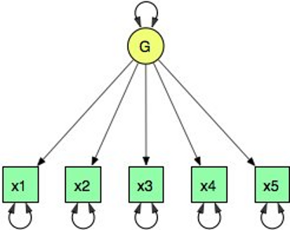

Beginners Guide to OpenMx
=========================

This document will walk the reader through the basic concepts used in the OpenMx library.  It will assume that you have successfully installed the R statistical programming language [http://www.r-project.org/] and the OpenMx library for R [http://openmx.psyc.virginia.edu].  Before we begin, let us start with a mini-lecture on the R programming language.  Our experience has found that this exercise will greatly increase your understanding of subsequent sections of the introduction.  Detailed introductions to R can be found on the internet.

The OpenMx scripts for the examples in this guide are available in the following files:

* http://openmx.psyc.virginia.edu/repoview/1/trunk/demo/OneFactorPathDemo.R
* http://openmx.psyc.virginia.edu/repoview/1/trunk/demo/OneFactorMatrixDemo.R

Pass By Value
-------------

.. code-block:: r
    :linenos:

    addone <- function(number) {
        number <- number + 1
        return(number)
    }

    avariable <- 5

    print(addone(avariable))
    print(avariable)

In the previous code block, the variables ``addone`` and ``avariable`` are defined. The value assigned to ``addone`` is a function, while the value assigned to ``avariable`` is the number 5.  The function ``addone`` takes a single argument, adds one to the argument, and returns the argument back to the user.  What is the result of executing this code block? Try it. The correct result is 6 and 5.  But why is the variable ``avariable`` still 5, even after the ``addone`` function was called? The answer to this question is that R uses pass-by-value function call semantics.

In order to understand pass-by-value semantics, we must understand the difference between *variables* and *values*. The *variables* declared in this example are ``addone``, ``avariable``, and ``number``.  The *values* refer to the things that are stored by the *variables*.  In programming languages that use pass-by-value semantics, at the beginning of a function call it is the *values* of the argument list that are passed to the function.  The variable ``avariable`` cannot be modified by the function ``addone``.  If I wanted to update the value stored in the variable, I would have needed to replace line 8 with the expression ``print(avariable <- addone(avariable))``.  Try it.  The updated example prints out 6 and 6.  The lesson from this exercise is that the only way to update a variable in a function call is to capture the result of the function call [#f1]_.  This lesson is sooo important that we'll repeat it:

* the only way to update a variable in a function call is to capture the result of the function call.

R has several built-in types of values that you are familiar with: numerics, integers, booleans, characters, lists, vectors, and matrices. In addition, R supports S4 object values to facilitate object-oriented programming.  Most of the functions in the OpenMx library return S4 object values.  You must always remember that R does not discriminate between built-in types and S4 object types in its call semantics.  Both built-in types and S4 object types are passed by value in R (unlike many other languages).

.. rubric:: Footnotes

.. [#f1] There are a few exceptions to this rule, but you can be assured such trickery is not used in the OpenMx library.

Path Model Specification
------------------------

Below is a figure of a one factor model with five indicators.  The script reads data from disk, creates the one factor model, fits the model to the observed covariances, and prints a summary of the results.  Let's break down what is happening in each section of this example.

.. code-block:: r
    :linenos:

	require(OpenMx)

	data(demoOneFactor)
    manifests <- names(demoOneFactor)
	latents <- c("G")

	factorModel <- mxModel("One Factor", 
	    type="RAM",
		manifestVars = manifests,
		latentVars = latents,
		mxPath(from=latents, to=manifests),
		mxPath(from=manifests, arrows=2),
		mxPath(from=latents, arrows=2, free=F, values=1.0),
		mxData(observed=cov(demoOneFactor), type="cov", numObs=500))

	summary(mxRun(factorModel))

This example uses a RAM-style specification technique. Let's break down what is happening in each section of this example.

Preamble
^^^^^^^^

Every OpenMx script must begin with either ``library(OpenMx)`` or ``require(OpenMx)``.  These commands will load the OpenMx library.

Reading Data
^^^^^^^^^^^^

The ``data`` function can be used to read sample data that has been pre-packaged into the R library.  In order to read your own data, you will most likely use the ``read.table``, ``read.csv``, ``read.delim`` functions, or other specialized functions available from CRAN to read from 3rd party sources.

Model Creation
^^^^^^^^^^^^^^

The ``mxModel`` function is used to create a model.  By specifying the ``type`` argument to equal 'RAM', we create a path style model. A RAM style model must include a vector of manifest variables (``manifestVars=``) and a vector for latent variables (``latentVars=``).  In this case the manifest variables are ``c("x1", "x2", "x3", "x4", "x5")`` and the latent variable is ``c("G")``.

Path Creation
^^^^^^^^^^^^^

Paths are created using the ``mxPath`` function. Multiple paths can be created with a single invocation of the ``mxPath`` function. The ``from`` argument specifies the path sources, and the ``to`` argument specifies the path sinks.  If the ``to`` argument is missing, then it is assumed to be identical to the 'from' argument. By default, the :math:`i^{th}` element of the 'from' argument is matched with the :math:`i^{th}` element of the 'to' argument, in order to create a path.  The ``arrows`` argument specifies whether the path is unidirectional (single-headed arrow, ``1``) or bidirectional (double-headed arrow, ``2``).  The next three arguments are vectors: ``free``, is a boolean vector that specifies whether a path is free or fixed; ``values`` is a numeric vector that specifies the starting value of the path; ``labels`` is a character vector that assigns a label to each free or fixed parameter.

Objective Function Creation
^^^^^^^^^^^^^^^^^^^^^^^^^^^

When using a path specification of the model, the objective function is ``RAM``. 

Data Source Creation
^^^^^^^^^^^^^^^^^^^^

A ``mxData`` function is used to construct a data source for the model. In this example, we are specifying a covariance matrix.  In addition to reading in the actual covariance matrix as the first (``observed``) argument, we specify the ``type`` and if required the number of observations (``numObs``).

Model Population
^^^^^^^^^^^^^^^^

The ``mxModel`` function is somewhat of a swiss-army knife.  The first argument to the ``mxModel`` function can be a ``name`` or previously defined model.  An ``mxModel`` can contain ``mxPath``, ``mxData``, ``mxObjective`` and other ``mxModel`` statements as arguments.

Model Execution
^^^^^^^^^^^^^^^^

The ``mxRun`` function will run a model through the optimizer.  The return value of this function is an identical model, with all the free parameters in the cells of the matrices of the model assigned to their final values.  The summary function is a convenient method for displaying the highlights of a model after it has been executed.

Matrix Model Specification
--------------------------

.. code-block:: r
    :linenos:

    require(OpenMx)

    data(demoOneFactor)

    factorModel <- mxModel(name = "One Factor")
        mxMatrix(type="Full", nrow=5, ncol=1, free=T, values=0.2, name="A")
        mxMatrix(type="Symm", nrow=1, ncol=1, free=T, values=1, name="L")
        mxMatrix(type="Diag", nrow=5, ncol=5, free=T, values=1, name="U")
        mxAlgebra(expression=A %*% L %*% t(A) + U, name="R")
        mxMLObjective(covariance="R", dimnames = names(demoOneFactor))
        mxData(observed=cov(demoOneFactor), type="cov", numObs=500)
    
    factorModelFit <- mxRun(factorModel)
    summary(factorModelFit)

We will now re-create the model from the previous section, but this time we will use a matrix specification technique. The script reads data from disk, creates the one factor model, fits the model to the observed covariances, and prints a summary of the results.  Let's break down what is happening in each section of this example.

Preamble
^^^^^^^^

Every OpenMx script must begin with either ``library(OpenMx)`` or ``require(OpenMx)``.  These commands will load the OpenMx library.

Reading Data
^^^^^^^^^^^^

The ``data`` function can be used to read sample data that has been pre-packaged into the R library.  In order to read your own data, you will most likely use the ``read.table``, ``read.csv``, ``read.delim`` functions, or other specialized functions available from CRAN to read from 3rd party sources.

Model Creation
^^^^^^^^^^^^^^

The basic unit of abstraction in the OpenMx library is the model.  A model serves as a container for a collection of matrices, algebras, objective functions, data sources, and nested sub-models.  In the parlance of R, a model is a value that belongs to the class MxModel that has been defined by the OpenMx library.  The following table indicates what classes are defined by the OpenMx library.

+--------------------+---------------------+
| entity             | S4 class            |
+====================+=====================+
| model              | MxModel             | 
+--------------------+---------------------+
| algebra            | MxAlgebra           |
+--------------------+---------------------+
| objective function | MxObjectiveFunction |
+--------------------+---------------------+
| constraint         | MxConstraint        |
+--------------------+---------------------+
| data source        | MxData              |
+--------------------+---------------------+

All of the entities listed in the table are identified by the OpenMx library by the name assigned to them.  A name is any character string that does not contain the "." character.  In the parlance of the OpenMx library, a model is a container of named entities.  The name of an OpenMx entity bears no relation to the R variable that is used to identify the entity. In our example, the variable ``factorModel`` is created with the ``mxModel`` function and stores a value that is a "MxModel" object with the name ``One Factor``.

Matrix Creation
^^^^^^^^^^^^^^^

The next three lines create three "MxMatrix" objects, using the ``mxMatrix`` function.  The first argument declares the ``type`` of the matrix, the second argument declares the number of rows in the matrix (``nrow``), and the third argument declares the number of columns (``ncol``).  The ``free`` argument specifies whether a cell is a free or fixed parameter.  The ``values`` argument specifies the starting values in the matrix. and the ``name`` argument specifies the name of the matrix. 

Each "MxMatrix" object is a container that stores five matrices of equal dimensions.  The five matrices stored in a "MxMatrix" object are: 'values, 'free', 'labels', 'lbound', and 'ubound'.  'Values' stores the current values of each cell in the matrix.  'Free' stores a boolean that determines whether a cell is free or fixed.  'Labels' stores a character label for each cell in the matrix. And 'lbound' and 'ubound' store the lower and upper bounds, respectively, for each cell that is a free parameter.  If a cell has no label, lower bound, or upper bound, then an NA value is stored in the cell of the respective matrix.

Algebra Creation
^^^^^^^^^^^^^^^^

An ``mxAlgebra`` function is used to construct an expression for the expected covariance algebra.  The first argument is the algebra expression that will be evaluated by the numerical optimizer.  The matrix operations and functions that are permitted in an MxAlgebra expression are listed in the help for the mxAlgebra function (``?mxAlgebra``).  The algebra expression refers to entities according to their names.

Objective Function Creation
^^^^^^^^^^^^^^^^^^^^^^^^^^^

``MxObjective`` constructs an objective function for the model.  For this example, we are using a maximum likelihood objective function and specifying an expected covariance algebra and omitting an expected means algebra. The expected covariance algebra is referenced according to its name.  The objective function for a particular model is given the name "objective".  Consequently there is no need to specify a name for objective function objects. We need to assign ``dimnames`` for the rows and columns of the covariance matrix, such that a correspondence can be determined between the expected covariance matrix and the observed covariance matrix.

Data Source Creation
^^^^^^^^^^^^^^^^^^^^
An ``mxData`` function provides a data source for the model. In this example, we are specifying a covariance matrix. The data source for a particular model is given the name "data". Consequently there is no need to specify a name for data objects.

Model Population
^^^^^^^^^^^^^^^^

The mxModel function is somewhat of a swiss-army knife.  If the first argument to the ``mxModel`` function is an existing model, then the result of the function call is a new model with the remaining arguments to the function call added or removed from the model (depending on the 'remove' argument, which defaults to FALSE).  Alternatively, we can give it a ``name`` and populate the model with three matrices, an algebra, an objective function, and a data source, which are all arguments of the ``mxModel``.  

Model Execution
^^^^^^^^^^^^^^^^

The ``mxRun`` function will run a model through the optimizer.  The return value of this function is an identical model, with all the free parameters in the cells of the matrices of the model assigned to their final values.  The summary function is a convenient method for displaying the highlights of a model after it has been executed.

Alternative Formulation
^^^^^^^^^^^^^^^^^^^^^^^

Rather than adding the paths/matrices/algebras, objective function and data as arguments to the ``mxModel``, which we will use primarily throughout the documentation, we can also create separate objects for each of the parts of the model, which can then be combined in an mxModel statement at the end.  To repeat ourselves, the name of an OpenMx entity bears no relation to the R variable that is used to identify the entity. In our example, the variable ``matrixA`` stores a value that is a MxMatrix object with the name “A”.
 
.. code-block:: r
    :linenos:

    require(OpenMx)

    data(demoOneFactor)

    factorModel <- mxModel(name = "One Factor")

    matrixA <-  mxMatrix(type="Full", nrow=5, ncol=1, free=T, values=0.2, name="A")
    matrixL <-  mxMatrix(type="Symm", nrow=1, ncol=1, free=T, values=1, name="L")
    matrixU <-  mxMatrix(type="Diag", nrow=5, ncol=5, free=T, values=1, name="U")

    algebraR <- mxAlgebra(expression=A %*% L %*% t(A) + U, name="R")

    objective <- mxMLObjective(covariance="R", dimnames = names(demoOneFactor))
    data <- mxData(observed=cov(demoOneFactor), type="cov", numObs=500)

    factorModel <- mxModel(factorModel, matrixA, matrixL, matrixU, algebraR, objective, data)
    
    factorModelFit <- mxRun(factorModel)
    summary(factorModelFit)

Note that lines 5 and 17 could have been combined with the following call: ``factorModel <- mxModel(matrixA, matrixL, matrixU, algebraR, objective, data, name = "One Factor")``.
