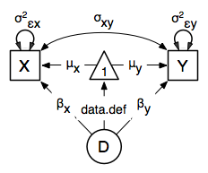

    .. _definitionmeans-path-specification:

Definition Variables, Path Specification
========================================

This example will demonstrate the use of OpenMx definition variables with the analysis of a simple two group dataset.  What are definition variables?  Essentially, definition variables can be thought of as observed variables that are used to change the statistical model on an individual case basis.  In essence, it is as though one or more variables in the raw data vectors are used to specify the statistical model for that individual.  Many different types of statistical model can be specified in this fashion; some  are readily specified in standard fashion, and some cannot.  To illustrate, we implement a two-group model.  The groups differ in their means but not in their variances and covariances.  This situation could easily be modeled in a regular multiple group fashion - it is only implemented using definition variables to illustrate their use.  The results are verified using summary statistics and an Mx 1.0 script for comparison is also available.

Mean Differences
----------------

The example shows the use of definition variables to test for mean differences. It is available in the following file:

* http://openmx.psyc.virginia.edu/svn/trunk/demo/DefinitionMeans_PathRaw.R

A parallel version of this example, using matrix specification of models rather than paths, can be found here:

* http://openmx.psyc.virginia.edu/svn/trunk/demo/DefinitionMeans_MatrixRaw.R

Statistical Model
^^^^^^^^^^^^^^^^^

Algebraically, we are going to fit the following model to the observed *x* and *y* variables:

.. math::
   :nowrap:
   
   \begin{eqnarray*} 
   x_{i} = \mu_{x} + \beta_x * def + \epsilon_{xi}\\
   y_{i} = \mu_{y} + \beta_y * def + \epsilon_{yi}
   \end{eqnarray*}

where :math:`def` is the definition variable.  The residual sources of variance, :math:`\epsilon_{xi}` and :math:`\epsilon_{yi}` covary to the extent :math:`\sigma_{xy}`.  So, the task is to estimate: the two means :math:`\mu_{x}` and :math:`\mu_{y}`; the deviations from these means due to belonging to the group identified by having :math:`def` set to 1 (as opposed to zero), :math:`\beta_{x}` and :math:`\beta_{y}`; and the parameters of the variance covariance matrix: cov(:math:`\epsilon_{x},\epsilon_{y}`).

Our task is to implement the model shown in the figure below:

Data Simulation
^^^^^^^^^^^^^^^

Our first step to running this model is to simulate the data to be analyzed. Each individual is measured on two observed variables, *x* and *y*, and a third variable *def* which denotes their group membership with a 1 or a 0.  These values for group membership are not accidental, and must be adhered to in order to obtain readily interpretable results.  Other values such as 1 and 2 would yield the same model fit, but would make the interpretation more difficult.  

.. cssclass:: input
..

.. code-block:: r

    library(MASS)    # to get hold of mvrnorm function 
    set.seed(200)    # to make the simulation repeatable
    N              <- 500    # sample size, per group
    Sigma          <- matrix(c(1,.5,.5,1),2,2)
    group1         <- mvrnorm(N, c(1,2), Sigma) # Use mvrnorm from MASS package
    group2         <- mvrnorm(N, c(0,0), Sigma)

We make use of the superb R function ``mvrnorm`` in order to simulate N=500 records of data for each group.  These observations correlate 0.5 and have a variance of 1, per the matrix *Sigma*.  The means of *x* and *y* in group 1 are 1.0 and 2.0, respectively; those in group 2 are both zero.  The output of the ``mvrnorm`` function calls are matrices with 500 rows and 2 columns, which are stored in group 1 and group 2.  Now we create the definition variable

.. cssclass:: input
..

.. code-block:: r

    # Put the two groups together, create a definition variable, 
    # and make a list of which variables are to be analyzed (selVars)
    xy             <- rbind(group1,group2)      # Bind groups together by rows
    dimnames(xy)[2]<- list(c("x","y"))          # Add names
    def            <- rep(c(1,0),each=N);       # Add def var [2n] for group status
    selVars        <- c("x","y")                # Make selection variables object

The objects *xy* and *def* might be combined in a data frame.  However, in this case we won't bother to do it externally, and simply paste them together in the ``mxData`` function call.

Model Specification
^^^^^^^^^^^^^^^^^^^

The following code contains all of the components of our model.  Before specifying a model, the OpenMx library must be loaded into R using either the ``require()`` or ``library()`` function. This code uses the ``mxModel`` function to create an MxModel object, which we'll then run.  Note that all the objects required for estimation (data, matrices, an expectation function, and a fit function) are declared within the ``mxModel`` function.  This type of code structure is recommended for OpenMx scripts generally.

.. cssclass:: input
..

.. code-block:: r

    dataRaw      <- mxData( observed=data.frame(xy,def), type="raw" )
    # variances
    variances    <- mxPath( from=c("x","y"), arrows=2, 
                            free=TRUE, values=1, labels=c("Varx","Vary") )
    # covariances
    covariances  <- mxPath( from="x", to="y", arrows=2, 
                            free=TRUE, values=.1, labels=c("Covxy") )
    # means
    means        <- mxPath( from="one", to=c("x","y"), arrows=1, 
                            free=TRUE, values=1, labels=c("meanx","meany") )
    # definition value
    defValues    <- mxPath( from="one", to="DefDummy", arrows=1, 
                            free=FALSE, values=1, labels="data.def" )
    # beta weights
    betaWeights  <- mxPath( from="DefDummy", to=c("x","y"), arrows=1, 
                            free=TRUE, values=1, labels=c("beta_1","beta_2") )

    defMeansModel <- mxModel("Definition Means Path Specification", type="RAM",
                             manifestVars=selVars, latentVars="DefDummy",
                             dataRaw, variances, covariances, means, 
                             defValues, betaWeights)

The first argument in an ``mxModel`` function has a special function. If an object or variable containing an ``MxModel`` object is placed here, then ``mxModel`` adds to or removes pieces from that model. If a character string (as indicated by double quotes) is placed first, then that becomes the name of the model. Models may also be named by including a ``name`` argument. This model is named ``"Definition Means Path Specification"``.  The second argument of the ``mxModel`` function call declares that we are going to be using RAM specification of the model, using directional and bidirectional path coefficients between the variables.  Model specification is carried out using two lists of variables, ``manifestVars`` and ``latentVars``.

.. cssclass:: input
..

.. code-block:: r

    manifestVars=c("x","y")
    latentVars="DefDummy"

Next, we declare where the data are, and their type, by creating an MxData object with the ``mxData`` function. This code first references the object where our data are, then uses the ``type`` argument to specify that this is raw data. Analyses using definition variables have to use raw data, so that the model can be specified on an individual data vector level.

.. cssclass:: input
..

.. code-block:: r

    dataRaw      <- mxData( observed=data.frame(xy,def), type="raw" )

Then ``mxPath`` functions are used to specify paths between the manifest and latent variables. In the present case, we need four mxPath commands to specify the model.  The first is for the variances of the *x* and *y* variables, and the second specifies their covariance.  The third specifies a path from the mean vector, always known by the special keyword ``one``, to each of the observed variables, and to the single latent variable ``DefDummy``.  This last path is specified to contain the definition variable, by virtue of the ``data.def`` label.  Definition variables are part of the data so the first part is always ``data.``.  The second part refers to the actual variable in the dataset whose values are modeled.  Finally, two paths are specified from the ``DefDummy`` latent variable to the observed variables.  These parameters estimate the deviation of the mean of those with a ``data.def`` value of 1 versus those with ``data.def`` values of zero.

.. cssclass:: input
..

.. code-block:: r

    # variances
    variances    <- mxPath( from=c("x","y"), arrows=2, 
                            free=TRUE, values=1, labels=c("Varx","Vary") )
    # covariances
    covariances  <- mxPath( from="x", to="y", arrows=2, 
                            free=TRUE, values=.1, labels=c("Covxy") )
    # means
    means        <- mxPath( from="one", to=c("x","y"), arrows=1, 
                            free=TRUE, values=1, labels=c("meanx","meany") )
    # definition value
    defValues    <- mxPath( from="one", to="DefDummy", arrows=1, 
                            free=FALSE, values=1, labels="data.def" )
    # beta weights
    betaWeights  <- mxPath( from="DefDummy", to=c("x","y"), arrows=1, 
                            free=TRUE, values=1, labels=c("beta_1","beta_2") )

We can then run the model and examine the output with a few simple commands.

Model Fitting
^^^^^^^^^^^^^^

.. cssclass:: input
..

.. code-block:: r

    # Run the model
    defMeansFit<-mxRun(defMeansModel)

    defMeansFit$matrices

The R object *defmeansFit* contains matrices and algebras; here we are interested in the matrices, which can be seen with the ``defmeansFit$matrices`` entry.  In path notation, the unidirectional, one-headed arrows appear in the matrix **A**, the two-headed arrows in **S**, and the mean vector single headed arrows in **M**.

.. cssclass:: input
..

.. code-block:: r

    # Compare OpenMx estimates to summary statistics from raw data, 
    # remembering to knock off 1 and 2 from group 1's data
    # so as to estimate variance of combined sample without 
    # the mean difference contributing to the variance estimate.
 
    # First compute some summary statistics from data
    ObsCovs <- cov(rbind(group1 - rep(c(1,2), each=N), group2))
    ObsMeansGroup1 <- c(mean(group1[,1]), mean(group1[,2]))
    ObsMeansGroup2 <- c(mean(group2[,1]), mean(group2[,2]))

    # Second extract parameter estimates and matrix algebra results from model
    Sigma <- mxEval(S[1:2,1:2], defMeansFit)
    Mu <- mxEval(M[1:2], defMeansFit)
    beta <- mxEval(A[1:2,3], defMeansFit)

    # Third, check to see if things are more or less equal
    omxCheckCloseEnough(ObsCovs,Sigma,.01)
    omxCheckCloseEnough(ObsMeansGroup1,as.vector(Mu+beta),.001)
    omxCheckCloseEnough(ObsMeansGroup2,as.vector(Mu),.001)

These models may also be specified using matrices instead of paths. See :ref:`definitionmeans-matrix-specification` for matrix specification of these models.
