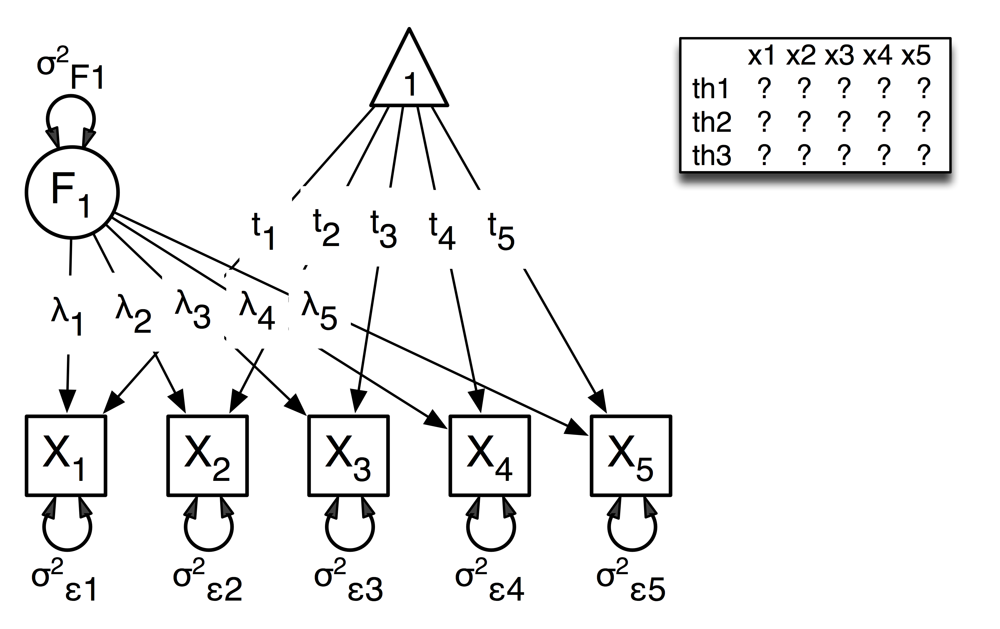

.. _factoranalysisordinal-matrix-specification:

Factor Analysis Ordinal, Matrix Specification
=============================================

This example builds on the 'Factor Analysis, Matrix Specification' example, and extends it to the ordinal case.  We will discuss a common factor model with several indicators.  This example can be found in the following files:

* http://openmx.psyc.virginia.edu/repoview/1/trunk/demo/OneFactorModelOrdinal_MatrixRaw.R
* http://openmx.psyc.virginia.edu/repoview/1/trunk/demo/OneFactorModelOrdinal01_MatrixRaw.R

Common Factor Model
-------------------

The common factor model is a method for modeling the relationships between observed variables believed to measure or indicate the same latent variable. While there are a number of exploratory approaches to extracting latent factor(s), this example uses structural modeling to fit a confirmatory factor model. The model for any person and path diagram of the common factor model for a set of variables :math:`x_{1}` - :math:`x_{5}` are given below.

.. math::
   :nowrap:
   
   \begin{eqnarray*} 
   x_{ij} = \mu_{j} + \lambda_{j} * \eta_{i} + \epsilon_{ij}
   \end{eqnarray*}

The path diagram above displays 16 parameters (represented in the arrows: 5 manifest variances, five manifest means, five factor loadings and one factor variance).  However, given we are dealing with ordinal data in this example, we are estimating thresholds rather than means, with nThresholds being one less the number of categories in the variables, here 3. Furthermore, we must constrain either the factor variance or one factor loading to a constant to identify the model and scale the latent variable.  In this instance, we chose to constrain the variance of the factor.  We also need to constrain the total variances of the manifest variables, as ordinal variables do not have a scale of measurement.  As such, this model contains 20 free parameters and is not fully saturated. 

Data
^^^^

Our first step to running this model is to include the data to be analyzed. The data for this example were simulated in R.  Given the focus of this documentation is on OpenMx, we will not discuss the details of the simulation here, but we do provide the code so that the user can simulate data in a similar way.

.. code-block:: r

    # Step 1: set up simulation parameters 
    # Note: nVariables>=5, nThresholds>=1, nSubjects>=nVariables x nThresholds
    # (maybe more) and model should be identified
    
    nVariables<-5
    nFactors<-1
    nThresholds<-3
    nSubjects<-500
    isIdentified <- function(nVariables,nFactors) 
        as.logical(1+sign((nVariables*(nVariables-1)/2) 
        - nVariables*nFactors + nFactors*(nFactors-1)/2))
    # if this function returns FALSE then model is not identified, otherwise it is.
    isIdentified(nVariables,nFactors)

    loadings <- matrix(.7,nrow=nVariables,ncol=nFactors)
    residuals <- 1 - (loadings * loadings)
    sigma <- loadings %*% t(loadings) + vec2diag(residuals)
    mu <- matrix(0,nrow=nVariables,ncol=1)
    
    # Step 2: simulate multivariate normal data

    set.seed(1234)
    continuousData <- mvrnorm(n=nSubjects,mu,sigma)

    # Step 3: chop continuous variables into ordinal data 
    # with nThresholds+1 approximately equal categories, based on 1st variable

    quants<-quantile(continuousData[,1],  probs = c((1:nThresholds)/(nThresholds+1)))
    ordinalData<-matrix(0,nrow=nSubjects,ncol=nVariables)
    for(i in 1:nVariables)
    {
    ordinalData[,i] <- cut(as.vector(continuousData[,i]),c(-Inf,quants,Inf))
    }

    # Step 4: make the ordinal variables into R factors

    ordinalData <- mxFactor(as.data.frame(ordinalData),levels=c(1:(nThresholds+1)))

    # Step 5: name the variables

    fruitynames<-paste("banana",1:nVariables,sep="")
    names(ordinalData)<-fruitynames
    

Model Specification
^^^^^^^^^^^^^^^^^^^

The following code contains all of the components of our model. Before running a model, the OpenMx library must be loaded into R using either the ``require()`` or ``library()`` function. All objects required for estimation (data, matrices, and an objective function) are included in their functions. This code uses the ``mxModel`` function to create an ``MxModel`` object, which we will then run.  We pre-specify a number of 'variables', namely the number of variables analyzed ``nVariables``, in this case 5, the number of factors ``nFactors``, here one, and the number of thresholds ``nthresholds``, here 3 or one less than the number of categories in the simulated ordinal variable.

.. code-block:: r

    oneFactorThresholdModel <- mxModel("oneFactorThresholdModel",
        mxMatrix(
            type="Full", 
            nrow=nVariables, 
            ncol=nFactors, 
            free=TRUE, 
            values=0.2, 
            lbound=-.99, 
            ubound=.99, 
            name="facLoadings"
        ),
        mxMatrix(
            type="Unit", 
            nrow=nVariables, 
            ncol=1, 
            name="vectorofOnes"
        ),
        mxAlgebra(
            expression=vectorofOnes - (diag2vec(facLoadings %*% t(facLoadings))) , 
            name="resVariances"
        ),
        mxAlgebra(
            expression=facLoadings %*% t(facLoadings) + vec2diag(resVariances), 
            name="expCovariances"
        ),
        mxMatrix(
            type="Zero", 
            nrow=1, 
            ncol=nVariables, 
            name="expMeans"
        ),
        mxMatrix(
            type="Full", 
            nrow=nThresholds, 
            ncol=nVariables,
            free=TRUE, 
            values=.2,
            lbound=rep( c(-Inf,rep(.01,(nThresholds-1))) , nVariables),
            dimnames=list(c(), fruitynames),
            name="thresholdDeviations"
        ),
        mxMatrix(
            type="Lower",
            nrow=nThresholds,
            ncol=nThresholds,
            free=FALSE,
            values=1,
            name="unitLower"
        ),
        mxAlgebra(
            expression=unitLower %*% thresholdDeviations, 
            name="expThresholds"
        ),
        mxData(
            observed=ordinalData, 
            type='raw'
        ),
        mxFIMLObjective(
            covariance="expCovariances", 
            means="expMeans", 
            dimnames=fruitynames, 
            thresholds="expThresholds"
        )
    )

This ``mxModel`` function can be split into several parts. First, we give the model a name "Common Factor ThresholdModel Matrix Specification".

The second component of our code creates an ``MxData`` object. The example above, reproduced here, first references the object where our data is, then uses the ``type`` argument to specify that this is raw data.

.. code-block:: r

    mxData(
        observed=ordinalData, 
        type="raw"
    )

The first ``mxMatrix`` statement declares a ``Full`` **nVariables x nFactors** matrix of factor loadings to be estimated, called "facLoadings", where the rows represent the dependent variables and the column(s) represent the independent variable(s).  The common factor model requires that one parameter (typically either a factor loading or factor variance) be constrained to a constant value. In our model, we will constrain the factor variance to 1 for identification, and let all the factor loadings be freely estimated.  Even though we specify just one start value of 0.2, it is recycled for each of the elements in the matrix.  Given the factor variance is fixed to one, and the variances of the observed variables are fixed to one (see below), the factor loadings are standarized, and thus must lie between -.99 and .99 as indicated by the ``lbound`` and ``ubound`` values.

.. code-block:: r

    # factor loadings
    mxMatrix(
        type="Full", 
        nrow=nVariables, 
        ncol=nFactors, 
        free=TRUE, 
        values=0.2, 
        lbound=-.99, 
        ubound=.99, 
        name="facLoadings"
    )

Note that if ``nFactors>1``, we could add  a ``standardized`` ``mxMatrix`` to estimate the correlation between the factors.  Such a matrix automatically has 1's on the diagonal, fixing the factor variances to one and thus allowing all the factor loadings to be estimated.  In the current example, all the factor loadings are estimated which implies that the factor variance is fixed to 1.  Alternatively, we could add a ``symmetric`` **1x1** ``mxMatrix`` to estimates the variance of the factor, when one of the factor loadings is fixed.

As our data are ordinal, we further need to constrain the variances of the observed variables to unity.  These variances are made up of the contributions of the latent common factor and the residual variances.  The amount of variance explained by the common factor is obtained by squaring the factor loadings.  We subtract the squared factor loadings from 1 to get the amount explained by the residual variance, thereby implicitly fixing the variances of the observed variables to 1.  To do this for all variables simultaneously, we use matrix algebra functions.  We first specify a vector of One's by declaring a ``Unit`` **nVariables x 1** matrix called ``vectorofOnes``.  We need to subtract the squared factor loadings which are on the diagonal of the matrix multiplication of the factor loading matrix ``facLoadings`` and its transpose.  To extract those into squared factor loadings into a vector, we use the ``diag2vec`` function.  This new vector is subtracted from the ``vectorofOnes`` using an ``mxAlgebra`` statement to generate the residual variances, and named ``resVariances``.

.. code-block:: r

    mxMatrix(
        type="Unit", 
        nrow=nVariables, 
        ncol=1, 
        name="vectorofOnes"
    )
    # residuals
    mxAlgebra(
        expression=vectorofOnes - (diag2vec(facLoadings %*% t(facLoadings))) , 
        name="resVariances"
    )

We then use the reverse function ``vec2diag`` to put the residual variances on the diagonal and add the contributions through the common factor from the matrix multipication of the factor loadings matrix and its transpose to obtain the formula for the expected covariances, aptly named ``expCovariances``.

.. code-block:: r

    mxAlgebra(
        expression=facLoadings %*% t(facLoadings) + vec2diag(resVariances), 
        name="expCovariances"
    )
    
When fitting to ordinal rather than continuous data, we estimate thresholds rather than means.  The matrix of thresholds is of size **nThresholds x nVariables** where ``nThresholds`` is one less than the number of categories for the ordinal variable(s).  We still specify a matrix of means, however, it is fixed to zero.  An alternative approach is to fix the first two thresholds (to zero and one, see below), which allows us to estimate means and variances in a similar way to fitting to continuous data.  Let's first specify the model with zero means and free thresholds.

The means are specified as a ``Zero`` **1 x nVariables** matrix, called "expMeans".  A means matrix always contains a single row, and one column for every manifest variable in the model.

.. code-block:: r

    # expected means
    mxMatrix(
        type="Zero", 
        nrow=1, 
        ncol=nVariables, 
        name="expMeans"
    )
    
The mean of the factor(s) is also fixed to 1, which is implied by not including a matrix for it.  Alternatively, we could explicitly add a ``Full`` **1 x nFactors** ``mxMatrix`` with a fixed value of zero for the factor mean(s), named "facMeans".  

We estimate the ``Full`` **nThresholds x nVariables** matrix.  To make sure that the thresholds systematically increase from the lowest to the highest, we estimate the first threshold and the increments compared to the previous threshold by constraining the increments to be positive.  This is accomplished through some R algebra, concatenating `minus infinity` and (nThreshold-1) times .01 as the lower bound for the remaining estimates.  This matrix of ``thresholdDeviations`` is then pre-multiplied by a ``lower`` triangular matrix of ones of size **nThresholds x nThresholds**  to obtain the expected thresholds in increasing order in the ``thresholdMatrix``.

.. code-block:: r

    mxMatrix(
         type="Full", 
         nrow=nThresholds, 
         ncol=nVariables,
         free=TRUE, 
         values=.2,
         lbound=rep( c(-Inf,rep(.01,(nThresholds-1))) , nVariables),
         dimnames=list(c(), fruitynames),
         name="thresholdDeviations"
     )
     mxMatrix(
         type="Lower",
         nrow=nThresholds,
         ncol=nThresholds,
         free=FALSE,
         values=1,
         name="unitLower"
     )
     # expected thresholds
     mxAlgebra(
         expression=unitLower %*% thresholdDeviations, 
         name="expThresholds"
     )

The final part of this model is the objective function.  The choice of fit function determines the required arguments.  Here we fit to raw ordinal data, thus we specify the matrices for the expected covariance matrix of the data, as well as the expected means and thresholds previously specified.  We use ``dimnames`` to map the model for means, thresholds and covariances onto the observed variables.

.. code-block:: r

    mxFIMLObjective(
        covariance="expCovariances", 
        means="expMeans", 
        dimnames=fruitynames, 
        thresholds="expThresholds"
    )

The free parameters in the model can then be estimated using full information maximum likelihood (FIML) for covariances, means and thresholds.  To do so, the model is run using the ``mxRun`` function, and the output of the model can be accessed from the ``@output`` slot of the resulting model.  A summary of the output can be reached using ``summary()``.

.. code-block:: r

    oneFactorFit <- mxRun(oneFactorThresholdModel)

    oneFactorFit@output

    summary(oneFactorFit)
    
As indicate above, the model can be re-parameterized such that means and variances of the observed variables are estimated similar to the continuous case, by fixing the first two thresholds.  This basically rescales the parameters of the model.  Below is the full script:

.. code-block:: r

    oneFactorThresholdModel01 <- mxModel("oneFactorThresholdModel01",
        mxMatrix(
            type="Full", 
            nrow=nVariables, 
            ncol=nFactors, 
            free=TRUE, 
            values=0.2, 
            lbound=-.99, 
            ubound=2, 
            name="facLoadings"
        ),
        mxMatrix(
            type="Diag", 
            nrow=nVariables, 
            ncol=nVariables,
            free=TRUE,
            values=0.9,
            name="resVariances"
        ),
        mxAlgebra(
            expression=facLoadings %*% t(facLoadings) + resVariances, 
            name="expCovariances"
        ),
        mxMatrix(
            type="Full", 
            nrow=1, 
            ncol=nVariables,
            free=TRUE,
            name="expMeans"
        ),
        mxMatrix(
            type="Full", 
            nrow=nThresholds, 
            ncol=nVariables,
            free=rep( c(F,F,rep(T,(nThresholds-2))), nVariables), 
            values=rep( c(0,1,rep(.2,(nThresholds-2))), nVariables),
            lbound=rep( c(-Inf,rep(.01,(nThresholds-1))), nVariables),
            dimnames=list(c(), fruitynames),
            name="thresholdDeviations"
        ),
        mxMatrix(
            type="Lower",
            nrow=nThresholds,
            ncol=nThresholds,
            free=FALSE,
            values=1,
            name="unitLower"
        ),
        mxAlgebra(
            expression=unitLower %*% thresholdDeviations, 
            name="expThresholds"
        ),
        mxMatrix(
            type="Unit",
            nrow=nThresholds,
            ncol=1,
            name="columnofOnes"
        ),
        mxAlgebra(
            expression=expMeans %x% columnofOnes,
            name="meansMatrix"
        ),
        mxAlgebra(
            expression=sqrt(t(diag2vec(expCovariances))) %x% columnofOnes,
            name="variancesMatrix"
        ),
        mxAlgebra(
            expression=(expThresholds - meansMatrix) / variancesMatrix,
            name="thresholdMatrix"
        ),
        mxMatrix( 
            type="Iden", 
            nrow=nVariables, 
            ncol=nVariables, 
            name="Identity"
        ),
        mxAlgebra(
            expression=solve(sqrt(Identity * expCovariances)) %*% facLoadings,
            name="standFacLoadings"
        ),
        mxData(
            observed=ordinalData, 
            type='raw'
        ),
        mxFIMLObjective(
            covariance="expCovariances", 
            means="expMeans", 
            dimnames=fruitynames, 
            thresholds="expThresholds"
        )
    )

We will only highlight the changes from the previous model specification.  By fixing the first and second threshold to 0 and 1 respectively for each variable, we are now able to estimate a mean and a variance for each variable instead.  If we are estimating the variances of the observed variables, the factor loadings are no longer standardized, thus we relax the upper boundary on the factor loading matrix ``facLoadings`` to be 2.  The residual variances are now directly estimated as a ``Diagonal`` matrix of size ``nVariables x nVariables``, and given a start value higher than that for the factor loadings.  As the residual variances are already on the diagonal of the ``resVariances`` matrix, we no longer need to add the ``vec2diag`` function to obtain the ``expCovariances`` matrix.

.. code-block:: r

    mxMatrix(
        type="Full", 
        nrow=nVariables, 
        ncol=nFactors, 
        free=TRUE, 
        values=0.2, 
        lbound=-.99, 
        ubound=2, 
        name="facLoadings"
    )
    mxMatrix(
        type="Diag", 
        nrow=nVariables, 
        ncol=nVariables,
        free=TRUE,
        values=0.9,
        name="resVariances"
    )
    mxAlgebra(
        expression=facLoadings %*% t(facLoadings) + resVariances, 
        name="expCovariances"
    )
    
Next, we now estimate the means for the observed variables and thus change the ``expMeans`` matrix to a ``Full`` matrix, and set it free.  The most complicated change happens to the matrix of ``thresholdDeviations``.  Its type and dimensions stay the same.  However, we now fix the first two thresholds, but allow the remainder of the thresholds (in this case, just one) to be estimated.  We use the R ``rep`` function to make this happen.  The ``values`` statement now has the fixed value of 0 for the first threshold, the fixed value of 1 for the second threshold, and the start value of .2 for the remaining threshold(s).  Finally, no change is required for the ``lbound`` matrix, which is still necessary to keep the estimated increments (third threshold and possible more) positive.

.. code-block:: r

    mxMatrix(
        type="Full", 
        nrow=1, 
        ncol=nVariables,
        free=TRUE,
        name="expMeans"
    )
    mxMatrix(
        type="Full", 
        nrow=nThresholds, 
        ncol=nVariables,
        free=rep( c(F,F,rep(T,(nThresholds-2))), nVariables), 
        values=rep( c(0,1,rep(.2,(nThresholds-2))), nVariables),
        lbound=rep( c(-Inf,rep(.01,(nThresholds-1))), nVariables),
        dimnames=list(c(), fruitynames),
        name="thresholdDeviations"
    )

These are all the changes required to fit the alternative specification, which should give the same likelihood and goodness-of-fit statistics as the original one.  We have added some matrices and algebra to calculate the 'standardized' thresholds and factor loadings which should be equal to those obtained with the original specification.  To standardize the thresholds, the respective mean is subtracted from the thresholds, by expanding the means matrix to the same size as the threshold matrix.  The result is divided by the corresponding standard deviation.  To standardize the factor loadings, they are pre-multiplied by the inverse of the standard deviations.
 
.. code-block:: r
    
    mxMatrix(
        type="Unit",
        nrow=nThresholds,
        ncol=1,
        name="columnofOnes"
    )
    mxAlgebra(
        expression=expMeans %x% columnofOnes,
        name="meansMatrix"
    )
    mxAlgebra(
        expression=sqrt(t(diag2vec(expCovariances))) %x% columnofOnes,
        name="variancesMatrix"
    )
    mxAlgebra(
        expression=(expThresholds - meansMatrix) / variancesMatrix,
        name="thresholdMatrix"
    )
    mxMatrix( 
        type="Iden", 
        nrow=nVariables, 
        ncol=nVariables, 
        name="Identity"
    )
    mxAlgebra(
        expression=solve(sqrt(Identity * expCovariances)) %*% facLoadings,
        name="facLoadingsMatrix"
    )
    
