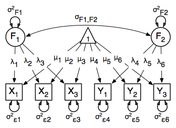

.. _factoranalysis-matrix-specification:

Factor Analysis, Matrix Specification
=====================================

This example will demonstrate latent variable modeling via the common factor model using RAM matrices for model specification. We'll walk through two applications of this approach: one with a single latent variable, and one with two latent variables. As with previous examples, these two applications are split into four files, with each application represented separately with raw and covariance data. These examples can be found in the following files:

* http://openmx.psyc.virginia.edu/repoview/1/trunk/demo/OneFactorModel_MatrixCov.R
* http://openmx.psyc.virginia.edu/repoview/1/trunk/demo/OneFactorModel_MatrixRaw.R
* http://openmx.psyc.virginia.edu/repoview/1/trunk/demo/TwoFactorModel_MatrixCov.R
* http://openmx.psyc.virginia.edu/repoview/1/trunk/demo/TwoFactorModel_MatrixRaw.R

Parallel versions of this example, using path-centric specification of models rather than paths, can be found here:

* http://openmx.psyc.virginia.edu/repoview/1/trunk/demo/OneFactorModel_PathCov.R
* http://openmx.psyc.virginia.edu/repoview/1/trunk/demo/OneFactorModel_PathRaw.R
* http://openmx.psyc.virginia.edu/repoview/1/trunk/demo/TwoFactorModel_PathCov.R
* http://openmx.psyc.virginia.edu/repoview/1/trunk/demo/TwoFactorModel_PathRaws.R

Common Factor Model
-------------------

The common factor model is a method for modeling the relationships between observed variables believed to measure or indicate the same latent variable. While there are a number of exploratory approaches to extracting latent factor(s), this example uses structural modeling to fit confirmatory factor models. The model for any person and path diagram of the common factor model for a set of variables :math:`x_{1}` - :math:`x_{6}` are given below.

.. math::
   :nowrap:
   
   \begin{eqnarray*} 
   x_{ij} = \mu_{j} + \lambda_{j} * \eta_{i} + \epsilon_{ij}
   \end{eqnarray*}

.. image:: graph/OneFactorModel.png
    :height: 2in

While 19 parameters are displayed in the equation and path diagram above (6 manifest variances, six manifest means, six factor loadings and one factor variance), we must constrain either the factor variance or one factor loading to a constant to identify the model and scale the latent variable. As such, this model contains 18 parameters. Unlike the manifest variable examples we've run up until now, this model is not fully saturated. The means and covariance matrix for six observed variables contain 27 degrees of freedom, and thus our model contains 9 degrees of freedom. 

Data
^^^^

Our first step to running this model is to include the data to be analyzed. The data for this example contain nine variables. We'll select the six we want for this model using the selection operators used in previous examples. Both raw and covariance data are included below, but only one is required for any model.

.. code-block:: r

    data(myFADataRaw)
    names(myFADataRaw)

    oneFactorRaw <- myFADataRaw[,c("x1", "x2", "x3", "x4", "x5", "x6")]

    myFADataCov <- matrix(
        c(0.997, 0.642, 0.611, 0.672, 0.637, 0.677, 0.342, 0.299, 0.337,
          0.642, 1.025, 0.608, 0.668, 0.643, 0.676, 0.273, 0.282, 0.287,
          0.611, 0.608, 0.984, 0.633, 0.657, 0.626, 0.286, 0.287, 0.264,
          0.672, 0.668, 0.633, 1.003, 0.676, 0.665, 0.330, 0.290, 0.274,
          0.637, 0.643, 0.657, 0.676, 1.028, 0.654, 0.328, 0.317, 0.331,
          0.677, 0.676, 0.626, 0.665, 0.654, 1.020, 0.323, 0.341, 0.349,
          0.342, 0.273, 0.286, 0.330, 0.328, 0.323, 0.993, 0.472, 0.467,
          0.299, 0.282, 0.287, 0.290, 0.317, 0.341, 0.472, 0.978, 0.507,
          0.337, 0.287, 0.264, 0.274, 0.331, 0.349, 0.467, 0.507, 1.059),
        nrow=9,
        dimnames=list(
            c("x1", "x2", "x3", "x4", "x5", "x6", "y1", "y2", "y3"),
            c("x1", "x2", "x3", "x4", "x5", "x6", "y1", "y2", "y3")),
    )

    oneFactorCov <- myFADataCov[c("x1","x2","x3","x4","x5","x6"), 
			c("x1","x2","x3","x4","x5","x6")]

    myFADataMeans <- c(2.988, 3.011, 2.986, 3.053, 3.016, 3.010, 2.955, 2.956, 2.967)

    oneFactorMeans <- myFADataMeans[1:6]

Model Specification
^^^^^^^^^^^^^^^^^^^

The following code contains all of the components of our model. Before running a model, the OpenMx library must be loaded into R using either the ``require()`` or ``library()`` function. All objects required for estimation (data, matrices, and an objective function) are included in their functions. This code uses the ``mxModel`` function to create an ``MxModel`` object, which we will then run.

.. code-block:: r

    oneFactorModel <- mxModel("Common Factor Model Matrix Specification", 
        mxData(
            myFADataRaw, 
            type="raw"
        ),
        # asymmetric paths
        mxMatrix(
            type="Full", 
            nrow=7, 
            ncol=7,
            values=c(0,0,0,0,0,0,1,
                     0,0,0,0,0,0,1,
                     0,0,0,0,0,0,1,
                     0,0,0,0,0,0,1,
                     0,0,0,0,0,0,1,
                     0,0,0,0,0,0,1,
                     0,0,0,0,0,0,0),
            free=c(F, F, F, F, F, F, F,
                   F, F, F, F, F, F, T,
                   F, F, F, F, F, F, T,
                   F, F, F, F, F, F, T,
                   F, F, F, F, F, F, T,
                   F, F, F, F, F, F, T,
                   F, F, F, F, F, F, F),
            labels=c(NA,NA,NA,NA,NA,NA,"l1",
                     NA,NA,NA,NA,NA,NA,"l2",
                     NA,NA,NA,NA,NA,NA,"l3",
                     NA,NA,NA,NA,NA,NA,"l4",
                     NA,NA,NA,NA,NA,NA,"l5",
                     NA,NA,NA,NA,NA,NA,"l6",
                     NA,NA,NA,NA,NA,NA,NA),
            byrow=TRUE,
            name="A"
        ),
        # symmetric paths
        mxMatrix(
            type="Symm",
            nrow=7,
            ncol=7, 
            values=c(1,0,0,0,0,0,0,
                     0,1,0,0,0,0,0,
                     0,0,1,0,0,0,0,
                     0,0,0,1,0,0,0,
                     0,0,0,0,1,0,0,
                     0,0,0,0,0,1,0,
                     0,0,0,0,0,0,1),
            free=c(T, F, F, F, F, F, F,
                   F, T, F, F, F, F, F,
                   F, F, T, F, F, F, F,
                   F, F, F, T, F, F, F,
                   F, F, F, F, T, F, F,
                   F, F, F, F, F, T, F,
                   F, F, F, F, F, F, T),
            labels=c("e1", NA,   NA,   NA,   NA,   NA,   NA,
                     NA, "e2",   NA,   NA,   NA,   NA,   NA,
                     NA,   NA, "e3",   NA,   NA,   NA,   NA,
                     NA,   NA,   NA, "e4",   NA,   NA,   NA,
                     NA,   NA,   NA,   NA, "e5",   NA,   NA,
                     NA,   NA,   NA,   NA,   NA, "e6",   NA,
                     NA,   NA,   NA,   NA,   NA,   NA, "varF1"),
            byrow=TRUE,
            name="S"
        ),
        # filter matrix
        mxMatrix(
            type="Full", 
            nrow=6, 
            ncol=7,
            free=FALSE,
            values=c(1,0,0,0,0,0,0,
                     0,1,0,0,0,0,0,
                     0,0,1,0,0,0,0,
                     0,0,0,1,0,0,0,
                     0,0,0,0,1,0,0,
                     0,0,0,0,0,1,0),
            byrow=TRUE,
            name="F"
        ),
        # means
        mxMatrix(
            type="Full", 
            nrow=1, 
            ncol=7,
            values=c(1,1,1,1,1,1,0),
            free=c(T,T,T,T,T,T,F),
            labels=c("meanx1","meanx2","meanx3","meanx4","meanx5","meanx6",NA),
            name="M"
        ),
        mxRAMObjective("A","S","F","M")
    )

This ``mxModel`` function can be split into several parts. First, we give the model a name. The first argument in an ``mxModel`` function has a special function. If an object or variable containing an ``MxModel`` object is placed here, then ``mxModel`` adds to or removes pieces from that model. If a character string (as indicated by double quotes) is placed first, then that becomes the name of the model. Models may also be named by including a ``name`` argument. This model is named ``"Common Factor Model Matrix Specification"``.

The second component of our code creates an ``MxData`` object. The example above, reproduced here, first references the object where our data is, then uses the ``type`` argument to specify that this is raw data.

.. code-block:: r

    mxData(
        observed=oneFactorRaw, 
        type="raw"
    )
  
If we were to use a covariance matrix and vector of means as data, we would replace the existing ``mxData`` function with this one:

.. code-block:: r

    mxData(
        observed=oneFactorCov, 
        type="cov",
        numObs=500,
        means=oneFactorMeans
    ) 
  
Model specification is carried out using ``mxMatrix`` functions to create matrices for a RAM specified model. The **A** matrix specifies all of the asymmetric paths or regressions in our model. In the common factor model, these parameters are the factor loadings. This matrix is square, and contains as many rows and columns as variables in the model (manifest and latent, typically in that order). Regressions are specified in the **A** matrix by placing a free parameter in the row of the dependent variable and the column of independent variable. 

The common factor model requires that one parameter (typically either a factor loading or factor variance) be constrained to a constant value. In our model, we will constrain the first factor loading to a value of 1, and let all other loadings be freely estimated. All factor loadings have a starting value of one and labels of ``"l1"`` - ``"l6"``.

.. code-block:: r

    # asymmetric paths
    mxMatrix(
        type="Full",
        nrow=7,
        ncol=7,
        values=c(0,0,0,0,0,0,1,
                 0,0,0,0,0,0,1,
                 0,0,0,0,0,0,1,
                 0,0,0,0,0,0,1,
                 0,0,0,0,0,0,1,
                 0,0,0,0,0,0,1,
                 0,0,0,0,0,0,0),
        free=c(F, F, F, F, F, F, F,
               F, F, F, F, F, F, T,
               F, F, F, F, F, F, T,
               F, F, F, F, F, F, T,
               F, F, F, F, F, F, T,
               F, F, F, F, F, F, T,
               F, F, F, F, F, F, F),
        labels=c(NA,NA,NA,NA,NA,NA,"l1",
                 NA,NA,NA,NA,NA,NA,"l2",
                 NA,NA,NA,NA,NA,NA,"l3",
                 NA,NA,NA,NA,NA,NA,"l4",
                 NA,NA,NA,NA,NA,NA,"l5",
                 NA,NA,NA,NA,NA,NA,"l6",
                 NA,NA,NA,NA,NA,NA,NA),
        byrow=TRUE,
        name="A"
    )

The second matrix in a RAM model is the **S** matrix, which specifies the symmetric or covariance paths in our model. This matrix is symmetric and square, and contains as many rows and columns as variables in the model (manifest and latent, typically in that order). The symmetric paths in our model consist of six residual variances and one factor variance. All of these variances are given starting values of one and labels ``"e1"`` - ``"e6"`` and ``"varF1"``.

.. code-block:: r

    # symmetric paths
    mxMatrix(
        type="Symm", 
        nrow=7, 
        ncol=7, 
        values=c(1,0,0,0,0,0,0,
                 0,1,0,0,0,0,0,
                 0,0,1,0,0,0,0,
                 0,0,0,1,0,0,0,
                 0,0,0,0,1,0,0,
                 0,0,0,0,0,1,0,
                 0,0,0,0,0,0,1),
        free=c(T, F, F, F, F, F, F,
               F, T, F, F, F, F, F,
               F, F, T, F, F, F, F,
               F, F, F, T, F, F, F,
               F, F, F, F, T, F, F,
               F, F, F, F, F, T, F,
               F, F, F, F, F, F, T),
        labels=c("e1", NA,   NA,   NA,   NA,   NA,   NA,
                 NA, "e2",   NA,   NA,   NA,   NA,   NA,
                 NA,   NA, "e3",   NA,   NA,   NA,   NA,
                 NA,   NA,   NA, "e4",   NA,   NA,   NA,
                 NA,   NA,   NA,   NA, "e5",   NA,   NA,
                 NA,   NA,   NA,   NA,   NA, "e6",   NA,
                 NA,   NA,   NA,   NA,   NA,   NA, "varF1"),
        byrow=TRUE,
        name="S"
    )
      
The third matrix in our RAM model is the **F** or filter matrix. Our data contains six observed variables, but the **A** and **S** matrices contain seven rows and columns. For our model to define the covariances present in our data, we must have some way of projecting the relationships defined in the **A** and **S** matrices onto our data. The **F** matrix filters the latent variables out of the expected covariance matrix, and can also be used to reorder variables. 

The **F** matrix will always contain the same number of rows as manifest variables and columns as total (manifest and latent) variables. If the manifest variables in the **A** and **S** matrices precede the latent variables and are in the same order as the data, then the **F** matrix will be the horizontal adhesion of an identity matrix and a zero matrix. This matrix contains no free parameters, and is made with the ``mxMatrix`` function below.

.. code-block:: r

    # filter matrix
    mxMatrix(
        type="Full",
        nrow=6, 
        ncol=7,
        free=FALSE,
        values=c(1,0,0,0,0,0,0,
                 0,1,0,0,0,0,0,
                 0,0,1,0,0,0,0,
                 0,0,0,1,0,0,0,
                 0,0,0,0,1,0,0,
                 0,0,0,0,0,1,0),
        byrow=TRUE,
        name="F"
    )

The last matrix of our model is the **M** matrix, which defines the means and intercepts for our model. This matrix describes all of the regressions on the constant in a path model, or the means conditional on the means of exogenous variables. This matrix contains a single row, and one column for every manifest and latent variable in the model. In our model, the latent variable has a constrained mean of zero, while the manifest variables have freely estimated means, labeled ``"meanx1"`` through ``"meanx6"``.

.. code-block:: r

    # means
    mxMatrix(
        type="Full", 
        nrow=1, 
        ncol=7,
        values=c(1,1,1,1,1,1,0),
        free=c(T,T,T,T,T,T,F),
        labels=c("meanx1","meanx2","meanx3","meanx4","meanx5","meanx6",NA),
        name="M"
    )

The final part of this model is the objective function. This defines both how the specified matrices combine to create the expected covariance matrix of the data, as well as the fit function to be minimized. In a RAM specified model, the expected covariance matrix is defined as:       
          
.. math::
   :nowrap:
   
   \begin{eqnarray*} 
   ExpCovariance = F * (I - A)^{-1} * S * ((I - A)^{-1})' * F'
   \end{eqnarray*}        

The expected means are defined as:

.. math::
   :nowrap:
   
   \begin{eqnarray*} 
   ExpMean = F * (I - A)^{-1} * M 
   \end{eqnarray*} 

The free parameters in the model can then be estimated using maximum likelihood for covariance and means data, and full information maximum likelihood for raw data. While users may define their own expected covariance matrices using other objective functions in OpenMx, the ``mxRAMObjective`` function yields maximum likelihood estimates of structural equation models when the **A**, **S**, **F** and **M** matrices are specified. The **M** matrix is required both for raw data and for covariance or correlation data that includes a means vector. The ``mxRAMObjective`` function takes four arguments, which are the names of the **A**, **S**, **F** and **M** matrices in your model.

.. code-block:: r

    mxRAMObjective("A", "S", "F", "M")

The model now includes an observed covariance matrix (i.e., data) and the matrices and objective function required to define the expected covariance matrix and estimate parameters.

The model can now be run using the ``mxRun`` function, and the output of the model can be accessed from the ``@output`` slot of the resulting model.  A summary of the output can be reached using ``summary()``.

.. code-block:: r

    oneFactorFit <- mxRun(oneFactorModel)

    oneFactorFit@output

    summary(oneFactorFit)
    
    
Rather than specifying the model using RAM notation, we can also write the model explicitly with self-declared matrices, matching the formula for the expected mean and covariance structure of the one factor model:

.. math::
   :nowrap:
   
   \begin{eqnarray*} 
   \mu_x = varMeans + (facLoadings * facMeans)'
   \end{eqnarray*}

.. math::
    :nowrap:

   \begin{eqnarray*} 
   \sigma_x = facLoadings * facVariances * facLoadings' + resVariances
   \end{eqnarray*}

We start with displaying the complete script.  Note that we have used the succinct form of coding and that the ``mxData`` command did not change.

.. code-block:: r

    oneFactorModel <- mxModel("Common Factor Model Matrix Specification", 
        mxData( observed=myFADataRaw, type="raw" ),
        mxMatrix( type="Full", nrow=6, ncol=1, values=1, free=c(F,T,T,T,T,T), 
            labels=c("l1","l2","l3","l4","l5","l6"), 
            name="facLoadings" ),
        mxMatrix( type="Symm", nrow=1, ncol=1, values=1, free=T, 
            labels="varF1", 
            name="facVariances" ),
        mxMatrix( type="Diag", nrow=6, ncol=6, free=T, values=1, 
            labels=c("e1","e2","e3","e4","e5","e6"), 
            name="resVariances" ),
        mxMatrix( type="Full", nrow=1, ncol=6, values=1, free=T,
            labels=c("meanx1","meanx2","meanx3","meanx4","meanx5","meanx6"), 
            name="varMeans" ),
        mxMatrix( type="Full", nrow=1, ncol=1, values=0, free=F, 
            name="facMeans" ),
        mxAlgebra( expression= facLoadings %&% facVariances + resVariances, 
            name="expCov" ),
        mxAlgebra(expression= varMeans + t(facLoadings %*% facMeans), 
            name="expMean" ),
        mxFIMLObjective( covariance="expCov", means="expMean", dimnames=manifestVars)
    )
    oneFactorFit<-mxRun(oneFactorModel)

The first ``mxMatrix`` statement declares a ``Full`` **6x1** matrix of factor loadings to be estimated, called "facLoadings".  We fix the first factor loading to 1 for identification.  Even though we specify just one start value of 1 which is recycled for each of the elements in the matrix, it becomes the fixed value for the first factor loading and the start value for the other factor loadings.  The second ``mxMatrix`` is a ``symmetric`` **1x1** which estimates the variance of the factor, named "facVariances".  The third ``mxMatrix`` is a ``Diag`` **6x6** matrix for the residual variances, named "resVariances".  The fourth ``mxMatrix`` is a ``Full`` **1x6** matrix of free elements for the means of the observed variables, called "varMeans".  The fifth ``mxMatrix`` is a ``Full`` **1x1** matrix with a fixed value of zero for the factor mean, named "facMeans".  

We then use two algebra statement to work out the expected mean and covariance matrices.  Note that the formula's for the expression of the expected covariance and the expected mean vector map directly on to the mathematical equations.  The arguments for the ``mxFIMLObjective`` now refer to these algebras for the expected covariance and expected means.  The ``dimnames`` are used to map them onto the observed variables.

Two Factor Model
----------------

The common factor model can be extended to include multiple latent variables. The model for any person and path diagram of the common factor model for a set of variables :math:`x_{1}` - :math:`x_{3}` and :math:`y_{1}` - :math:`y_{3}` are given below.

.. math::
   :nowrap:
   
   \begin{eqnarray*} 
   x_{ij} = \mu_{j} + \lambda_{j} * \eta_{1i} + \epsilon_{ij}\\
   y_{ij} = \mu_{j} + \lambda_{j} * \eta_{2i} + \epsilon_{ij}
   \end{eqnarray*}

Our model contains 21 parameters (6 manifest variances, six manifest means, six factor loadings, two factor variances and one factor covariance), but each factor requires one identification constraint. Like in the common factor model above, we will constrain one factor loading for each factor to a value of one. As such, this model contains 19 parameters. The means and covariance matrix for six observed variables contain 27 degrees of freedom, and thus our model contains 8 degrees of freedom. 

The data for the two factor model can be found in the ``myFAData`` files introduced in the common factor model. For this model, we will select three x variables (``x1-x3``) and three y variables (``y1-y3``).d

.. code-block:: r

    twoFactorRaw <- myFADataRaw[,c("x1", "x2", "x3", "y1", "y2", "y3")]

    twoFactorCov <- myFADataCov[c("x1","x2","x3","y1","y2","y3"),
                                c("x1","x2","x3","y1","y2","y3")]

    twoFactorMeans <- myFADataMeans[c(1:3,7:9)]
  
Specifying the two factor model is virtually identical to the single factor case. The ``mxData`` function has been changed to reference the appropriate data, but is identical in usage. We've added a second latent variable, so the **A** and **S** matrices are now of order 8x8. Similarly, the **F** matrix is now of order 6x8 and the **M** matrix of order 1x8. The ``mxRAMObjective`` has not changed. The code for our two factor model looks like this:

.. code-block:: r

    twoFactorModel <- mxModel("Two Factor Model Matrix Specification", 
        type="RAM",
        mxData(
            observed=twoFactorRaw, 
            type="raw",
        ),
        # asymmetric paths
        mxMatrix(
            type="Full",
            nrow=8, 
            ncol=8,
            values=c(0,0,0,0,0,0,1,0,
                     0,0,0,0,0,0,1,0,
                     0,0,0,0,0,0,1,0,
                     0,0,0,0,0,0,0,1,
                     0,0,0,0,0,0,0,1,
                     0,0,0,0,0,0,0,1,
                     0,0,0,0,0,0,0,0,
                     0,0,0,0,0,0,0,0),
            free=c(F, F, F, F, F, F, F, F,
                   F, F, F, F, F, F, T, F,
                   F, F, F, F, F, F, T, F,
                   F, F, F, F, F, F, F, F,
                   F, F, F, F, F, F, F, T,
                   F, F, F, F, F, F, F, T,
                   F, F, F, F, F, F, F, F,
                   F, F, F, F, F, F, F, F),
            labels=c(NA,NA,NA,NA,NA,NA,"l1", NA,
                     NA,NA,NA,NA,NA,NA,"l2", NA,
                     NA,NA,NA,NA,NA,NA,"l3", NA,
                     NA,NA,NA,NA,NA,NA, NA,"l4",
                     NA,NA,NA,NA,NA,NA, NA,"l5",
                     NA,NA,NA,NA,NA,NA, NA,"l6",
                     NA,NA,NA,NA,NA,NA, NA, NA,
                     NA,NA,NA,NA,NA,NA, NA, NA),
            byrow=TRUE,
            name="A"
        ),
        # symmetric paths
        mxMatrix(
            type="Symm", 
            nrow=8, 
            ncol=8, 
            values=c(1,0,0,0,0,0, 0, 0,
                     0,1,0,0,0,0, 0, 0,
                     0,0,1,0,0,0, 0, 0,
                     0,0,0,1,0,0, 0, 0,
                     0,0,0,0,1,0, 0, 0,
                     0,0,0,0,0,1, 0, 0,
                     0,0,0,0,0,0, 1,.5,
                     0,0,0,0,0,0,.5, 1),
            free=c(T, F, F, F, F, F, F, F,
                   F, T, F, F, F, F, F, F,
                   F, F, T, F, F, F, F, F,
                   F, F, F, T, F, F, F, F,
                   F, F, F, F, T, F, F, F,
                   F, F, F, F, F, T, F, F,
                   F, F, F, F, F, F, T, T,
                   F, F, F, F, F, F, T, T),
            labels=c("e1", NA,   NA,   NA,   NA,   NA,    NA,    NA,
                     NA, "e2",   NA,   NA,   NA,   NA,    NA,    NA,
                     NA,   NA, "e3",   NA,   NA,   NA,    NA,    NA,
                     NA,   NA,   NA, "e4",   NA,   NA,    NA,    NA,
                     NA,   NA,   NA,   NA, "e5",   NA,    NA,    NA,
                     NA,   NA,   NA,   NA,   NA, "e6",    NA,    NA,
                     NA,   NA,   NA,   NA,   NA,   NA, "varF1", "cov",
                     NA,   NA,   NA,   NA,   NA,   NA, "cov", "varF2"),
            byrow=TRUE,
            name="S"
        ),
        # filter matrix
        mxMatrix(
            type="Full",
            nrow=6, 
            ncol=8,
            free=F,
            values=c(1,0,0,0,0,0,0,0,
                     0,1,0,0,0,0,0,0,
                     0,0,1,0,0,0,0,0,
                     0,0,0,1,0,0,0,0,
                     0,0,0,0,1,0,0,0,
                     0,0,0,0,0,1,0,0),
            byrow=T,
            name="F"
        ),
        # means
        mxMatrix(
            type="Full",
            nrow=1, 
            ncol=8,
            values=c(1,1,1,1,1,1,0,0),
            free=c(T,T,T,T,T,T,F,F),
            labels=c("meanx1","meanx2","meanx3",
                     "meanx4","meanx5","meanx6",
                      NA,NA),
            name="M"
        ),
        mxRAMObjective("A","S","F","M")
    )

The four ``mxMatrix`` functions have changed slightly to accomodate the changes in the model. The **A** matrix, shown below, is used to specify the regressions of the manifest variables on the factors. The first three manifest variables (``"x1"``-``"x3"``) are regressed on ``"F1"``, and the second three manifest variables (``"y1"``-``"y3"``) are regressed on ``"F2"``. We must again constrain the model to identify and scale the latent variables, which we do by constraining the first loading for each latent variable to a value of one.

.. code-block:: r

    # asymmetric paths
    mxMatrix(
        type="Full",
        nrow=8, 
        ncol=8,
        values=c(0,0,0,0,0,0,1,0,
                 0,0,0,0,0,0,1,0,
                 0,0,0,0,0,0,1,0,
                 0,0,0,0,0,0,0,1,
                 0,0,0,0,0,0,0,1,
                 0,0,0,0,0,0,0,1,
                 0,0,0,0,0,0,0,0,
                 0,0,0,0,0,0,0,0),
        free=c(F, F, F, F, F, F, F, F,
               F, F, F, F, F, F, T, F,
               F, F, F, F, F, F, T, F,
               F, F, F, F, F, F, F, F,
               F, F, F, F, F, F, F, T,
               F, F, F, F, F, F, F, T,
               F, F, F, F, F, F, F, F,
               F, F, F, F, F, F, F, F),
        labels=c(NA,NA,NA,NA,NA,NA,"l1", NA,
                 NA,NA,NA,NA,NA,NA,"l2", NA,
                 NA,NA,NA,NA,NA,NA,"l3", NA,
                 NA,NA,NA,NA,NA,NA, NA,"l4",
                 NA,NA,NA,NA,NA,NA, NA,"l5",
                 NA,NA,NA,NA,NA,NA, NA,"l6",
                 NA,NA,NA,NA,NA,NA, NA, NA,
                 NA,NA,NA,NA,NA,NA, NA, NA),
        byrow=TRUE,
        name="A"
    )
      
The **S** matrix has an additional row and column, and two additional parameters. For the two factor model, we must add a variance term for the second latent variable and a covariance between the two latent variables.  
      
.. code-block:: r

    # symmetric paths
    mxMatrix(
        type="Symm", 
        nrow=8, 
        ncol=8, 
        values=c(1,0,0,0,0,0, 0, 0,
                 0,1,0,0,0,0, 0, 0,
                 0,0,1,0,0,0, 0, 0,
                 0,0,0,1,0,0, 0, 0,
                 0,0,0,0,1,0, 0, 0,
                 0,0,0,0,0,1, 0, 0,
                 0,0,0,0,0,0, 1,.5,
                 0,0,0,0,0,0,.5, 1),
        free=c(T, F, F, F, F, F, F, F,
               F, T, F, F, F, F, F, F,
               F, F, T, F, F, F, F, F,
               F, F, F, T, F, F, F, F,
               F, F, F, F, T, F, F, F,
               F, F, F, F, F, T, F, F,
               F, F, F, F, F, F, T, T,
               F, F, F, F, F, F, T, T),
        labels=c("e1", NA,   NA,   NA,   NA,   NA,    NA,    NA,
                 NA, "e2",   NA,   NA,   NA,   NA,    NA,    NA,
                 NA,   NA, "e3",   NA,   NA,   NA,    NA,    NA,
                 NA,   NA,   NA, "e4",   NA,   NA,    NA,    NA,
                 NA,   NA,   NA,   NA, "e5",   NA,    NA,    NA,
                 NA,   NA,   NA,   NA,   NA, "e6",    NA,    NA,
                 NA,   NA,   NA,   NA,   NA,   NA, "varF1", "cov",
                 NA,   NA,   NA,   NA,   NA,   NA, "cov", "varF2"),
        byrow=TRUE,
        name="S"
    )
      
The **F** and **M** matrices contain only minor changes. The **F** matrix is now of order 6x8, but the additional column is simply a column of zeros. The **M** matrix contains an additional column (with only a single row), which contains the mean of the second latent variable. As this model does not contain a parameter for that latent variable, this mean is constrained to zero.

The model is now ready to run using the ``mxRun`` function, and the output of the model can be accessed from the ``@output`` slot of the resulting model.  A summary of the output can be reached using ``summary()``.

These models may also be specified using paths instead of matrices. See :ref:`factoranalysis-path-specification` for path specification of these models.