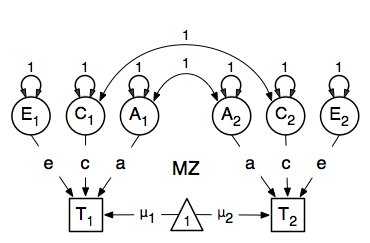
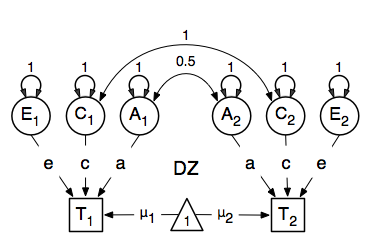

    .. _geneticepidemiology-path-specification:

Genetic Epidemiology, Path Specification
=========================================

Mx is probably most popular statistical modeling package in the behavior genetics field, as it was conceived with genetic models in mind, which rely heavily on multiple groups.  We introduce here an OpenMx script for the basic genetic model in genetic epidemiologic research, the ACE model.  This model assumes that the variability in a phenotype, or observed variable,  can be explained by differences in genetic and environmental factors, with **A** representing additive genetic factors, **C** shared/common environmental factors and **E** unique/specific environmental factors (see Neale & Cardon 1992, for a detailed treatment).  To estimate these three sources of variance, data have to be collected on relatives with different levels of genetic and environmental similarity to provide sufficient information to identify the parameters.  One such design is the classical twin study, which compares the similarity of identical (monozygotic, MZ) and fraternal (dizygotic, DZ) twins to infer the role of **A**, **C** and **E**.

The example starts with the ACE model and includes one submodel, the AE model. It is available in the following file:

* http://openmx.psyc.virginia.edu/svn/tags/stable-1.2/demo/UnivariateTwinAnalysis_PathRaw.R

A parallel version of this example, using matrix specification of models rather than paths, can be found here:

* http://openmx.psyc.virginia.edu/svn/tags/stable-1.2/demo/UnivariateTwinAnalysis_MatrixRaw.R

ACE Model: a Twin Analysis
--------------------------

A twin analysis is a typical example of multiple groups, in this case MZ twins and DZ twins, with different expectations for the covariance structure (and possibly means).  We illustrate the model here with the corresponding two path diagrams:

    

Data
^^^^

Let us assume you have collected data on a large sample of twin pairs for your phenotype of interest.  For illustration purposes, we use Australian data on body mass index (BMI) which are saved in a text file 'myTwinData.txt'.  We use R to read the data into a data.frame and to create two subsets of the data for MZ females (mzData) and DZ females (dzData) respectively with the code below.  We also define the objects ``selVars`` for the variables selected for analysis, and ``aceVars`` for the latent variables to simplify the OpenMx code.

.. code-block:: r

    require(OpenMx)

    #Prepare Data
    data(myTwinData)
    twinVars <- c(  'fam','age','zyg','part',
                    'wt1','wt2','ht1','ht2','htwt1','htwt2','bmi1','bmi2')
    summary(myTwinData)
    selVars <- c('bmi1','bmi2')
    aceVars <- c("A1","C1","E1","A2","C2","E2")
    mzData <- as.matrix(subset(myTwinData, zyg==1, c(bmi1,bmi2)))
    dzData <- as.matrix(subset(myTwinData, zyg==3, c(bmi1,bmi2)))
    colMeans(mzData,na.rm=TRUE)
    colMeans(dzData,na.rm=TRUE)
    cov(mzData,use="complete")
    cov(dzData,use="complete")

Model Specification
^^^^^^^^^^^^^^^^^^^

There are different ways to draw a path diagram of the ACE model.  The most commonly used approach is with the three latent variables in circles at the top, separately for twin 1 and twin 2 respectively called **A1**, **C1**, **E1** and **A2**, **C2**, **E2**.  The latent variables are connected to the observed variables in boxes at the bottom, representing the measures for twin 1 and twin 2: **T1** and **T2**, by single-headed arrows from the latent to the manifest variables.  Path coefficients **a**, **c** and **e** are estimated but constrained to be the same for twin 1 and twin 2, as well as for MZ and DZ twins.  As MZ twins share all their genotypes, the double-headed path connecting **A1** and **A2** is fixed to one in the MZ diagram.  DZ twins share on average half their genes, and as a result the corresponding path is fixed to 0.5 in the DZ diagram.  As environmental factors that are shared between twins are assumed to increase similarity between twins to the same extent in MZ and DZ twins (equal environments assumption), the double-headed path connecting **C1** and **C2** is fixed to one in both diagrams above.  The unique environmental factors are by definition uncorrelated between twins.

Let's go through the paths specification step by step.  First, we start with the ``require(OpenMx)`` statement.  We include the full code here.  As MZ and DZ have to be evaluated together, the models for each will be arguments of a bigger model.  Given the diagrams for the MZ and the DZ group look rather similar, we start by specifying all the common elements in yet another model, called ``ACEModel`` which will then be shared with the two submodels for each of the twin types, defined in separate ``mxModel`` commands.  The latter two ``MxModel`` objects (``mzModel`` and ``dzModel``) are arguments of the overall ``twinACE`` model, and will be saved together in the R object ``twinACEModel`` and thus be run together.

.. code-block:: r

    #Fit ACE Model with RawData and Path-Style Input
    ACEModel <- mxModel("ACE", 
        type="RAM",
        manifestVars=selVars,
        latentVars=aceVars,
        # variances of latent variables
        mxPath(
            from=aceVars, 
            arrows=2, 
            free=FALSE, 
            values=1
        ),
        # means of latent variables
        mxPath(
            from="one", 
            to=aceVars, 
            arrows=1, 
            free=FALSE, 
            values=0
        ),
        # means of observed variables
        mxPath(
            from="one", 
            to=selVars, 
            arrows=1, 
            free=TRUE, 
            values=20, 
            labels="mean",
        ),
        # path coefficients for twin 1
        mxPath(
            from=c("A1","C1","E1"), 
            to="bmi1", 
            arrows=1, 
            free=TRUE, 
            values=.6, 
            label=c("a","c","e")
        ),
        # path coefficients for twin 2
        mxPath(
            from=c("A2","C2","E2"), 
            to="bmi2", 
            arrows=1, 
            free=TRUE, 
            values=.6, 
            label=c("a","c","e")
        ),
        # covariance between C1 & C2
        mxPath(
            from="C1", 
            to="C2", 
            arrows=2, 
            free=FALSE, 
            values=1
        )
    )    
    mzModel <- mxModel(ACEModel, name="MZ",
        # covariance between A1 & A2
        mxPath(
            from="A1", 
            to="A2", 
            arrows=2, 
            free=FALSE, 
            values=1
        ),
        mxData(
            observed=mzData, 
            type="raw"
        )
    )
    dzModel <- mxModel(ACEModel, name="DZ", 
    # covariance between A1 & A2
        mxPath(
            from="A1", 
            to="A2", 
            arrows=2, 
            free=FALSE, 
            values=.5
        ),
        mxData(
            observed=dzData, 
            type="raw"
        )
    )
    twinACEModel <- mxModel("twinACE", mzModel, dzModel,
        mxAlgebra(
            expression=MZ.objective + DZ.objective, 
            name="minus2loglikelihood"
        ), 
        mxAlgebraObjective("minus2loglikelihood")
    )

Now we will discuss the script line by line.  For further details on RAM, see ref.  Note that we left the comma's at the end of the lines which are necessary when all the arguments are combined prior to running the model.  Each line can be pasted into R, and then evaluated together once the whole model is specified.  Models specifying paths are translated into 'RAM' specifications for optimization, indicated by using the ``type="RAM"``.  We start the path diagram specification by providing the names for the manifest variables in ``manifestVars`` and the latent variables in ``latentVars``.  We use here the ``selVars`` and ``aceVars`` objects that we created previously when preparing the data.

.. code-block:: r

	mxModel("ACE", 
	        type="RAM",
	        manifestVars=selVars,
	        latentVars=aceVars,

We start by specifying paths for the variances and means of the latent variables.  These include double-headed arrows from each latent variable back to itself, fixed at one.

.. code-block:: r        

    # variances of latent variables
    mxPath(
        from=aceVars, 
        arrows=2, 
        free=FALSE, 
        values=1
    ),

and single-headed arrows from the triangle (with a fixed value of one) to each of the latent variables, fixed at zero. 

.. code-block:: r        

    # means of latent variables
    mxPath(
        from="one", 
        to=aceVars, 
        arrows=1, 
        free=FALSE, 
        values=0
    ),

Next we specify paths for the means of the observed variables using single-headed arrows from ``one`` to each of the manifest variables.  These are set to be free and given a start value of 20.  As we use the same label (``mean``) for the two means, they are constrained to be equal.  Remember that R 'recycles'.

.. code-block:: r        

    # means of observed variables
    mxPath(
        from="one", 
        to=selVars, 
        arrows=1, 
        free=TRUE, 
        values=20, 
        labels="mean"
    ),

The main paths of interest are those from each of the latent variables to the respective observed variable.  These are also estimated (thus all are set free), get a start value of 0.6 and appropriate labels.

.. code-block:: r        

    # path coefficients for twin 1
    mxPath(
        from=c("A1","C1","E1"), 
        to="bmi1", 
        arrows=1, 
        free=TRUE, 
        values=0.6, 
        label=c("a","c","e")
    ),
    # path coefficients for twin 2
    mxPath(
        from=c("A2","C2","E2"), 
        to="bmi2", 
        arrows=1, 
        free=TRUE, 
        values=0.6, 
        label=c("a","c","e")
    ),
    
As the common environmental factors are by definition the same for both twins, we fix the correlation between **C1** and **C2** to one.    

.. code-block:: r        

    # covariance between C1 & C2
    mxPath(
        from="C1", 
        to="C2", 
        arrows=2, 
        free=FALSE, 
        values=1
    ))

We add the paths that are specific to the MZ group or the DZ group into the respective models, ``mzModel`` and ``dzModel``, which are combined in ``twinACEModel``.  So we have two ``mxModel`` statements following the ``ACEModel`` model statement.  Each of the two models have access to all the paths already defined given ``ACEModel`` is the first argument of ``mzModel`` and ``dzModel``.  In the MZ model we add the path for the correlation between **A1** and **A2** which is fixed to one.  That concludes the specification of the model for the MZ's, thus we move to the ``mxData`` command that calls up the data.frame with the MZ raw data, ``mzData``, with the type specified explicitly.  We also give the model a name, ``MZ``, to refer back to it later when we need to add the objective functions.

.. code-block:: r

    mzModel <- mxModel(ACEModel, name="MZ",
        # covariance between A1 & A2 in MZ's
        mxPath(
            from="A1", 
            to="A2", 
            arrows=2, 
            free=FALSE, 
            values=1
        ),
        mxData(
            observed=mzData, 
            type="raw"
        )
    )

The ``mxModel`` command for the DZ group is very similar, except that the the correlation between **A1** and **A2** is fixed to 0.5 and the DZ data, ``dzData`` are read in, and the model is named ``DZ``.  Note that OpenMx can handle constants in algebra.

.. code-block:: r

    dzModel <- mxModel(ACEModel, name="DZ", 
        # covariance between A1 & A2 in DZ's
        mxPath(
            from="A1", 
            to="A2", 
            arrows=2, 
            free=FALSE, 
            values=.5
        ),
        mxData(
            observed=dzData, 
            type="raw"
        )
    )

Finally, both models need to be evaluated simultaneously.  We specify a new ``mxModel`` which has the ``mzModel`` and ``dzModel`` as its arguments.  We then generate the sum of the objective functions for the two groups, using ``mxAlgebra``, and use the result (``minus2loglikelihood``) as argument of the ``mxAlgebraObjective`` command.

.. code-block:: r        

    twinACEModel <- mxModel("twinACE", mzModel, dzModel,
        mxAlgebra(
            expression=MZ.objective + DZ.objective, 
            name="minus2loglikelihood"
        ), 
        mxAlgebraObjective("minus2loglikelihood")
    )

Model Fitting
^^^^^^^^^^^^^
        
We need to invoke the ``mxRun`` command to start the model evaluation and optimization.  Detailed output will be available in the resulting object, which can be obtained by a ``print()`` statement.

.. code-block:: r        

    #Run ACE model
    twinACEFit <- mxRun(twinACEModel)

Often, however, one is interested in specific parts of the output.  In the case of twin modeling, we typically will inspect the likelihood, the expected covariance matrices and mean vectors, the parameter estimates, and possibly some derived quantities, such as the standardized variance components, obtained by dividing each of the components by the total variance.  Note in the code below that the ``mxEval`` command allows easy extraction of the values in the various matrices/algebras which form the first argument, with the model name as second argument.  Once these values have been put in new objects, we can use any regular R expression to derive further quantities or organize them in a convenient format for including in tables.  Note that helper functions could easily (and will likely) be written for standard models to produce 'standard' output. 

.. code-block:: r

    MZc <- twinACEFit$MZ.objective@info$expCov    # expected covariance matrix for MZ's
    DZc <- twinACEFit$DZ.objective@info$expCov    # expected covariance matrix for DZ's
    M <- twinACEFit$MZ.objective@info$expMean    # expected mean
    A <- mxEval(a*a, twinACEFit)    # additive genetic variance, a^2
    C <- mxEval(c*c, twinACEFit)    # shared environmental variance, c^2
    E <- mxEval(e*e, twinACEFit)    # unique environmental variance, e^2
    V <- (A+C+E)    # total variance
    a2 <- A/V        # standardized A
    c2 <- C/V        # standardized C
    e2 <- E/V        # standardized E
    ACEest <- rbind(cbind(A,C,E),cbind(a2,c2,e2))    # table of estimates
    LL_ACE <- mxEval(objective, twinACEFit)        # likelihood of ACE model

Alternative Models: an AE Model
-------------------------------

To evaluate the significance of each of the model parameters, nested submodels are fit in which the parameters of interest are fixed to zero.  If the likelihood ratio test between the two models (one including the parameter and the other not) is significant, the parameter that is dropped from the model significantly contributes to the variance of the phenotype in question.  Here we show how we can fit the AE model as a submodel with a change in two ``mxPath`` commands.  First, we define a new model 'AEModel' with 'ACEModel' as its first argument.  ``ACEModel`` included the common parts of the model, necessary for both MZ and DZ group.  Next we re-specify the path from **C1** to **bmi1** to be fixed to zero, and do the same for the path from **C2** to **bmi2**.  We need to respecify the mzModel and the dzModel, so that they are now built with the changed paths from the common ``AEModel``.  We can run this model in the same way as before, by combining the objective functions of the two groups and generate similar summaries of the results.

.. code-block:: r

    #Run AE model
    AEModel <- mxModel(ACEModel, name="twinAE",
        mxPath(
            from=c("A1","C1","E1"), 
            to="bmi1", 
            arrows=1, 
            free=c(T,F,T),
            values=c(.6,0,.6), 
            label=c("a","c","e")
        ),
        mxPath(
            from=c("A2","C2","E2"), 
            to="bmi2", 
            arrows=1, 
            free=c(T,F,T),
            values=c(.6,0,.6), 
            label=c("a","c","e")
        )
    )
    mzModel <- mxModel(AEModel, name="MZ",
        mxPath(
            from="A1", 
            to="A2", 
            arrows=2, 
            free=FALSE, 
            values=1
        ),
        mxData(
            observed=mzData, 
            type="raw"
        )
    )
    dzModel <- mxModel(AEModel, name="DZ", 
        mxPath(
            from="A1", 
            to="A2", 
            arrows=2, 
            free=FALSE, 
            values=.5
        ),
        mxData(
            observed=dzData, 
            type="raw"
        )
    )        
    twinAEModel <- mxModel("twinAE", mzModel, dzModel,
        mxAlgebra(
            expression=MZ.objective + DZ.objective, 
            name="twin"
        ), 
        mxAlgebraObjective("twin")
    )

    twinAEFit <- mxRun(twinAEModel)
    
    
    MZc <- twinAEFit$MZ.objective@info$expCov
    DZc <- twinAEFit$DZ.objective@info$expCov
    M <- twinAEFit$MZ.objective@info$expMean
    A <- mxEval(a*a, twinAEFit)
    C <- mxEval(c*c, twinAEFit)
    E <- mxEval(e*e, twinAEFit)
    V <- (A+C+E)
    a2 <- A/V
    c2 <- C/V
    e2 <- E/V
    AEest <- rbind(cbind(A, C, E),cbind(a2, c2, e2))
    LL_AE <- mxEval(objective, twinAEFit)

We use a likelihood ratio test (or take the difference between -2 times the log-likelihoods of the two models, for the difference in degrees of freedom) to determine the best fitting model, and print relevant output.

.. code-block:: r

    LRT_ACE_AE <- LL_AE - LL_ACE

    #Print relevant output
    ACEest
    AEest
    LRT_ACE_AE

Note that the way to specify submodels using path specification is not straightforward and requires repeating code.  The OpenMx team is currently working on better alternatives.  These models may also be specified using matrices instead of paths, which allow for easier submodel specification. See :ref:`geneticepidemiology-matrix-specification` for matrix specification of these models.
