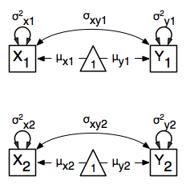

.. _multiplegroups-path-specification:

Multiple Groups, Path Specification
===================================

An important aspect of structural equation modeling is the use of multiple groups to compare means and covariances structures between any two (or more) data groups, for example males and females, different ethnic groups, ages etc.  Other examples include groups which have different expected covariances matrices as a function of parameters in the model, and need to be evaluated together for the parameters to be identified.

The example includes the heterogeneity model as well as its submodel, the homogeneity model, and is available in the following file:

* http://openmx.psyc.virginia.edu/svn/trunk/demo/BivariateHeterogeneity_PathRaw.R

A parallel version of this example, using matrix specification of models rather than paths, can be found here:

* http://openmx.psyc.virginia.edu/svn/trunk/demo/BivariateHeterogeneity_MatrixRaw.R

Heterogeneity Model
-------------------

We will start with a basic example here, building on modeling means and variances in a saturated model.  Assume we have two groups and we want to test whether they have the same mean and covariance structure.

The path diagram of the heterogeneity model for a set of variables :math:`x` and :math:`y` are shown below.

.. math::
..   :nowrap:
   
..   \begin{eqnarray*} 
..   x = \mu_{x1} + \sigma_{x1}
..   \end{eqnarray*}

Data
^^^^

For this example we simulated two datasets (*xy1* and *xy2*) each with zero means and unit variances, one with a correlation of 0.5, and the other with a correlation of 0.4 with 1000 subjects each.  We use the ``mvrnorm`` function in the ``MASS`` package, which takes three arguments: ``Sample Size``, ``Means``, ``Covariance Matrix``.  We check the means and covariance matrix in R and provide ``dimnames`` for the dataframe.  See attached R code for simulation and data summary.

.. cssclass:: input
..

.. code-block:: r

    #Simulate Data
    require(MASS)
    #group 1
    set.seed(200)
    xy1 <- mvrnorm (1000, c(0,0), matrix(c(1,.5,.5,1),2,2))
    #group 2
    set.seed(200)
    xy2 <- mvrnorm (1000, c(0,0), matrix(c(1,.4,.4,1),2,2))

    #Print Descriptive Statistics
    selVars <- c('X','Y')
    summary(xy1)
    cov(xy1)
    dimnames(xy1) <- list(NULL, selVars)
    summary(xy2)
    cov(xy2)
    dimnames(xy2) <- list(NULL, selVars)
    
Model Specification
^^^^^^^^^^^^^^^^^^^

As before, we include the OpenMx package using a ``require`` statement.
We first fit a heterogeneity model, allowing differences in both the mean and covariance structure of the two groups.  As we are interested whether the two structures can be equated, we have to specify the models for the two groups, named ``group1`` and ``group2`` within another model, named ``bivHet``.  The structure of the job thus looks as follows, with two ``mxModel`` commands as arguments of another ``mxModel`` command.  Note that ``mxModel`` commands are unlimited in the number of arguments.

.. cssclass:: input
..

.. code-block:: r

    require(OpenMx)

    bivHetModel <- mxModel("bivHet",
        mxModel("group1"), 
        mxModel("group2"), 
        mxFitFunctionMultigroup(c("group1.fitfunction", "group2.fitfunction")) )
     
For each of the groups, we fit a saturated model, by specifying paths with free parameters for the variances and the covariance using two-headed arrows to generate the expected covariance matrix.  Single-headed arrows from the constant ``one`` to the manifest variables contain the free parameters for the expected means.  Note that we have specified different labels for all the free elements, in the two ``mxModel`` statements.  The type is RAM by default.

.. cssclass:: input
..

.. code-block:: r

    dataRaw1     <- mxData( observed=xy1, type="raw")
    variances1   <- mxPath( from=selVars, arrows=2, 
                            free=T, values=1, lbound=.01, labels=c("vX1","vY1") )
    covariance1  <- mxPath( from="X", to="Y", arrows=2, 
                            free=T, values=.2, lbound=.01, labels="cXY1")
    means1       <- mxPath( from="one", to=selVars, arrows=1, 
                            free=T, values=c(0.1,-0.1), ubound=c(NA,0), lbound=c(0,NA), 
                            labels=c("mX1","mY1") )
    model1       <- mxModel("group1", type="RAM", manifestVars=selVars,
                             dataRaw1, variances1, covariance1, means1)

    dataRaw2     <- mxData( observed=xy2, type="raw")
    variances2   <- mxPath( from=selVars, arrows=2, 
                            free=T, values=1, lbound=.01, labels=c("vX2","vY2") )
    covariance2  <- mxPath( from="X", to="Y", arrows=2, 
                            free=T, values=.2, lbound=.01, labels="cXY2")
    means2       <- mxPath( from="one", to=selVars, arrows=1, 
                            free=T, values=c(0.1,-0.1), ubound=c(NA,0), lbound=c(0,NA), 
                            labels=c("mX2","mY2") )
    model2       <- mxModel("group2", type="RAM", manifestVars=selVars,
                             dataRaw2, variances2, covariance2, means2)
    
We estimate five parameters (two means, two variances, one covariance) per group for a total of 10 free parameters.  We cut the ``Labels matrix:`` parts from the output generated with ``bivHetModel$group1$matrices`` and ``bivHetModel$group2$matrices``.

.. cssclass:: output
..

.. code-block:: r

    in group1                           in group2
        $S                                  $S
                X      Y                            X      Y 
        X   "vX1" "cXY1"                    X   "vX2" "cXY2"
        Y  "cXY1"  "vY1"                    Y  "cXY2"  "vY2" 
                                    
        $M                                  $M
                X      Y                            X      Y 
        [1,] "mX1" "mY1"                    [1,] "mX2" "mY2"

To evaluate both models together, we use an ``mxFitFunctionMultigroup`` command that adds up the values of the fit functions of the two groups.

.. cssclass:: input
..

.. code-block:: r

    fun           <- mxFitFunctionMultigroup(c("group1.fitfunction", "group2.fitfunction"))

    bivHetModel   <- mxModel("bivariate Heterogeneity Path Specification",
                            model1, model2, fun )
    

Model Fitting
^^^^^^^^^^^^^

The ``mxRun`` command is required to actually evaluate the model.  Note that we have adopted the following notation of the objects.  The result of the ``mxModel`` command ends in ``Model``; the result of the ``mxRun`` command ends in ``Fit``.  Of course, these are just suggested naming conventions.

.. cssclass:: input
..

.. code-block:: r

    bivHetFit <- mxRun(bivHetModel)

A variety of output can be printed.  We chose here to print the expected means and covariance matrices, which the RAM objective function generates based on the path specification, respectively in the matrices **M** and **S** for the two groups.  OpenMx also puts the values for the expected means and covariances in the ``means`` and ``covariance`` objects.  We also print the likelihood of the data given the model.

.. cssclass:: input
..

.. code-block:: r

    EM1Het <- bivHetFit$group1.fitfunction$info$expMean
    EM2Het <- bivHetFit$group2.fitfunction$info$expMean
    EC1Het <- bivHetFit$group1.fitfunction$info$expCov
    EC2Het <- bivHetFit$group2.fitfunction$info$expCov
    LLHet <- bivHetFit$output$fit

Homogeneity Model: a Submodel
-----------------------------

Next, we fit a model in which the mean and covariance structure of the two groups are equated to one another, to test whether there are significant differences between the groups.  As this model is nested within the previous one, the data are the same.

Model Specification
^^^^^^^^^^^^^^^^^^^

Rather than having to specify the entire model again, we copy the previous model ``bivHetModel`` into a new model ``bivHomModel`` to represent homogeneous structures.

.. cssclass:: input
..

.. code-block:: r

    #Fit Homogeneity Model
    bivHomModel <- bivHetModel

As the free parameters of the paths are translated into RAM matrices, and matrix elements can be equated by assigning the same label, we now have to equate the labels of the free parameters in group1 to the labels of the corresponding elements in group2.  This can be done by referring to the relevant matrices using the ``ModelName$MatrixName`` syntax, followed by ``$labels``.  Note that in the same way, one can refer to other arguments of the objects in the model.  Here we assign the labels from group1 to the labels of group2, separately for the 'covariance' matrices (in **S**) used for the expected covariance matrices and the 'means' matrices (in **M**) for the expected mean vectors.

.. cssclass:: input
..

.. code-block:: r

    bivHomModel$group2.S$labels <- bivHomModel$group1.S$labels
    bivHomModel$group2.M$labels <- bivHomModel$group1.M$labels

The specification for the submodel is reflected in the names of the labels which are now equal for the corresponding elements of the mean and covariance matrices, as below.

.. cssclass:: output
..

.. code-block:: r

    in group1                           in group2
        $S                                  $S
                X      Y                            X      Y  
        X   "vX1" "cXY1"                    X   "vX1" "cXY1"
        Y  "cXY1"  "vY1"                    Y  "cXY1"  "vY1" 
                                      
        $M                                  $M
                X      Y                            X      Y  
        [1,] "mX1" "mY1"                    [1,] "mX1" "mY1"

Model Fitting
^^^^^^^^^^^^^

We can produce similar output for the submodel, i.e. expected means and covariances and likelihood, the only difference in the code being the model name.  Note that as a result of equating the labels, the expected means and covariances of the two groups should be the same, and a total of 5 parameters is estimated.

.. cssclass:: input
..

.. code-block:: r

    bivHomFit <- mxRun(bivHomModel)
    EM1Hom <- bivHomFit$group1.fitfunction$info$expMean
    EM2Hom <- bivHomFit$group2.fitfunction$info$expMean
    EC1Hom <- bivHomFit$group1.fitfunction$info$expCov
    EC2Hom <- bivHomFit$group2.fitfunction$info$expCov
    LLHom <- bivHomFit$output$fit
        

Finally, to evaluate which model fits the data best, we generate a likelihood ratio test from the difference between -2 times the log-likelihood of the homogeneity model and -2 times the log-likelihood of the heterogeneity model.  This statistic is asymptotically distributed as a Chi-square, which can be interpreted with the difference in degrees of freedom of the two models, in this case 5 df.

.. cssclass:: input
..

.. code-block:: r

    Chi <- LLHom-LLHet
    LRT <- rbind(LLHet,LLHom,Chi)
    LRT

These models may also be specified using matrices instead of paths. See :ref:`multiplegroups-matrix-specification` for matrix specification of these models.
