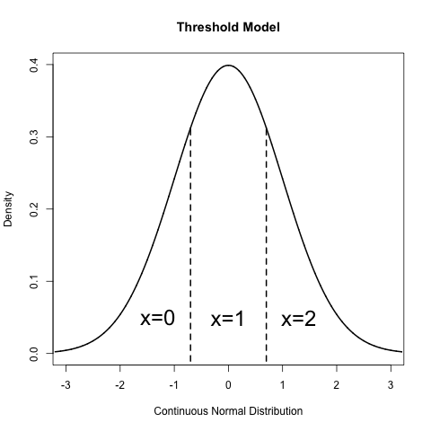

.. _ordinal-specification-matrix:

Ordinal and Joint Ordinal-Continuous Model Specification
========================================================

This chapter deals with the specification of models that are either fit exclusively to ordinal variables or to a mix of ordinal and continuous variables. It extends the continuous data common factor model found in previous chapters to ordinal data.

The examples for this chapter can be found in the following files:

* http://openmx.psyc.virginia.edu/svn/tags/stable-1.2/demo/OneFactorModelOrdinal_MatrixRaw.R
* http://openmx.psyc.virginia.edu/svn/tags/stable-1.2/demo/OneFactorModelOrdinal01_MatrixRaw.R

The continuous versions of these models for raw data can be found the previous demos here:

* http://openmx.psyc.virginia.edu/svn/tags/stable-1.2/demo/OneFactorModel_MatrixRaw.R
* http://openmx.psyc.virginia.edu/svn/tags/stable-1.2/demo/OneFactorModel_PathRaw.R

Ordinal Data
------------

OpenMx models ordinal data under a threshold model. A continuous normal distribution is assumed to underly every ordinal variable. These latent continuous distributions are only observed as being above or below a threshold, where there is one fewer threshold than observed categories in the data. For example, consider a variable with three ordered categories indicated by the values zero, one and two. Under this approach, this variable is assumed to follow a normal distribution that is partitioned or cut by two thresholds: individuals with underlying scores below the first threshold have an observed value of zero, individuals with latent scores between the thresholds are observed with values of one, and individuals with underlying scores give observed values of two.

	
Each threshold may be freely estimated or assigned as a fixed parameter, depending on the desired model. In addition to the thresholds, ordinal variables still have a mean and variance that describes the parameters of the underlying continuous distribution. However, this underlying distribution must be scaled by fixing at least two parameters to identify the model. One method of identification fixes the mean and variance to specific values, most commonly to a standard normal distribution with a mean of zero and a variance of one. A variation on this method fixes the residual variance of the categorical variable to one, which is often easier to specify. Alternatively, categorical variables may be identified by fixing two thresholds to non-equivalent constant values. These methods will differ in the scale assigned to the ordinal variables (and thus, the scale of the parameters estimated from them), but all identify the same model and should provide equally valid results.

OpenMx allows for the inclusion of continuous and ordinal variables in the same model, as well as models with only continuous or only ordinal variables. Any number of continuous variables may be included in an OpenMx model; however, maximum likelihood estimation for ordinal data must be limited to twenty ordinal variables regardless of the number of continuous variables. Further technical details on ordinal and joint continuous-ordinal optimization are contained at the end of this chapter.

Specifying Threshold Matrices
^^^^^^^^^^^^^^^^^^^^^^^^^^^^^

In addition to the mean, variance and covariance structure of the data, the thresholds for ordinal variables must be included in the model. This matrix should be of a specific order: it should contain as many columns as their are ordinal variables, and as many rows as there are thresholds in the data. The number of thresholds can be determined as one fewer than the number of categories in the variable or variables included in the model. If ordinal variables have varying numbers of thresholds, the threshold matrix should have as many rows as the largest number of thresholds for any variable. For example, a model with two binary variables (one threshold) and one three-category variable (two thresholds), the threshold matrix should contain two rows and three columns to represent the maximum of two thresholds found across three ordinal variables.

Threshold matrices may be specified using the ``mxMatrix`` function, just like any other matrix in OpenMx. Columns represent variables, while the n$th$ row of the thresholds matrix represents the n$th$ threshold for that variable. The code below specifies one version of the three variable thresholds matrix.

.. code-block:: r

	mxMatrix(
		type="Full", 
		nrow=2, 
		ncol=3,
		free=c(TRUE,  TRUE,  TRUE,
			FALSE, FALSE, TRUE), 
		values=c(-1,  0,  -.5,
			NA, NA, 1.2),
		dimnames=list(c(), c('z1', 'z2', 'z3')),
		byrow=TRUE,
		name="thresh"
	)

In this example, variables 'z1' and 'z2' are binary, with a single freely estimated threshold for each variable with starting values of -1 and 0, respectively. The meaning of these thresholds will depend on the mean and variance of these variables; as we are freely estimating thresholds for binary variables, the mean and variances of these variables should be constrained to fixed values. The third column of the thresholds matrix represents variable 'z3', which contains two thresholds and thus three categories. These two thresholds are assigned free parameters with staring values of -0.5 and 1.2, and the mean and variance of this variable should also be constrained to fixed values for identification. For variables with multiple thresholds, starting values should be monotonically increasing in each column such that the first column represents the first threshold and lowest value and the last column represents the last threshold and highest value.

Unlike the mean and covariance structures, which may be specified either as matrices or as paths under models where type='RAM' is requested, thresholds must always be specified as matrices. Path models with ordinal variables may still specify the rest of the model using paths, but must include a threshold matrix.

Users of original or ''classic'' Mx may recall specifying thresholds not in absolute terms, but as deviations. This method estimated the difference between each threshold for a variable and the previous one, which ensured that thresholds were in the correct order (i.e., that the second threshold for a variable was not lower than the first). While users may employ this method as it suits them, OpenMx does not require this technique. Simply specifying a thresholds matrix is typically sufficient to keep thresholds in proper order.

Specifying Data for Ordinal Models
^^^^^^^^^^^^^^^^^^^^^^^^^^^^^^^^^^

In addition to specifying the thresholds matrix as shown above, users must identify ordinal variables by specifying those variables as ordered factors in the included data. Ordinal models can only be fit to raw data; if data is described as a covariance or other moment matrix, then the categorical nature of the data was already models to generate that moment matrix. Ordinal variables must be defined as specific columns in an R data frame.

Factors are a type of variable included in an R data frame. Unlike numeric or continuous variables, which must include only numeric and missing values, observed values for factors are treated as character strings. All factors contain a ``levels`` argument, which lists the possible values for a factor. Ordered factors contain information about the ordering of possible levels. Both R and OpenMx have tools for manipulating factors in data frames. The R functions ``factor()`` and ``as.factor()`` (and companions ``ordered()`` and ``as.ordered()``) can be used to specify ordered factors. OpenMx includes a helper function ``mxFactor()`` which more directly prepares ordinal variables as ordered factors in preparation for inclusion in OpenMx models. The code below demonstrates the ``mxFactor()`` function, replacing the variable ``z2`` that was initially read as a continuous variable and treating it as an ordinal variable with two levels.

.. code-block:: r

	data(myFADataRaw)
	
	oneFactorOrd <- myFADataRaw[,c("z1", "z2", "z3")]

	oneFactorOrd$z2 <- mxFactor(oneFactorOrd$z2, levels=c(0, 1))

Including Thresholds in Models
^^^^^^^^^^^^^^^^^^^^^^^^^^^^^^

Finally, the threshold matrix must be identified as such in the objective function in the same way that other matrices are identified as means or covariance matrices. Both the ``mxRAMObjective`` and ``mxFIMLObjective`` contain a ``thresholds`` argument, which takes the name of the matrix or algebra to be used as the threshold matrix for a given analysis. Although specifying ``type='RAM'`` generates a RAM objective function, this objective function must be replaced by one with a specified thresholds matrix.

You must specify dimnames (dimension names) for your thresholds matrix that correspond to the ordered factors in the data you wish to analyze. This may be done in either of two ways, both of which correspond to specifying dimnames for other OpenMx matrices. One method is to use the ``threshnames`` argument in the ``mxFIMLObjective`` or ``mxRAMObjective``, which specifies which variables are in a threshold matrix in the same way the ``dimnames`` argument specifies which variables are in the rest of the model. Another method is to specify dimnames for each matrix using the ``dimnames`` argument in the ``mxMatrix`` function. Either method may be used, but it is important to use the same method for all matrices in a given model (either using objective function arguments ``dimnames`` and ``threshnames`` or supplying ``dimnames`` for all ``mxMatrix`` objects manually). Objective function arguments ``dimnames`` and ``threshnames`` supersede the matrix ``dimname`` arguments, and ``threshnames`` will take the value of the ``dimnames`` if both ``dimnames`` and ``thresholds`` are specified but ``threshnames`` is omitted. 

Regardless of the number of continuous numeric variables included in a model, the thresholds matrix should only contain as many columns as there are ordinal variables in a model. All ordered factors included in an analysis must contain a column in the thresholds matrix, and all columns in the thresholds matrix must correspond to an ordered factor. The code below specifies an ``mxRAMObjective`` to include a thresholds matrix names ``''thresh''``. When models are built using ``type='RAM'``, the ``dimnames`` argument may be omitted, as the requisite dimnames for the ``A``, ``S``, ``F`` and ``M`` matrices are generated from the ``manifestVars`` and ``latentVars`` lists. However, the dimnames for the threshold matrix should be included using the ``dimnames`` argument in ``mxMatrix``.

.. code-block:: r

	mxRAMObjective(A="A", S="S", F="F", M="M", thresholds="thresh")

Example: Common Factor Model for Ordinal Data
---------------------------------------------

All of the raw data examples through the documentation may be converted to ordinal examples by the inclusion of ordinal data, the specification of a threshold matrix and inclusion of that threshold matrix in the objective function. The following example is a version of the continuous data common factor model referenced at the beginning of this chapter. Aside from replacing the continuous variables ``x1-x6`` with the ordinal variables ``z1-z3``, the code below simply incorporates the steps referenced above into the existing example. Data preparation occurs first, with the added ``mxFactor`` statements to identify ordinal variables and their ordered levels.

.. code-block:: r

	require(OpenMx)
	
	data(myFADataRaw)
	
	oneFactorOrd <- myFADataRaw[,c("z1", "z2", "z3")]
	
	oneFactorOrd$z1 <- mxFactor(oneFactorOrd$z1, levels=c(0, 1))
	oneFactorOrd$z2 <- mxFactor(oneFactorOrd$z2, levels=c(0, 1))
	oneFactorOrd$z3 <- mxFactor(oneFactorOrd$z3, levels=c(0, 1, 2))

Model specification can be achieved by appending the above threshold matrix and objective function to either the path or matrix common factor examples. The path example below has been altered by changing the variable names from ``x1-x6`` to ``z1-z3``, adding the threshold matrix and objective function, and identifying the ordinal variables by constraining their means to be zero and their residual variances to be one.

.. code-block:: r

   oneFactorModel <- mxModel("Common Factor Model Matrix Specification", 
        mxData(oneFactorOrd, type="raw"),
        # asymmetric paths
        mxMatrix(
            type="Full", 
            nrow=4, 
            ncol=4,
            values=c(0,0,0,1,
                     0,0,0,1,
                     0,0,0,1,
                     0,0,0,0),
            free=c(F, F, F, T,
                   F, F, F, T,
                   F, F, F, T,
                   F, F, F, F),
            labels=c(NA,NA,NA,"l1",
                     NA,NA,NA,"l2",
                     NA,NA,NA,"l3",
                     NA,NA,NA,NA),
            byrow=TRUE,
            name="A"
        ),
        # symmetric paths
        mxMatrix(
            type="Symm",
            nrow=4,
            ncol=4, 
            values=c(1,0,0,0,
                     0,1,0,0,
                     0,0,1,0,
                     0,0,0,1),
            free=FALSE,
            labels=c("e1", NA,   NA,    NA,
                     NA, "e2",   NA,    NA,
                     NA,   NA, "e3",    NA,
                     NA,   NA,   NA, "varF1"),
            byrow=TRUE,
            name="S"
        ),
        # filter matrix
        mxMatrix(
            type="Full", 
            nrow=3, 
            ncol=4,
            free=FALSE,
            values=c(1,0,0,0,
                     0,1,0,0,
                     0,0,1,0),
            byrow=TRUE,
            name="F"
        ),
        # means
        mxMatrix(
            type="Full", 
            nrow=1, 
            ncol=4,
            values=0,
            free=FALSE,
            labels=c("meanz1","meanz2","meanz3",NA),
            name="M"
        ),
		mxMatrix(
			type="Full", 
			nrow=2, 
			ncol=3,
			free=c(TRUE,  TRUE,  TRUE,
				FALSE, FALSE, TRUE), 
			values=c(-1,  0,  -.5,
				NA, NA, 1.2),
			byrow=TRUE,
			name="thresh"
		),
		mxRAMObjective("A", "S", "F", "M", 
			dimnames=c("z1", "z2", "z3", "F1"),
			thresholds="thresh",
			threshnames=c("z1", "z2", "z3"))
	) # close model

This model may then be optimized using the ``mxRun`` command.

.. code-block:: r

	oneFactorResults <- mxRun(oneFactorModel)

Example: Common Factor Model for Joint Ordinal-Continuous Data
--------------------------------------------------------------

Models with both continuous and ordinal variables may be specified just like any other ordinal data model. Threshold matrices in these models should contain columns only for the ordinal variables, and should contain column names to designate which variables are to be treated as ordinal. In the example below, the one factor model above is estimated with three continuous variables (``x1-x3``) and three ordinal variables (``z1-z3``).

.. code-block:: r

	require(OpenMx)

	oneFactorJoint <- myFADataRaw[,c("x1", "x2", "x3", "z1", "z2", "z3")]
	
	oneFactorJoint$z1 <- mxFactor(oneFactorOrd$z1, levels=c(0, 1))
	oneFactorJoint$z2 <- mxFactor(oneFactorOrd$z2, levels=c(0, 1))
	oneFactorJoint$z3 <- mxFactor(oneFactorOrd$z3, levels=c(0, 1, 2))

    oneFactorJointModel <- mxModel("Common Factor Model Matrix Specification", 
        mxData(observed=oneFactorJoint, type="raw"),
        # asymmetric paths
        mxMatrix(
            type="Full", 
            nrow=7, 
            ncol=7,
            values=c(0,0,0,0,0,0,1,
                     0,0,0,0,0,0,1,
                     0,0,0,0,0,0,1,
                     0,0,0,0,0,0,1,
                     0,0,0,0,0,0,1,
                     0,0,0,0,0,0,1,
                     0,0,0,0,0,0,0),
            free=c(F, F, F, F, F, F, T,
                   F, F, F, F, F, F, T,
                   F, F, F, F, F, F, T,
                   F, F, F, F, F, F, T,
                   F, F, F, F, F, F, T,
                   F, F, F, F, F, F, T,
                   F, F, F, F, F, F, F),
            labels=c(NA,NA,NA,NA,NA,NA,"l1",
                     NA,NA,NA,NA,NA,NA,"l2",
                     NA,NA,NA,NA,NA,NA,"l3",
                     NA,NA,NA,NA,NA,NA,"l4",
                     NA,NA,NA,NA,NA,NA,"l5",
                     NA,NA,NA,NA,NA,NA,"l6",
                     NA,NA,NA,NA,NA,NA,NA),
            byrow=TRUE,
            name="A"
        ),
        # symmetric paths
        mxMatrix(
            type="Symm",
            nrow=7,
            ncol=7, 
            values=c(1,0,0,0,0,0,0,
                     0,1,0,0,0,0,0,
                     0,0,1,0,0,0,0,
                     0,0,0,1,0,0,0,
                     0,0,0,0,1,0,0,
                     0,0,0,0,0,1,0,
                     0,0,0,0,0,0,1),
            free=c(T, F, F, F, F, F, F,
                   F, T, F, F, F, F, F,
                   F, F, T, F, F, F, F,
                   F, F, F, F, F, F, F,
                   F, F, F, F, F, F, F,
                   F, F, F, F, F, F, F,
                   F, F, F, F, F, F, F),
            labels=c("e1", NA,   NA,   NA,   NA,   NA,   NA,
                     NA, "e2",   NA,   NA,   NA,   NA,   NA,
                     NA,   NA, "e3",   NA,   NA,   NA,   NA,
                     NA,   NA,   NA, "e4",   NA,   NA,   NA,
                     NA,   NA,   NA,   NA, "e5",   NA,   NA,
                     NA,   NA,   NA,   NA,   NA, "e6",   NA,
                     NA,   NA,   NA,   NA,   NA,   NA, "varF1"),
            byrow=TRUE,
            name="S"
        ),
        # filter matrix
        mxMatrix(
            type="Full", 
            nrow=6, 
            ncol=7,
            free=FALSE,
            values=c(1,0,0,0,0,0,0,
                     0,1,0,0,0,0,0,
                     0,0,1,0,0,0,0,
                     0,0,0,1,0,0,0,
                     0,0,0,0,1,0,0,
                     0,0,0,0,0,1,0),
            byrow=TRUE,
            name="F"
        ),
        # means
        mxMatrix(
            type="Full", 
            nrow=1, 
            ncol=7,
            values=c(1,1,1,0,0,0,0),
            free=c(T,T,T,F,F,F,F),
            labels=c("meanx1","meanx2","meanx3","meanz1","meanz2","meanz3",NA),
            name="M"
        ),
		mxMatrix(
			type="Full", 
			nrow=2, 
			ncol=3,
			free=c(TRUE,  TRUE,  TRUE,
				FALSE, FALSE, TRUE), 
			values=c(-1,  0,  -.5,
				NA, NA, 1.2),
			byrow=TRUE,
			name="thresh"
		),
		mxRAMObjective("A", "S", "F", "M", 
			dimnames=c("x1","x2","x3","z1", "z2", "z3", "F1"),
			thresholds="thresh",
			threshnames=c("z1", "z2", "z3"))
	) # close model

This model may then be optimized using the ``mxRun`` command.

.. code-block:: r

	oneFactorJointResults <- mxRun(oneFactorJointModel)

Technical Details
-----------------

Maximum likelihood estimation for ordinal variables by generating expected covariance and mean matrices for the latent continuous variables underlying the set of ordinal variables, then integrating the multivariate normal distribution defined by those covariances and means. The likelihood for each row of the data is defined as the multivariate integral of the expected distribution over the interval defined by the thresholds bordering that row's data. OpenMx uses Alan Genz's SADMVN routine for multivariate normal integration (see http://www.math.wsu.edu/faculty/genz/software/software.html for more information). 

When continuous variables are present, OpenMx utilizes a block decomposition to separate the continuous and ordinal covariance matrices for FIML. The likelihood of the continuous variables is calculated normally.  The effects of the point estimates of the continuous variables is projected out of the expected covariance matrix of the ordinal data. The likelihood of the ordinal data is defined as the multivariate integral over the distribution defined by the resulting ordinal covariance matrix.
