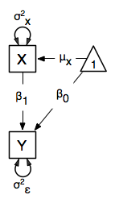
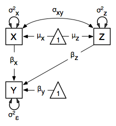
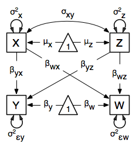

.. _regression-matrix-specification:

Regression, Matrix Specification
=====================================

Our next example will show how regression can be carried out from structural modeling perspective. This example is in three parts; a simple regression, a multiple regression, and multivariate regression. There are two versions of each example are available; one where the data is supplied as a covariance matrix and vector of means, and one with raw data. These examples are available in the following files:
Parallel versions of this example, using matrix specification of models rather than paths, can be found here:

* http://openmx.psyc.virginia.edu/svn/trunk/demo/SimpleRegression_MatrixCov.R
* http://openmx.psyc.virginia.edu/svn/trunk/demo/SimpleRegression_MatrixRaw.R
* http://openmx.psyc.virginia.edu/svn/trunk/demo/MultipleRegression_MatrixCov.R
* http://openmx.psyc.virginia.edu/svn/trunk/demo/MultipleRegression_MatrixRaw.R
* http://openmx.psyc.virginia.edu/svn/trunk/demo/MultivariateRegression_MatrixCov.R
* http://openmx.psyc.virginia.edu/svn/trunk/demo/MultivariateRegression_MatrixRaw.R

This example will focus on the RAM approach to building structural models. A parallel version of this example, using path-centric rather than matrix specification, is available here:

* http://openmx.psyc.virginia.edu/svn/trunk/demo/SimpleRegression_PathCov.R
* http://openmx.psyc.virginia.edu/svn/trunk/demo/SimpleRegression_PathRaw.R
* http://openmx.psyc.virginia.edu/svn/trunk/demo/MultipleRegression_PathCov.R
* http://openmx.psyc.virginia.edu/svn/trunk/demo/MultipleRegression_PathRaw.R
* http://openmx.psyc.virginia.edu/svn/trunk/demo/MultivariateRegression_PathCov.R
* http://openmx.psyc.virginia.edu/svn/trunk/demo/MultivariateRegression_PathRaw.R

Simple Regression
-----------------

We begin with a single dependent variable (*y*) and a single independent variable (*x*). The relationship between these variables takes the following form:

.. math::
   :nowrap:
   
   \begin{eqnarray*} 
   y = \beta_{0} + \beta_{1} * x + \epsilon
   \end{eqnarray*}

In this model, the mean of *y* is dependent on both regression coefficients (and by extension, the mean of *x*). The variance of *y* depends on both the residual variance and the product of the regression slope and the variance of *x*. This model contains five parameters from a structural modeling perspective :math:`\beta_{0}`, :math:`\beta_{1}`, :math:`\sigma^{2}_{\epsilon}`, and the mean and variance of *x*). We are modeling a covariance matrix with three degrees of freedom (two variances and one covariance) and a means vector with two degrees of freedom (two means). Because the model has as many parameters (5) as the data have degrees of freedom, this model is fully saturated.

Data
^^^^

Our first step to running this model is to include the data to be analyzed. The data must first be placed in a variable or object. For raw data, this can be done with the ``read.table`` function. The data provided has a header row, indicating the names of the variables.

.. code-block:: r

    data(myRegDataRaw)

The names of the variables provided by the header row can be displayed with the names() function.

.. code-block:: r

    names(myRegDataRaw)

As you can see, our data has four variables in it. However, our model only contains two variables, *x* and *y*. To use only them, we will select only the variables we want and place them back into our data object. That can be done with the R code below.

.. We can refer to individual rows and columns of a data frame or matrix using square brackets, with selected rows referenced first and selected columns referenced second, separated by a comma. In the code below, we select all rows (there is no selection operator before the comma) and only columns x and y. As we are selecting multiple columns, we use the c() function to concatonate or connect those two names into one object.

.. code-block:: r

    SimpleDataRaw <- myRegDataRaw[,c("x","y")]

For covariance data, we do something very similar. We create an object to house our data. Instead of reading in raw data from an external file, we can include a covariance matrix. This requires the ``matrix()`` function, which needs to know what values are in the covariance matrix, how big it is, and what the row and column names are (in dimnames). As our model also references means, we will include a vector of means in a separate object. Data is selected in the same way as before.

.. We'll select variables in much the same way as before, but we must now select both the rows and columns of the covariance matrix.  This means vector doesn't include names, so we will just select the second and third elements of that vector.

.. code-block:: r

    myRegDataCov <- matrix(
        c(0.808,-0.110, 0.089, 0.361,
         -0.110, 1.116, 0.539, 0.289,
          0.089, 0.539, 0.933, 0.312,
          0.361, 0.289, 0.312, 0.836),
        nrow=4,
        dimnames=list(
            c("w","x","y","z"),
            c("w","x","y","z"))
    )

    SimpleDataCov <- myRegDataCov[c("x","y"),c("x","y")]    

    myRegDataMeans <- c(2.582, 0.054, 2.574, 4.061)
    names(myRegDataMeans) <- c("w","x","y","z")

    SimpleDataMeans <- myRegDataMeans[c(2,3)]
    
Model Specification
^^^^^^^^^^^^^^^^^^^

The following code contains all of the components of our model. Before running a model, the OpenMx library must be loaded into R using either the ``require()`` or ``library()`` function. All objects required for estimation (data, paths, and a model type) are included in their own arguments or functions. This code uses the ``mxModel`` function to create an ``MxModel`` object, which we will then run.

.. code-block:: r

    require(OpenMx)

    uniRegModel <- mxModel("Simple Regression Matrix Specification", 
        mxData(
            observed=SimpleDataRaw, 
            type="raw"
        ),
        # asymmetric paths
        mxMatrix(
            type="Full", 
            nrow=2, 
            ncol=2,
            free=c(F, F,
                   T, F),
            values=c(0, 0,
                     1, 0),
            labels=c(NA,     NA,
                    "beta1", NA),
            byrow=TRUE,
            name="A"
        ),
        # symmetric paths
        mxMatrix(
            type="Symm", 
            nrow=2, 
            ncol=2, 
            values=c(1, 0,
                     0, 1),
            free=c(T, F,
                   F, T),
            labels=c("varx", NA,
                      NA,    "residual"),
            byrow=TRUE,
            name="S"
        ),
        # filter matrix
        mxMatrix(
            type="Iden",  
            nrow=2, 
            ncol=2,
            name="F"
        ),
        # means
        mxMatrix(
            type="Full", 
            nrow=1, 
            ncol=2,
            free=c(T, T),
            values=c(0, 0),
            labels=c("meanx", "beta0"),
            name="M"),
        mxExpectationRAM("A", "S", "F", "M",
            dimnames=c("x","y")),
        mxFitFunctionML()
    )
      
This ``mxModel`` function can be split into several parts. First, we give the model a title. The first argument in an ``mxModel`` function has a special function. If an object or variable containing an ``MxModel`` object is placed here, then ``mxModel`` adds to or removes pieces from that model. If a character string (as indicated by double quotes) is placed first, then that becomes the name of the model.  Models may also be named by including a ``name`` argument.  This model is named ``Simple Regression Matrix Specification``.

The second component of our code creates an ``MxData`` object. The example above, reproduced here, first references the object where our data is, then uses the ``type`` argument to specify that this is raw data.

.. code-block:: r

    mxData(
        observed=SimpleDataRaw, 
        type="raw"
    )
  
If we were to use a covariance matrix and vector of means as data, we would replace the existing ``mxData`` function with this one:

.. code-block:: r

    mxData(
        observed=SimpleDataCov, 
        type="cov",
        numObs=100,
        means=SimpleDataMeans
    )  

The next four functions specify the four matricies that make up the RAM specified model. Each of these matrices defines part of the relationship between the observed variables. These matrices are then combined by the expectation function, which follows the four ``mxMatrix`` functions, to define the expected covariances and means for the supplied data. In all of the included matrices, the order of variables matches those in the data. Therefore, the first row and column of all matrices corresponds to the *x* variable, while the second row and column of all matrices corresponds to the *y* variable. 

The **A** matrix is created first. This matrix specifies all of the assymetric paths or regressions among the variables. A free parameter in the **A** matrix defines a regression of the variable represented by that row on the variable represented by that column. For clarity, all matrices are specified with the ``byrow`` argument set to ``TRUE``, which allows better correspondence between the matrices as displayed below and their position in ``mxMatrix`` objects. In the section of code below, a free parameter is specified as the regression of *y* on *x*, with a starting value of 1, and a label of ``"beta1"``. This matrix is named ``"A"``.

.. code-block:: r

    # asymmetric paths
    mxMatrix(
        type="Full", 
        nrow=2, 
        ncol=2,
        free=c(F, F,
               T, F),
        values=c(0, 0,
                 1, 0),
        labels=c(NA,     NA,
                "beta1", NA),
        byrow=TRUE,
        name="A"
    )
  
The second ``mxMatrix`` function specifies the **S** matrix. This matrix specifies all of the symmetric paths or covariances among the variables. By definition, this matrix is symmetric, but all elements are specified. A free parameter in the **S** matrix represents a variance or covariance between the variables represented by the row and column that parameter is in. In the code below, two free parameters are specified. The free parameter in the first row and column of the **S** matrix is the variance of *x* (labeled ``"varx"``), while the free parameter in the second row and column is the residual variance of *y* (labeled ``"residual"``). This matrix is named ``"S"``.

.. code-block:: r

    # symmetric paths
    mxMatrix(
        type="Symm", 
        nrow=2, 
        ncol=2, 
        values=c(1, 0,
                 0, 1),
        free=c(T, F,
               F, T),
        labels=c("varx", NA,
                  NA,    "residual"),
        byrow=TRUE,
        name="S"
    )
  
The third ``mxMatrix`` function specifies the **F** matrix. This matrix is used to filter latent variables out of the expected covariance of the manifest variables, or to reorder the manifest variables. When there are no latent variables in a model and the order of manifest variables is the same in the model as in the data, then this filter matrix is simply an identity matrix.  

.. The ``dimnames`` provided at this matrix should match the names of the data, either the column names for raw data or the ``dimnames`` of covariance data. 

There are no free parameters in any **F** matrix.

.. code-block:: r

    # filter matrix
    mxMatrix(
        type="Iden", 
        nrow=2, 
        ncol=2,
        name="F",
        dimnames=list(c("x","y"),c("x","y"))
    )
  
The fourth and final ``mxMatrix`` function specifies the **M** matrix. This matrix is used to specify the means and intercepts of our model. Exogenous or independent variables receive means, while endogenous or dependent variables get intercepts, or means conditional on regression on other variables. This matrix contains only one row. This matrix consists of two free parameters; the mean of *x* (labeled ``"meanx"``) and the intercept of *y* (labeled ``"beta0"``). This matrix gives starting values of 1 for both parameters, and is named ``"M"``.

.. code-block:: r

    # means
    mxMatrix(
        type="Full", 
        nrow=1, 
        ncol=2,
        free=c(T, T),
        values=c(0, 0),
        labels=c("meanx", "beta0"),
        name="M"
    )
          
The final parts of this model are the expectation and fit functions. These define how the specified matrices combine to create the expected covariance matrix of the data, and the fit function to be minimized, respectively. In a RAM specified model, the expected covariance matrix is defined as:       
          
.. math::
    :nowrap:
   
    \begin{eqnarray*} 
    ExpCovariance = F * (I - A)^{-1} * S * ((I - A)^{-1})' * F'
    \end{eqnarray*}        

The expected means are defined as:

.. math::
    :nowrap:

    \begin{eqnarray*} 
    ExpMean = F * (I - A)^{-1} * M 
    \end{eqnarray*} 

The free parameters in the model can then be estimated using maximum likelihood for covariance and means data, and full information maximum likelihood for raw data. Although users may define their own expected covariance matrices using ``mxExpectationNormal`` and other functions in OpenMx, the ``mxExpectationRAM`` function computes the expected covariance and means matrices when the **A**, **S**, **F** and **M** matrices are specified. The **M** matrix is required both for raw data and for covariance or correlation data that includes a means vector.  The ``mxExpectationRAM`` function takes four arguments, which are the names of the **A**, **S**, **F** and **M** matrices in your model.  The ``mxFitFunctionML`` yields maximum likelihood estimates of structural equation models.  It uses full information maximum likelihood when the data are raw.

.. code-block:: r

    mxExpectationRAM("A", "S", "F", "M")
    mxFitFunctionML()

The model now includes an observed covariance matrix (i.e., data), model matrices, an expectation function, and a fit function.  So the model has all the required elements to define the expected covariance matrix and estimate parameters.

Model Fitting
^^^^^^^^^^^^^^

We've created an ``MxModel`` object, and placed it into an object or variable named ``uniRegModel``. We can run this model by using the ``mxRun`` function, which is placed in the object ``uniRegFit`` in the code below. We then view the output by referencing the ``output`` slot, as shown here.

.. code-block:: r

    uniRegFit <- mxRun(uniRegModel)

The ``@output`` slot contains a great deal of information, including parameter estimates and information about the matrix operations underlying our model. A more parsimonious report on the results of our model can be viewed using the ``summary()`` function, as shown here.

.. code-block:: r

    uniRegFit@output
    summary(uniRegFit)

Alternative Specification
^^^^^^^^^^^^^^^^^^^^^^^^^

Rather than using the RAM approach the regression model with matrices can also be specified differently and more directly comparable to the regression equation.  This approach uses a special kind of variable, called a definition variable, which will be explained in more detail in :ref:`definitionmeans-matrix-specification`.  Below is the complete code.

.. code-block:: r

    selVars <- c("y")
    
    uniRegModel <- mxModel("Simple Regression Matrix Specification", 
        mxData(
            observed=SimpleDataRaw,
            type="raw"
        ),
        mxMatrix(
            type="Full",
            nrow=1,
            ncol=1,
            free=FALSE, 
            labels=c("data.x"), 
            name="X"
        ),
        mxMatrix(
            type="Full", 
            nrow=1, 
            ncol=1,
            free=T,
            values=0,
            labels="beta0",
            name="Intercept"
        ),
        mxMatrix(
            type="Full", 
            nrow=1, 
            ncol=1,
            free=T,
            values=1,
            labels="beta1",
            name="regCoef"
        ),
        mxMatrix(
            type="Diag", 
            nrow=1, 
            ncol=1, 
            values=1,
            free=T,
            labels="residual",
            name="resVar"
        ),
        mxAlgebra( 
            expression= Intercept + regCoef %*% X,
            name="expMean",
        ),

        mxAlgebra(
            expression= resVar,
            name="expCov"
        ),
        mxExpectationNormal( 
            covariance="expCov",
            means="expMean",
            dimnames=selVars
        ),
        mxFitFunctionML()
    )

Note the the ``mxData`` statement has not changed.  The first key change is that we put the variable *x* in a matrix X by using a special type of label assignment in an ``mxMatrix`` statement.  The matrix is a ``Full`` **1x1** fixed matrix.  The label has two parts: the first part is called ``data.`` which indicates that the name used in the second part (``x``) is a variable found in the dataset referred to in the ``mxData`` statement.  This variable can now be used as part of any algebra, and is no longer considered a dependent variable.

.. code-block:: r

    uniRegModel <- mxModel("Simple Regression Matrix Specification", 
        mxData(
            observed=SimpleDataRaw,
            type="raw"
        ),
        mxMatrix(
            type="Full",
            nrow=1,
            ncol=1,
            free=FALSE, 
            labels=c("data.x"), 
            name="X"
        ),

Next, we specify three matrices, one for the intercept, one for the regression coefficient, and one for the residual variance.  In this example, the first two matrices are ``Full`` **1x1** matrices with a free element.  We give them labels consistent with their names in a regression equation, namely ``beta0`` and ``beta1``.  The third matrix is a ``Diag`` **1x1** matrix with a free element for the residual variance, named ``resVar``.

.. code-block:: r

    mxMatrix(
        type="Full", 
        nrow=1, 
        ncol=1,
        free=T,
        values=0,
        labels="beta0",
        name="Intercept"
    ),
    mxMatrix(
        type="Full", 
        nrow=1, 
        ncol=1,
        free=T,
        values=1,
        labels="beta1",
        name="regCoef"
    ),
    mxMatrix(
        type="Diag", 
        nrow=1, 
        ncol=1, 
        values=1,
        free=T,
        labels="residual",
        name="resVar"
    ),
    
Now we can explicitly specify the formula for the expected means and covariances using ``mxAlgebra`` statement.  Note that we here use the variable in the matrix **X** as part of the algebra.  We regress *y* on *x* in the means model and simply have the residual variance in the covariance model.

.. code-block:: r

    mxAlgebra( 
         expression= Intercept + regCoef %*% X,
         name="expMean",
    ),
    mxAlgebra(
         expression= resVar,
         name="expCov"
    ),
    
Finally, we call up the results of the algebras as the arguments for the expectation function.  The dimnames map the data to the model.  Note that ``selVars`` now includes only the *y* variable.  The fit function declares that the model is fit using maximum likelihood.  When combine with raw data this mean full information maximum likelihood (FIML) is optimized.

.. code-block:: r

    mxExpectationNormal( 
        covariance="expCov",
        means="expMean",
        dimnames=selVars
    ),
    mxFitFunctionML())
    

Multiple Regression
-------------------

In the next part of this demonstration, we move to multiple regression. The regression equation for our model looks like this:

.. math::
   :nowrap:
   
   \begin{eqnarray*} 
   y = \beta_{0} + \beta_{x} * x + \beta_{z} * z + \epsilon
   \end{eqnarray*}
   

Our dependent variable y is now predicted from two independent variables, *x* and *z*. Our model includes 3 regression parameters (:math:`\beta_{0}`, :math:`\beta_{x}`, :math:`\beta_{z}`), a residual variance (:math:`\sigma^{2}_{\epsilon}`) and the observed means, variances and covariance of *x* and *z*, for a total of 9 parameters. Just as with our simple regression, this model is fully saturated.

We prepare our data the same way as before, selecting three variables instead of two.

.. code-block:: r

    MultipleDataRaw <- myRegDataRaw[,c("x","y","z")]

    MultipleDataCov <- myRegDataCov[c("x","y","z"),c("x","y","z")]    

    MultipleDataMeans <- myRegDataMeans[c(2,3,4)]

Now, we can move on to our code. It is identical in structure to our simple regression code, containing the same **A**, **S**, **F** and **M** matrices. With the addition of a third variables, the **A**, **S** and **F** matrices become **3x3**, while the **M** matrix becomes a **1x3** matrix.

.. code-block:: r

    multiRegModel<-mxModel("Multiple Regression Matrix Specification", 
        mxData(
            MultipleDataRaw,
            type="raw"
        ),
        # asymmetric paths
        mxMatrix(
            type="Full",
            nrow=3,
            ncol=3,
            values=c(0,0,0,
                     1,0,1,
                     0,0,0),
            free=c(F, F, F,
                   T, F, T,
                   F, F, F),
            labels=c(NA,     NA, NA,
                    "betax", NA,"betaz",
                     NA,     NA, NA),
            byrow=TRUE,
            name = "A"
        ),
        # symmetric paths
        mxMatrix(
            type="Symm", 
            nrow=3, 
            ncol=3, 
            values=c(1, 0, .5,
                     0, 1, 0,
                    .5, 0, 1),
            free=c(T, F, T,
                   F, T, F,
                   T, F, T),
            labels=c("varx",  NA,         "covxz",
                      NA,    "residual",   NA,
                     "covxz", NA,         "varz"),
            byrow=TRUE,
            name="S"
        ),
        # filter matrix
        mxMatrix(
            type="Iden", 
            nrow=3, 
            ncol=3,
            name="F",
            dimnames=list(c("x","y","z"),c("x","y","z"))            
        ),
        # means
        mxMatrix(
            type="Full", 
            nrow=1,
            ncol=3,
            values=c(0,0,0),
            free=c(T,T,T),
            labels=c("meanx","beta0","meanz"),
            name="M"
        ),
        mxExpectationRAM("A","S","F","M"),
        mxFitFunctionML()
    )

The ``mxData`` function now takes a different data object (``MultipleDataRaw`` replaces ``SingleDataRaw``, adding an additional variable), but is otherwise unchanged. The ``mxExpectationRAM`` and ``mxFitFunctionML`` do not change. The only differences between this model and the simple regression script can be found in the **A**, **S**, **F** and **M** matrices, which have expanded to accommodate a second independent variable.

The A matrix now contains two free parameters, representing the regressions of the dependent variable y on both *x* and *z*. As regressions appear on the row of the dependent variable and the column of the independent variable, these two parameters are both on the second (*y*) row of the **A** matrix.

.. code-block:: r

    # asymmetric paths
    mxMatrix(
        type="Full",
        nrow=3,
        ncol=3,
        values=c(0,0,0,
                 1,0,1,
                 0,0,0),
        free=c(F, F, F,
               T, F, T,
               F, F, F),
        labels=c(NA,     NA, NA,
                "betax", NA,"betaz",
                 NA,     NA, NA),
        byrow=TRUE,
        name = "A"
    )
      
We've made a similar changes in the other matrices. The **S** matrix includes not only a variance term for the *z* variable, but also a covariance between the two independent variables. The **F** matrix still does not contain free parameters, but has expanded in size.  The **M** matrix includes an additional free parameter for the mean of *z*.

The model is run and output is viewed just as before, using the ``mxRun`` function, ``@output`` and the ``summary()`` function to run, view and summarize the completed model.

Multivariate Regression
-----------------------

The structural modeling approach allows for the inclusion of not only multiple independent variables (i.e., multiple regression), but multiple dependent variables as well (i.e., multivariate regression). Versions of multivariate regression are sometimes fit under the heading of path analysis. This model will extend the simple and multiple regression frameworks we've discussed above, adding a second dependent variable *w*.

.. math::
   :nowrap:
   
   \begin{eqnarray*} 
   y = \beta_{y} + \beta_{yx} * x + \beta_{yz} * z + \epsilon_{y}\\
   w = \beta_{w} + \beta_{wx} * x + \beta_{wz} * z + \epsilon_{w}
   \end{eqnarray*}

We now have twice as many regression parameters, a second residual variance, and the same means, variances and covariances of our independent variables. As with all of our other examples, this is a fully saturated model.

Data import for this analysis will actually be slightly simpler than before. The data we imported for the previous examples contains only the four variables we need for this model. We can use ``myRegDataRaw``, ``myRegDataCov``, and ``myRegDataMeans`` in our models.

.. code-block:: r

	data(myRegDataRaw)

    myRegDataCov <- matrix(
        c(0.808,-0.110, 0.089, 0.361,
         -0.110, 1.116, 0.539, 0.289,
          0.089, 0.539, 0.933, 0.312,
          0.361, 0.289, 0.312, 0.836),
        nrow=4,
        dimnames=list(
            c("w","x","y","z"),
            c("w","x","y","z"))
    )

    myRegDataMeans <- c(2.582, 0.054, 2.574, 4.061)

Our code should look very similar to our previous two models. The ``mxData`` function will reference the data referenced above, while the ``mxExpectationRAM`` again refers to the **A**, **S**, **F** and **M** matrices. Just as with the multiple regression example, the **A**, **S** and **F** expand to order 4x4, and the **M** matrix now contains one row and four columns.

.. code-block:: r

    multivariateRegModel<-mxModel("Multiple Regression Matrix Specification", 
        mxData(
            myRegDataRaw,
            type="raw"
        ),
        # asymmetric paths
        mxMatrix(
            type="Full", 
            nrow=4, 
            ncol=4,
            values=c(0,1,0,1,
                     0,0,0,0,
                     0,1,0,1,
                     0,0,0,0),
            free=c(F, T, F, T,
                   F, F, F, F,
                   F, T, F, T,
                   F, F, F, F),
            labels=c(NA, "betawx", NA, "betawz",
                     NA,  NA,     NA,  NA, 
                     NA, "betayx", NA, "betayz",
                     NA,  NA,     NA,  NA),
            byrow=TRUE,
            name="A"
        ),
        # symmetric paths
        mxMatrix(
            type="Symm", 
            nrow=4, 
            ncol=4, 
            values=c(1,  0, 0,  0,
                     0,  1, 0, .5,
                     0,  0, 1,  0,
                     0, .5, 0,  1),
            free=c(T, F, F, F,
                   F, T, F, T,
                   F, F, T, F,
                   F, T, F, T),
            labels=c("residualw",  NA,     NA,         NA,
                      NA,         "varx",  NA,        "covxz",
                      NA,          NA,    "residualy", NA,
                      NA,         "covxz", NA,        "varz"),
            byrow=TRUE,
            name="S"
        ),
        # filter matrix
        mxMatrix(
            type="Iden", 
            nrow=4, 
            ncol=4,
            name="F",
            dimnames=list(c("w", "x", "y", "z"),c("w", "x", "y", "z"))
        ),
        # means
        mxMatrix(
            type="Full", 
            nrow=1, 
            ncol=4,
            values=c(0,0,0,0),
            free=c(T,T,T,T),
            labels=c("betaw","meanx","betay","meanz"),
            name="M"
        ),
        mxExpectationRAM("A","S","F","M"),
        mxFitFunctionML()
    )

The only additional components to our ``mxMatrix`` functions are the inclusion of the *w* variable, which becomes the first row and column of all matrices. The model is run and output is viewed just as before, using the ``mxRun`` function, ``@output`` and the ``summary()`` function to run, view and summarize the completed model.

These models may also be specified using paths instead of matrices. See :ref:`regression-path-specification` for path specification of these models.
