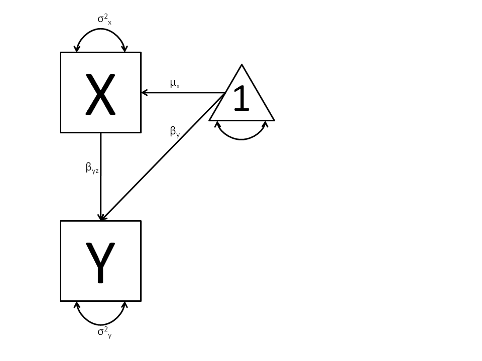
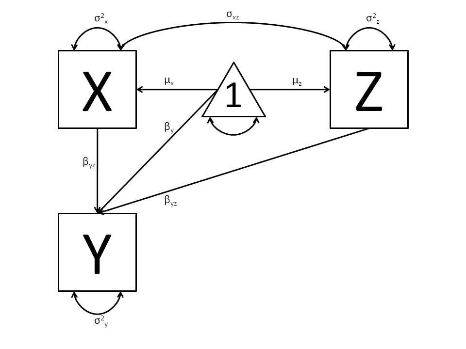

Regression, Path Specification
===============================

Our next example will show how regression can be carried out from a path-centric structural modeling perspective. This example is in three parts; a simple regression, a multiple regression, and multivariate regression. There are two versions of each example are available; one with raw data, and one where the data is supplied as a covariance matrix and vector of means. These examples are available in the following files:

* SimpleRegression_PathCov.R
* SimpleRegression_PathRaw.R
* MultipleRegression_PathCov.R
* MultipleRegression_PathRaw.R
* MultivariateRegression_PathCov.R
* MultivariateRegression_PathRaw.R

A parallel version of this example, using matrix specification of models rather than paths, can be found here link.

Simple Regression
-----------------

We begin with a single dependent variable (y) and a single independent variable (x). The relationship between these variables takes the following form:

.. math::
   :nowrap:
   
   \begin{eqnarray*} 
   y = \beta_{0} + \beta_{1} * x + \epsilon
   \end{eqnarray*}



In this model, the mean of y is dependent on both regression coefficients (and by extension, the mean of x). The variance of y depends on both the residual variance and the product of the regression slope and the variance of x. This model contains five parameters from a structural modeling perspective :math:`\beta_{0}`, :math:`\beta_{1}`, :math:`\sigma^{2}_{\epsilon}`, and the mean and variance of x). We are modeling a covariance matrix with three degrees of freedom (two variances and one variance) and a means vector with two degrees of freedom (two means). Because the model has as many parameters (5) as the data have degrees of freedom, this model is fully saturated.

Data
^^^^

Our first step to running this model is to put include the data to be analyzed. The data must first be placed in a variable or object. For raw data, this can be done with the read.table function. The data provided has a header row, indicating the names of the variables.

.. code-block:: r

  myRegDataRaw <- read.table("myRegData.txt",header=TRUE)

The names fo the variables provided by the header row can be displayed with the names() function.

.. code-block:: r

  > names(myRegDataRaw)
  [1] "w" "x" "y" "z"

As you can see, our data has four variables in it. However, our model only contains two variables, x and y. To use only them, we'll select only the variables we want and place them back into our data object. That can be done with the R code below.

.. We can refer to individual rows and columns of a data frame or matrix using square brackets, with selected rows referenced first and selected columns referenced second, separated by a comma. In the code below, we select all rows (there is no selection operator before the comma) and only columns x and y. As we are selecting multiple columns, we use the c() function to concatonate or connect those two names into one object.

.. code-block:: r

  SimpleDataRaw <- myRegDataRaw[,c("x","y")]

For covariance data, we do something very similar. We create an object to house our data. Instead of reading in raw data from an external file, we can also include a covariance matrix. This requires the matrix() function, which needs to know what values are in the covariance matrix, how big it is, and what the row and column names are. As our model also references means, we'll include a vector of means in a separate object. Data is selected in the same way as before.

.. We'll select variables in much the same way as before, but we must now select both the rows and columns of the covariance matrix.  This means vector doesn't include names, so we'll just select the second and third elements of that vector.

.. code-block:: r

  myRegDataCov <- matrix(
      c(0.808,-0.110, 0.089, 0.361,
       -0.110, 1.116, 0.539, 0.289,
        0.089, 0.539, 0.933, 0.312,
        0.361, 0.289, 0.312, 0.836),
      nrow=4,
      dimnames=list(
          c("w","x","y","z"),
          c("w","x","y","z"))
  )
 
  SimpleDataCov <- myRegDataCov[c("x","y"),c("x","y")]	
 
  myRegDataMeans <- c(2.582, 0.054, 2.574, 4.061)
 
  SimpleDataMeans <- myRegDataMeans[c(2,3)]
	
Model Specification
^^^^^^^^^^^^^^^^^^^

The following code contains all of the components of our model. Before running a model, the OpenMx library must be loaded into R using either the ``require()`` or ``library()`` function. All objects required for estimation (data, paths, and a model type) are included in their own arguments or functions. This code uses the ``mxModel`` function to create an ``MxModel`` object, which we'll then run.

.. code-block:: r

  require(OpenMx)
  uniRegModel <- mxModel("Simple Regression -- Path Specification", 
      type="RAM",
      mxData(
          observed=SimpleDataRaw, 
          type="raw"
      ),
      manifestVars=c("x", "y"),
      # variance paths
      mxPath(
          from=c("x", "y"), 
          arrows=2,
          free=TRUE, 
          values = c(1, 1),
          labels=c("varx", "residual")
      ),
      # regression weights
      mxPath(
          from="x",
          to="y",
          arrows=1,
          free=TRUE,
          values=1,
          labels="beta1"
      ), 
      # means and intercepts
      mxPath(
          from="one",
          to=c("x", "y"),
          arrows=1,
          free=TRUE,
          values=c(1, 1),
          labels=c("meanx", "beta0")
      )
  ) # close model

This ``mxModel`` function can be split into several parts. First, we give the model a title. The first argument in an ``mxModel`` function has a special function. If an object or variable containing an ``MxModel`` object is placed here, then ``mxModel`` adds to or removes pieces from that model. If a character string (as indicated by double quotes) is placed first, then that becomes the name of the model. Models may also be named by including a ``name`` argument. This model is named ``Simple Regression -- Path Specification``.

The next part of our code is the ``type``` argument. By setting ``type="RAM"``, we tell OpenMx that we are specifying a RAM model for covariances and means, and that we are doing so using the ``mxPath`` function. With this setting, OpenMx uses the specified paths to define the expected covariance and means of our data.

The third component of our code creates an ``MxData`` object. The example above, reproduced here, first references the object where our data is, then uses the ``type`` argument to specify that this is raw data.

.. code-block:: r

  mxData(
      observed=SimpleDataRaw, 
      type="raw"
  )
  
If we were to use a covariance matrix and vector of means as data, we would replace the existing ``mxData`` function with this one:

.. code-block:: r

  mxData(
      observed=SimpleDataCov, 
      type="cov",
      numObs=100,
      means=SimpleRegMeans
  )  
  
We must also specify the list of observed variables using the ``manifestVars`` argument. In the code below, we include a list of both observed variables, x and y. 
  
The last features of our code are three ``mxPath`` functions, which describe the relationships between variables. Each function first describes the variables involved in any path. Paths go from the variables listed in the ``from`` argument, and to the variables listed in the ``to`` argument. When ``arrows`` is set to ``1``, then one-headed arrows (regressions) are drawn from the ``from`` variables to the ``to`` variables. When ``arrows`` is set to ``2``, two headed arrows (variances or covariances) are drawn from the the ``from`` variables to the ``to`` variables. If ``arrows`` is set to ``2``, then the ``to`` argument may be omitted to draw paths both to and from the list of `from`` variables.

The variance terms of our model (that is, the variance of x and the residual variance of y) are created with the following ``mxPath`` function. We want two headed arrows from ``x`` to ``x``, and from ``y`` to ``y``. These paths should be freely estimated (``free=TRUE``), have starting values of ``1``, and be labeled ``"varx"`` and ``"residual"``, respectively.

.. code-block:: r

  mxPath(
      from=c("x", "y"), 
      arrows=2,
      free=TRUE, 
      values = c(1, 1),
      labels=c("varx", "residual")
  )
      
The regression term of our model (that is, the regression of y on x) is created with the following ``mxPath`` function. We want a single one-headed arrow from ``x`` to ``y``. This path should be freely estimated (``free=TRUE``), have a starting value of ``1``, and be labeled ``"beta1"``.     
          
.. code-block:: r

  mxPath(
          from="x",
          to="y",
          arrows=1,
          free=TRUE,
          values=1,
          labels="beta1"
      )

We also need means and intercepts in our model. Exogenous or independent variables have means, while endogenous or dependent variables have intercepts. These can be included by regressing both ``x`` and ``y`` on a constant, which can be refered to in OpenMx by ``"one"``. The intercept terms of our model are created with the following ``mxPath`` function. We want single one-headed arrows from the constant to both ``x`` and ``y``. These paths should be freely estimated (``free=TRUE``), have a starting value of ``1``, and be labeled ``meanx`` and ``"beta1"``, respectively.           
      
.. code-block:: r

  mxPath(
      from="one",
      to=c("x", "y"),
      arrows=1,
      free=TRUE,
      values=c(1, 1),
      labels=c("meanx", "beta0")
  )

Our model is now complete!

Model Fitting
^^^^^^^^^^^^^

We've created an ``MxModel`` object, and placed it into an object or variable named ``uniRegModel``. We can run this model by using the ``mxRun`` function, which is placed in the object ``uniRegFit`` in the code below. We then view the output by referencing the ``output`` slot, as shown here.

.. code-block:: r

  uniRegFit <- mxRun(uniRegModel)

  uniRegFit@output

The ``output`` slot contains a great deal of information, including parameter estimates and information about the matrix operations underlying our model. A more parsimonious report on the results of our model can be viewed using the ``summary`` function, as shown here.

.. code-block:: r

  summary(uniRegFit)

Multiple Regression
-------------------

In the next part of this demonstration, we move to multiple regression. The regression equation for our model looks like this:

.. math::
   :nowrap:
   
   \begin{eqnarray*} 
   y = \beta_{0} + \beta_{x} * x + \beta_{z} * z + \epsilon
   \end{eqnarray*}


   
Our dependent variable y is now predicted from two independent variables, x and z. Our model includes 3 regression parameters (:math:`\beta_{0}`, :math:`\beta_{x}`, :math:`\beta_{z}`), a residual variance (:math:`\sigma^{2}_{\epsilon}`) and the observed means, variances and covariance of x and z, for a total of 9 parameters. Just as with our simple regression, this model is fully saturated.

We prepare our data the same way as before, selecting three variables instead of two.

.. code-block:: r

  MultipleDataRaw <- myRegDataRaw[,c("x","y","z")]

  MultipleDataCov <- myRegDataCov[c("x","y","z"),c("x","y","z")]	
 
  MultipleDataMeans <- myRegDataMeans[c(2,3,4)]

Now, we can move on to our code. It is identical in structure to our simple regression code, but contains additional paths for the new parts of our model.

.. code-block:: r

  require(OpenMx)
  multiRegModel <- mxModel("Multiple Regression -- Path Specification", 
      type="RAM",
      mxData(
          observed=MultipleDataRaw, 
          type="raw"
      ),
      manifestVars=c("x", "y", "z"),
      # variance paths
      mxPath(
          from=c("x", "y", "z"), 
          arrows=2,
          free=TRUE, 
          values = c(1, 1, 1),
          labels=c("varx", "residual", "varz")
      ),
      # covariance of x and z
      mxPath(
          from="x",
          to="y",
          arrows=2,
          free=TRUE,
          values=0.5,
          labels="covxz"
      ), 
      # regression weights
      mxPath(
          from=c("x","z"),
          to="y",
          arrows=1,
          free=TRUE,
          values=1,
          labels=c("betax","betaz")
      ), 
      # means and intercepts
      mxPath(
          from="one",
          to=c("x", "y", "z"),
          arrows=1,
          free=TRUE,
          values=c(1, 1),
          labels=c("meanx", "beta0", "meanz")
      )
  ) # close model
  
  multiRegFit <- mxRun(multiRegModel)

  multiRegFit@output
  
  summary(multiRegFit)

The first bit of our code should look very familiar. ``require(OpenMx)`` makes sure the OpenMx library is loaded into R. This only needs to be done at the first model of any R session. The ``type="RAM"`` argument is identical. The ``mxData`` function references our multiple regression data, which contains one more variable than our simple regression data. Similarly, our ``manifestVars`` list contains an extra label, ``"z"``.

The ``mxPath`` functions work just as before. Our first function defines the variances of our variables. Whereas our simple regression included just the variance of x and the residual variance of y, our multiple regression includes the variance of z as well. 

Our second ``mxPath`` function specifies a two-headed arrow (covariance) between x and z. We've omitted the ``to`` argument from two-headed arrows up until now, as we have only required variaces. Covariances may be specified by using both the ``from`` and ``to`` arguments. This path is freely estimated, has a starting value of 0.5, and is labeled ``"covxz``.

.. code-block:: r

      mxPath(
          from="x",
          to="y",
          arrows=2,
          free=TRUE,
          values=0.5,
          labels="covxz"
      ), 

The third and fourth ``mxPath`` functions mirror the second and third ``mxPath`` functions from our simple regression, defining the regressions of y on both x and z as well as the means and intercepts of our model.

The model is run and output is viewed just as before, using the ``mxRun`` function, ``@output`` and the ``summary`` function to run, view and summarize the completed model.

Multivariate Regression
-----------------------

The structural modeling approach allows for the inclusion of not only multiple independent variables (i.e., multiple regression), but multiple dependent variables as well (i.e., multivariate regression). Versions of multivariate regression are sometimes fit under the heading of path analysis. This model will extend the simple and multiple regression frameworks we've discussed above, adding a second dependent variable "w".

.. math::
   :nowrap:
   
   \begin{eqnarray*} 
   y = \beta_{y} + \beta_{yx} * x + \beta_{yz} * z\epsilon\\
   w = \beta_{w} + \beta_{wx} * x + \beta_{wz} * z\epsilon
   \end{eqnarray*}


.. image:: Path3.png
    :height: 280

We now have twice as many regression parameters, a second residual variance, and the same means, variances and covariances of our independent variables. As with all of our other examples, this is a fully saturated model.

Data import for this analysis will actually be slightly simpler than before. The data we imported for the previous examples contains only the four variables we need for this model. We can use ``myRegDataRaw``, ``myRegDataCov``, and``myRegDataMeans`` in our models.

.. code-block:: r

  myRegDataRaw<-read.table("myRegData.txt",header=TRUE)
  
  myRegDataCov <- matrix(
      c(0.808,-0.110, 0.089, 0.361,
       -0.110, 1.116, 0.539, 0.289,
        0.089, 0.539, 0.933, 0.312,
        0.361, 0.289, 0.312, 0.836),
      nrow=4,
      dimnames=list(
          c("w","x","y","z"),
          c("w","x","y","z"))
  )
 
  myRegDataMeans <- c(2.582, 0.054, 2.574, 4.061)

Our code should look very similar to our previous two models. It includes the same ``type`` argument, ``mxData`` function, and ``manifestVars`` argument as previous models, with a different version of the data and additional variables in the latter two components.

.. code-block:: r

  multivariateRegModel <- mxModel("MultiVariate Regression -- Path Specification", 
      type="RAM",
      mxData(
          observed=myRegDataRaw, 
          type="raw"
      ),
      manifestVars=c("w", "x", "y", "z"),
      # variance paths
      mxPath(
          from=c("w", "x", "y", "z"), 
          arrows=2,
          free=TRUE, 
          values = c(1, 1, 1),
          labels=c("residualw", "varx", "residualy", "varz")
      ),
      # covariance of x and z
      mxPath(
          from="x",
          to="y",
          arrows=2,
          free=TRUE,
          values=0.5,
          labels="covxz"
      ), 
      # regression weights for y
      mxPath(
          from=c("x","z"),
          to="y",
          arrows=1,
          free=TRUE,
          values=1,
          labels=c("betayx","betayz")
      ), 
      # regression weights for w
      mxPath(
          from=c("x","z"),
          to="w",
          arrows=1,
          free=TRUE,
          values=1,
          labels=c("betawx","betawz")
      ), 
      # means and intercepts
      mxPath(
          from="one",
          to=c("w", "x", "y", "z"),
          arrows=1,
          free=TRUE,
          values=c(1, 1),
          labels=c("betaw", "meanx", "betay", "meanz")
      )
  ) # close model
  
  multivariateRegFit <- mxRun(multivariateRegModel)

  multivariateRegFit@output
  
  summary(multivariateRegFit)  
  
The only additional components to our ``mxPath`` functions are the inclusion of the "w" variable and the additional set of regression coefficients for "w". Running the model and viewing output works exactly as before.

These models may also be specified using matrices instead of paths. See link for matrix specification of these models.
  
