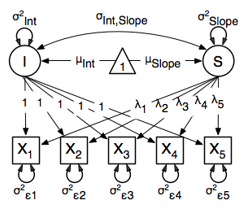

Time Series, Path Specification
=================================

This example will demonstrate a growth curve model using path-centric specification. As with previous examples, this application is split into two files, one each raw and covariance data. These examples can be found in the following files:

* http://openmx.psyc.virginia.edu/repoview/1/trunk/demo/LatentGrowthCurveModel_PathCov.R
* http://openmx.psyc.virginia.edu/repoview/1/trunk/demo/LatentGrowthCurveModel_PathRaw.R

Parallel versions of this example, using matrix specification of models rather than paths, can be found here:

* http://openmx.psyc.virginia.edu/repoview/1/trunk/demo/LatentGrowthCurveModel_MatrixCov.R
* http://openmx.psyc.virginia.edu/repoview/1/trunk/demo/LatentGrowthCurveModel_MatrixRaw.R

Latent Growth Curve Model
-------------------------
The latent growth curve model is a variation of the factor model for repeated measurements. For a set of manifest variables :math:`x_{i1}` - :math:`x_{i5}` measured at five discrete times for people indexed by the letter *i*, the growth curve model can be expressed both algebraically and via a path diagram as shown here:

.. math::
   :nowrap:
   
   \begin{eqnarray*} 
   x_{ij} = Intercept_{i} + \lambda_{j} * Slope_{i} + \epsilon_{i}
   \end{eqnarray*}

The values and specification of the :math:`\lambda` parameters allow for alterations to the growth curve model. This example will utilize a linear growth curve model, so we will specify :math:`\lambda` to increase linearly with time. If the observations occur at regular intervals in time, then :math:`\lambda` can be specified with any values increasing at a constant rate. For this example, we'll use [0, 1, 2, 3, 4] so that the intercept represents scores at the first measurement occasion, and the slope represents the rate of change per measurement occasion. Any linear transformation of these values can be used for linear growth curve models.

Our model for any number of variables contains 6 free parameters; two factor means, two factor variances, a factor covariance and a (constant) residual variance for the manifest variables. Our data contains five manifest variables, and so the covariance matrix and means vector contain 20 degrees of freedom. Thus, the linear growth curve model fit to these data has 14 degrees of freedom.

Data
^^^^

The first step to running our model is to import data. The code below is used to import both raw data and a covariance matrix and means vector, either of which can be used for our growth curve model. This data contains five variables, which are repeated measurements of the same variable ``"x"``. As growth curve models make specific hypotheses about the variances of the manifest variables, correlation matrices generally aren't used as data for this model.

.. code-block:: r

	myLongitudinalData <- read.table("myLongitudinalData.txt",header=T)

	myLongitudinalDataCov<-matrix(
		c(6.362, 4.344, 4.915,  5.045,  5.966,
		  4.344, 7.241, 5.825,  6.181,  7.252,
		  4.915, 5.825, 9.348,  7.727,  8.968,
		  5.045, 6.181, 7.727, 10.821, 10.135,
		  5.966, 7.252, 8.968, 10.135, 14.220),
	nrow=5,
	dimnames=list(
		c("x1","x2","x3","x4","x5"),
		c("x1","x2","x3","x4","x5"))
	)

	myLongitudinalDataMean <- c(9.864, 11.812, 13.612, 15.317, 17.178)

Model Specification
^^^^^^^^^^^^^^^^^^^

We'll create a path-centric factor model with the same functions and arguments used in previous path-centric examples. This model is a special type of two-factor model, with fixed factor loadings, constant residual variance and manifest means dependent on latent means.

Before running a model, the OpenMx library must be loaded into R using either the ``require()`` or ``library()`` function. This code uses the ``mxModel`` function to create an ``MxModel`` object, which we'll then run.

.. code-block:: r

	require(OpenMx)

	growthCurveModel <- mxModel("Linear Growth Curve Model -- Path Specification", 
		type="RAM",
		mxData(
			myLongitudinalData,
			type="raw"
		),
		manifestVars=c("x1","x2","x3","x4","x5"),
		latentVars=c("intercept","slope"),
		# residual variances
		mxPath(
			from=c("x1","x2","x3","x4","x5"), 
			arrows=2,
			free=TRUE, 
			values = c(1, 1, 1, 1, 1),
			labels=c("residual","residual","residual","residual","residual")
		),
		# latent variances and covariance
		mxPath(
			from=c("intercept","slope"), 
			arrows=2,
			all=TRUE,
			free=TRUE, 
			values=c(1, 1, 1, 1),
			labels=c("vari", "cov", "cov", "vars")
		),
		# intercept loadings
		mxPath(
			from="intercept",
			to=c("x1","x2","x3","x4","x5"),
			arrows=1,
			free=FALSE,
			values=c(1, 1, 1, 1, 1)
		),
		# slope loadings
		mxPath(
			from="slope",
			to=c("x1","x2","x3","x4","x5"),
			arrows=1,
			free=FALSE,
			values=c(0, 1, 2, 3, 4
		),
		# manifest means
		mxPath(
			from="one",
			to=c("x1", "x2", "x3", "x4", "x5"),
			arrows=1,
			free=FALSE,
			values=c(0, 0, 0, 0, 0)
		),
		# latent means
		mxPath(
			from="one",
			to=c("intercept", "slope"),
			arrows=1,
			free=TRUE,
			values=c(1, 1),
			labels=c("meani", "means")
		)
	) # close model

The model begins with a name, in this case "Linear Growth Curve Model -- Path Specification". If the first argument is an object containing an ``MxModel`` object, then the model created by the ``mxModel`` function will contain all of the named entities in the referenced model object. The ``type="RAM"`` argument specifies a RAM model, allowing the ``mxModel`` to define an expected covariance matrix from the paths we supply.

Data is supplied with the ``mxData`` function. This example uses raw data, but the ``mxData`` function in the code above could be replaced with the function below to include covariance data.

.. code-block:: r

	mxData(
		myLongitudinalDataCov,
		type="cov",
		numObs=500,
		means=myLongitudinalDataMeans
	),

Next, the manifest and latent variables are specified with the ``manifestVars`` and ``latentVars`` arguments. The two latent variables in this model are named ``"Intercept"`` and ``"Slope"``.

There are six ``mxPath`` functions in this model. The first two specify the variances of the manifest and latent variables, respectively. The manifest variables are specified below, which take the form of residual variances. The ``to`` argument is omitted, as it is not required to specify two-headed arrows. The residual variances are freely estimated, but held to a constant value across the five measurement occasions by giving all five variances the same label, ``residual``.

.. code-block:: r

	# residual variances
	mxPath(
		from=c("x1","x2","x3","x4","x5"), 
		arrows=2,
		free=TRUE, 
		values = c(1, 1, 1, 1, 1),
		labels=c("residual","residual","residual","residual","residual")
	),
      
Next are the variances and covariance of the two latent variables. Like the last function, we've omitted the ``to`` argument for this set of two-headed paths. However, we've set the ``all`` argument to ``TRUE``, which creates all possible paths between the variables. As omitting the ``to`` argument is identical to putting identical variables in the ``from`` and ``to`` arguments, we are creating all possible paths from and to our two latent variables. This results in four paths: from intercept to intercept (the variance of the interecpts), from intercept to slope (the covariance of the latent variables), from slope to intercept (again, the covariance), and from slope to slope (the variance of the slopes). As the covariance is both the second and third path on this list, the second and third elements of both the ``values`` argument (.5) and the ``labels`` argument (``"cov"``) are the same.
      
.. code-block:: r

	# latent variances and covariance
	mxPath(
		from=c("intercept","slope"), 
		arrows=2,
		all=TRUE,
		free=TRUE, 
		values=c(1, 1, 1, 1),
		labels=c("vari", "cov", "cov", "vars")
	),
      
The third and fourth ``mxPath`` functions specify the factor loadings. As these are defined to be a constant value of 1 for the intercept factor and the set [0, 1, 2, 3, 4] for the slope factor, these functions have no free parameters.       
      
.. code-block:: r

	# intercept loadings
	mxPath(
		from="intercept",
		to=c("x1","x2","x3","x4","x5"),
		arrows=1,
		free=FALSE,
		values=c(1, 1, 1, 1, 1)
	),
	# slope loadings
	mxPath(
		from="slope",
		to=c("x1","x2","x3","x4","x5"),
		arrows=1,
		free=FALSE,
		values=c(0, 1, 2, 3, 4)
	),
  
The last two ``mxPath`` functions specify the means. The manifest variables are not regressed on the constant, and thus have intercepts of zero. The observed means are entirely functions of the means of the intercept and slope. To specify this, the manifest variables are regressed on the constant (denoted ``"one"``) with a fixed value of zero, and the regressions of the latent variables on the constant are estimated as free parameters.

.. code-block:: r

	# manifest means
	mxPath(
		from="one",
		to=c("x1", "x2", "x3", "x4", "x5"),
		arrows=1,
		free=FALSE,
		values=c(0, 0, 0, 0, 0)
	),
	# latent means
	mxPath(
		from="one",
		to=c("intercept", "slope"),
		arrows=1,
		free=TRUE,
		values=c(1, 1),
		labels=c("meani", "means")
	),

The model is now ready to run using the ``mxRun`` function, and the output of the model can be accessed from the ``output`` slot of the resulting model.
A summary of the output can be reached using ``summary()``.

	growthCurveFit <- mxRun(growthCurveModel)

	growthCurveFit@output
	summary(growthCurveFit)

These models may also be specified using matrices instead of paths. See `here <http://openmx.psyc.virginia.edu/repoview/1/trunk/docs/build/html/Examples_Matrix.html#timeseries-matrix-specification>`_ for matrix specification of these models.