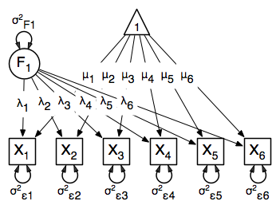

This vignette will demonstrate latent variable modeling and confirmatory analysis via the common factor model. We’ll walk through the construction of a single and multiple factor model first through specifying the path diagram, and then an alternate form of model specification through manually defining the matrices in a RAM-type model. Additionally, we will demonstrate how to specify data for analysis using either raw data or a covariance matrix of manifest variables. Scripts for [a variety of implementations are located within the `/demo/` directory of the OpenMx GitHub repository](https://github.com/OpenMx/OpenMx/tree/master/demo) and are named in accordance with their specific implementation (eg. "OneFactorModel_PathRaw.R", "TwoFactorModel_MatrixCov.R", etc.)

## Common Factor Model
The common factor model is a method for modeling the relationships between observed variables believed to measure or indicate the same latent variable. While there are a number of exploratory approaches to extracting latent factor(s), this example uses structural modeling to fit confirmatory factor models. The model for any person and path diagram of the common factor model for a set of variables $x_{1}-x_{6}$ are given below.

\begin{eqnarray*} x_{ij} = \mu_{j} + \lambda_{j} * \eta_{i} + \epsilon_{ij} \end{eqnarray*}

<center>



</center>

While 19 parameters are displayed in the equation and path diagram above (six manifest variances, six manifest means, six factor loadings and one factor variance), we must constrain either the factor variance or one factor loading to a constant to identify the model and scale the latent variable. As such, this model contains 18 parameters. The means and covariance matrix for six observed variables contain 27 degrees of freedom, and thus our model contains 9 degrees of freedom.

OpenMX handles model definition through the `MxModel` class, instantiated via the `mxModel()` function. Model definition requires input data for analysis and the model specification itself. Input data can be either in the form of a set of variable observations or by having a correlation/covariance matrix and associated variable means, while the model specification can either be produced via specifying a path diagram or the actual matrices from the RAM model.

### Input Data
Our first step to running this model is to include the data to be analyzed. The `MxData` class instantiated through `mxData()` is used for representing data within the `MxModel`. 

As mentioned, one method of data specification is through loading a raw set of observations on variables. The data for this example is the packaged `myFADataRaw` dataset, which contains 500 observations on nine observed variables. In accordance with the path diagram above, we specify the first six variables for analysis in the model.

```{r}
require(OpenMx)
data(myFADataRaw)

myFADataRaw <- myFADataRaw[,c("x1","x2","x3","x4","x5","x6")]
dataRaw      <- mxData( observed=myFADataRaw, type="raw" )
```
Alternatively, our data could be specificed via a correlation/covariance matrix with variable means and number of observations. A type argument of `"cov"` is specified in the below example with a covariance matrix, and would be `"cor"` if we provided a correlation matrix (other inputs being the same).

```{r}
myFADataCov<-matrix(
	c(0.997, 0.642, 0.611, 0.672, 0.637, 0.677,
	  0.642, 1.025, 0.608, 0.668, 0.643, 0.676,
	  0.611, 0.608, 0.984, 0.633, 0.657, 0.626,
	  0.672, 0.668, 0.633, 1.003, 0.676, 0.665,
	  0.637, 0.643, 0.657, 0.676, 1.028, 0.654,
	  0.677, 0.676, 0.626, 0.665, 0.654, 1.020),
	nrow=6,
	dimnames=list(
		c("x1","x2","x3","x4","x5","x6"),
		c("x1","x2","x3","x4","x5","x6"))
)

myFADataMeans <- c(2.988, 3.011, 2.986, 3.053, 3.016, 3.010)
names(myFADataMeans) <- c("x1","x2","x3","x4","x5","x6")

dataCov      <- mxData( observed=myFADataCov, type="cov", numObs=500,
                        mean=myFADataMeans )
```

### Model Specification

#### Path Diagram Specification
One method of model specification is through defining the model via the existing path diagram. In this instance, our model instantiation will take as arguments the `MxData` defined previously, as well as lists of manifest variables & latent variables, and an arbitrary number of `MxPath` objects defining the paths between these variables. First, we will start by defining our manifest and latent variables in accordance to the path diagram.

```{r}
latentVars <- "F1"
manifestVars=c("x1","x2","x3","x4","x5","x6")
```

Next, we define our various paths between variables. The `mxPath()` function has a number of parameters for instantiating a similar set of paths in a single call, and all of these can be grouped together within the `mxModel()` call later.

First off, we define the latent variable variance path. The `from` field without a specified `to` value evaluates as if the paths go back to their origin, as we want with our variances. The `arrows` field of `2` indicates a double-headed path in this instance. This `mxPath()` call effectively represents one path, the variance on the latent variable $F_1$, which we default pre-fitting to 1 and label `"varF1"` The `free` field of `TRUE` indicates that this value will be optimized once we fit the model.
```{r}
# latent variance
latVar       <- mxPath( from="F1", arrows=2,
                        free=TRUE, values=1, labels ="varF1" )
```

Additionally, we need residual variance paths for the observed variables. These can all be created in one `mxPath()` call by specifying a list in `from`, as well as initial values and labels for these variances.

```{r}
# residual variances
resVars      <- mxPath( from=c("x1","x2","x3","x4","x5","x6"), arrows=2,
                        free=TRUE, values=c(1,1,1,1,1,1),
                        labels=c("e1","e2","e3","e4","e5","e6") )
```

Next come the factor loadings. These are specified as asymmetric paths (regressions) of the manifest variables on the latent variable `"F1"`. As we have to scale the latent variable, the first factor loading has been given a fixed value of one by setting the first elements of the `free` and `values` arguments to `FALSE` and `1`, respectively. Alternatively, the latent variable could have been scaled by fixing the factor variance to 1 in the previous `mxPath()` function and freely estimating all factor loadings. The five factor loadings that are freely estimated are all given starting values of `1` and labels `"l2"` through `"l6"`.

```{r}
# factor loadings
facLoads     <- mxPath( from="F1", to=c("x1","x2","x3","x4","x5","x6"), arrows=1,
                        free=c(FALSE,TRUE,TRUE,TRUE,TRUE,TRUE), values=c(1,1,1,1,1,1),
                        labels =c("l1","l2","l3","l4","l5","l6") )
```

Lastly, we must specify the mean structure for this model. As there are a total of seven variables in this model (six manifest and one latent), we have the potential for seven means. However, we must constrain at least one mean to a constant value, as there is not sufficient information to yield seven mean and intercept estimates from the six observed means. The six observed variables receive freely estimated intercepts, while the factor mean is fixed to a value of zero in the code below.

```{r}
# means
means        <- mxPath( from="one", to=c("x1","x2","x3","x4","x5","x6","F1"), arrows=1,
                        free=c(T,T,T,T,T,T,FALSE), values=c(1,1,1,1,1,1,0),
                        labels =c("meanx1","meanx2","meanx3","meanx4","meanx5","meanx6",NA) )
```

Finally, we insantiate our unfitted model using `mxModel()`. This model begins with a name (“Common Factor Model Path Specification”) for the model and a `type="RAM"` argument. The name for the model may be omitted, or may be specified in any other place in the model using the name argument. Including type="RAM" allows the mxModel function to interpret the mxPath functions that follow and turn those paths into an expected covariance matrix and means vector for the ensuing data. The raw data specification from before (`dataRaw`) is included as the model data.

```{r}
oneFactorPathModel <- mxModel("Common Factor Model Path Specification", type="RAM",
                        manifestVars=c("x1","x2","x3","x4","x5","x6"), latentVars="F1",
                        dataRaw, resVars, latVar, facLoads, means)
```
#### Matrix Specification

### Running Model & Results

## Multiple Factor Model

#### Path Diagram Specification

#### Matrix Specification